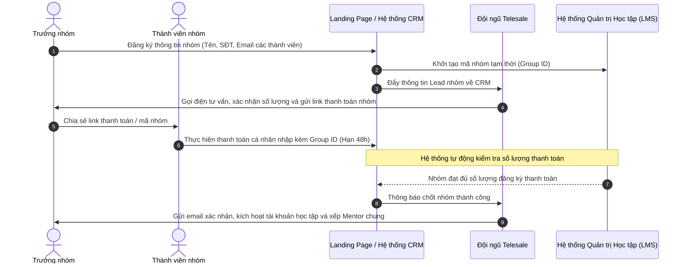

# CHƯƠNG TRÌNH GÓI NHÓM THỰC CHIẾN (GROUP BUYING) - ĐỒNG HÀNH BỨT PHÁ CV

## 1. Tổng quan & Mục tiêu Chương trình
Chương trình "Bán tập thể cho một nhóm" (Group Buying) được thiết kế nhằm khai thác tâm lý học tập và thực tập theo nhóm của sinh viên công nghệ thông tin (IT). Vào mùa hè hoặc các kỳ thực tập OJT (On-the-Job Training), sinh viên thường có xu hướng tìm kiếm cơ hội thực tập chung với bạn học cùng lớp, cùng câu lạc bộ (CLB) hoặc cùng nhóm dự án bài tập lớn.

**Mục tiêu chiến lược:**
*   **Kích cầu kinh doanh:** Tăng trưởng số lượng học viên đăng ký nhanh chóng trong thời gian ngắn (đặc biệt là mùa hè).
*   **Giảm thiểu Chi phí Thu hút Khách hàng (CAC):** Tận dụng mạng lưới tự lan tỏa của sinh viên. Một người đăng ký sẽ tự thuyết phục thêm 2-3 người bạn khác tham gia để được hưởng giá ưu đãi, giúp doanh nghiệp tiết kiệm chi phí chạy Ads trực tiếp.
*   **Nâng cao hiệu quả đào tạo:** Học viên học theo nhóm có sẵn sẽ phối hợp làm việc nhóm (Teamwork) tốt hơn, tỷ lệ hoàn thành dự án cao hơn và giảm áp lực hỗ trợ cho Mentor.

---

## 2. Đối tượng Áp dụng
*   Nhóm sinh viên học ngành CNTT, An toàn thông tin, Hệ thống thông tin, Công nghệ phần mềm... từ các trường Đại học/Cao đẳng.
*   Nhóm thành viên thuộc các Câu lạc bộ IT, đội nhóm học thuật.
*   Áp dụng cho **Gói Tiêu chuẩn (Standard)** của IOC (Học phí gốc: **5.000.000 VNĐ / khóa / 3 tháng**).

---

## 3. Chính sách Giá & Chiết khấu Nhóm (Group Pricing Structure)

Chính sách chiết khấu lũy tiến dựa trên số lượng thành viên đăng ký cùng lúc trong một nhóm. Số lượng thành viên càng đông, ưu đãi giảm học phí trên mỗi cá nhân càng lớn (tối đa áp dụng cho nhóm 5 người).

| Quy mô Nhóm | Mức Chiết khấu / Học viên | Học phí Sau Giảm / Học viên | Tổng Doanh thu Gói Nhóm | Tổng Mức Giảm của Nhóm |
| :--- | :--- | :--- | :--- | :--- |
| **Cá nhân (1 người)** | 0% | 5.000.000 VNĐ | 5.000.000 VNĐ | 0 VNĐ |
| **Nhóm Song hành (2 người)** | 10% (Giảm 500k) | 4.500.000 VNĐ | 9.000.000 VNĐ | 1.000.000 VNĐ |
| **Nhóm Tam ca (3 người)** | 20% (Giảm 1.000.000đ) | 4.000.000 VNĐ | 12.000.000 VNĐ | 3.000.000 VNĐ |
| **Nhóm Chiến hữu (5 người)** | 30% (Giảm 1.500.000đ) | 3.500.000 VNĐ | 17.500.000 VNĐ | 7.500.000 VNĐ |

---

## 4. Quyền lợi Đặc biệt Dành riêng cho Nhóm
Không chỉ được ưu đãi về tài chính, các nhóm đăng ký chương trình còn nhận được các đặc quyền vận hành giúp nâng cao trải nghiệm học tập:

1.  **Cùng làm Dự án thật (Team-based Project Placement):**
    *   Nhóm đăng ký chung sẽ được ưu tiên xếp vào cùng một dự án giả lập hoặc dự án mã nguồn mở phù hợp.
    *   Học viên tự phân chia vai trò (Project Manager/Team Lead, Frontend Developer, Backend Developer, QA/QC Tester) mô phỏng chính xác cấu trúc một Scrum Team thực tế.
2.  **Mentor Đồng hành Chuyên biệt (Dedicated Team Mentor):**
    *   Các nhóm từ 5 người được chỉ định một Mentor chuyên trách theo sát suốt 3 tháng thực tập.
    *   Các buổi Weekly Review/Sprint Review sẽ được thực hiện riêng cho nhóm để tối ưu hóa sự tương tác và sửa lỗi hệ thống.
3.  **Tối ưu Lịch làm việc Hybrid tại Văn phòng:**
    *   Được đăng ký lịch lên văn phòng (Offline) trùng nhau để thuận tiện cho việc thảo luận và làm việc trực tiếp, tối đa 2.5 ngày/tuần.

---

## 5. Điều khoản & Điều kiện Áp dụng (Terms & Conditions)
Để đảm bảo vận hành ổn định và tránh trục lợi chính sách, chương trình áp dụng các quy định sau:

*   **Thời gian Đăng ký và Thanh toán:**
    *   Nhóm phải cử ra 1 Trưởng nhóm (Leader) làm đầu mối liên hệ.
    *   Hồ sơ thông tin của tất cả thành viên trong nhóm phải được gửi cùng một lúc qua form đăng ký nhóm.
    *   Toàn bộ thành viên trong nhóm phải hoàn thành học phí trong vòng **48 giờ** kể từ thời điểm trưởng nhóm gửi link xác nhận thanh toán của nhóm. Nếu có thành viên không hoàn tất phí, nhóm sẽ bị hạ cấp chiết khấu xuống bậc tương ứng với số lượng người nộp tiền thực tế.
*   **Chính sách Bảo lưu & Rút lui:**
    *   Không áp dụng hoàn trả học phí đối với các gói đăng ký nhóm sau khi đã mở tài khoản học tập và nhận bàn giao tài nguyên dự án.
    *   Trường hợp 1 thành viên xin bảo lưu (vì lý do bất khả kháng), học viên đó được bảo lưu sang khóa sau nhưng không ảnh hưởng đến mức chiết khấu hiện tại của các thành viên còn lại trong nhóm.
*   **Tính Độc quyền (Không áp dụng cộng dồn):**
    *   Ưu đãi gói nhóm không áp dụng đồng thời với các chương trình khuyến mãi giảm giá khác (như Flash Sale cá nhân, học bổng học thuật riêng, ưu đãi chương trình referral). Học viên chỉ được lựa chọn hình thức ưu đãi cao nhất tại thời điểm đăng ký.

---

## 6. Phân tích Kinh tế & Sức khỏe Tài chính (Unit Economics)
Chúng ta sẽ kiểm chứng tính khả thi của chương trình thông qua bài toán tài chính tính trên mỗi sinh viên:

### So sánh biên lợi nhuận giữa khách hàng cá nhân và khách hàng nhóm:

| Chỉ số (Tính trên 1 Học viên) | Khách Cá nhân (Standard) | Nhóm 3 Người (Giảm 20%) | Nhóm 5 Người (Giảm 30%) |
| :--- | :--- | :--- | :--- |
| **Giá bán thực tế (Revenue)** | **5.000.000đ** | **4.000.000đ** | **3.500.000đ** |
| Chi phí Marketing (CAC thực tế) | 1.500.000đ | 500.000đ | 300.000đ |
| Chi phí Vận hành/Mentor (COGS) | 1.500.000đ | 1.500.000đ | 1.300.000đ * |
| **Lợi nhuận gộp giữ lại (Margin)**| **2.000.000đ** | **2.000.000đ** | **1.900.000đ** |
| **Biên lợi nhuận gộp (%)** | **40%** | **50%** | **54.2%** |

*(Ghi chú: * Với nhóm 5 người, chi phí Mentor/COGS trên đầu người giảm đi do Mentor review chung một dự án nhóm, tối ưu hóa thời gian và năng suất hoạt động của Mentor con người).*

> [!TIP]
> **Nhận xét chiến lược:** Dù giảm giá bán đáng kể cho sinh viên, biên lợi nhuận gộp của mô hình nhóm vẫn duy trì ở mức cao và thậm chí tăng lên (từ 40% lên trên 54.2%) nhờ chi phí thu hút khách hàng (CAC) và chi phí vận hành (COGS) giảm cực mạnh. Đây là một mũi tên trúng hai đích: Sinh viên được học giá rẻ, doanh nghiệp tối ưu chi phí và tăng lượng học viên nhanh chóng.

---

## 7. Quy trình Đăng ký & Triển khai Hệ thống

**Kế hoạch Hành động nhanh để kích cầu:**
1.  Thiết kế thêm widget "Mua chung - Tiết kiệm đến 30%" trên Landing Page chính.
2.  Tạo tính năng "Tự tạo nhóm / Tìm bạn ghép nhóm" trên website để những sinh viên đi một mình nhưng vẫn muốn ghép nhóm có cơ hội kết nối với nhau.
3.  Truyền thông mạnh thông điệp: *"Học có hội - Thực chiến có đội - Bứt phá CV cùng đồng bọn mùa hè này!"* vào các hội nhóm lớp của các trường đại học.
