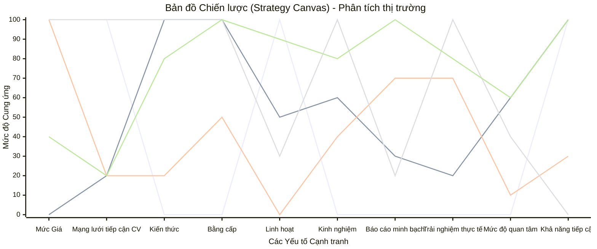

**IOC - VER2**

# I. TỔNG QUAN DỰ ÁN

## 1. Giới thiệu sản phẩm (Executive Summary)

IOC 2.0 (Internship OneConnect) không chỉ là một **đơn vị cung ứng dịch vụ quản trị và vận hành thực tập trọn gói (Managed Internship Service)** mà còn là một **nền tảng công nghệ giáo dục (EdTech Platform) tích hợp môi trường thực tập ảo (Virtual Experience)** mạnh mẽ. Dự án được thiết kế nhằm tái cấu trúc hoạt động thực tập của sinh viên, chuyển đổi từ một thủ tục mang tính hình thức thành một quy trình thực chiến: kết hợp các bài tập/dự án mô phỏng từ các doanh nghiệp/Big Tech với sự hướng dẫn sát sao của chuyên gia, đồng thời cung cấp dữ liệu đánh giá đầu ra định lượng để minh chứng chất lượng cho nhà trường và sinh viên.

Khác với các mô hình giới thiệu chỗ thực tập truyền thống, IOC 2.0 được thiết kế như một **dịch vụ vận hành và hạ tầng kỹ thuật thực tập dùng chung**, có khả năng áp dụng cho nhiều nhóm ngành khác nhau (CNTT, kinh tế, dữ liệu, vận hành, truyền thông, phân tích nghiệp vụ…), miễn là có thể tổ chức công việc theo cấu trúc dự án thực tế/thực tập ảo và đầu ra rõ ràng. **Tuy nhiên, trong năm 2026 IOC vẫn tập trung vào ngành Công nghệ thông tin (CNTT), nơi đội ngũ có thế mạnh và kinh nghiệm sâu.**

IOC 2.0 cung cấp giải pháp trọn gói từ **vận hành đến công nghệ**, trực tiếp thiết kế – triển khai – đo lường toàn bộ hành trình thực tập của sinh viên, bắt đầu từ giai đoạn đăng ký, đánh giá đầu vào, hội nhập (onboarding), làm việc thực chiến (On-the-job training), cho đến đánh giá đầu ra. Thông qua quá trình này, dự án phục vụ trực tiếp **hai nhóm khách hàng chính**:

*   **Nhà trường**: Được cung cấp **dịch vụ vận hành thực tập trọn gói (đứng ra điều phối quy trình, thiết kế môi trường dự án và cơ chế tiếp nhận theo mùa vụ)**, giúp giải bài toán khó nhất là **tìm nơi để gửi sinh viên đi thực tập chất lượng (đặc biệt với các trường top dưới)**; đồng thời có lớp “bằng chứng” đầu ra (tiến độ, đánh giá của chuyên gia, kết quả dự án) để đảm bảo uy tín và đối soát.
*   **Sinh viên**: được làm dự án, có chuyên gia hướng dẫn và đánh giá, tích lũy kinh nghiệm và hồ sơ năng lực (portfolio) thực tế để ứng tuyển.

---

## 2. Vấn đề cốt lõi (Strategic Diagnosis)

Dựa trên lý thuyết của Richard Rumelt cha đẻ của sách "Good Strategy/Bad Strategy", IOC 2.0 xác định một **Chẩn đoán (Diagnosis)** về nút thắt CHALLENGE lớn nhất mang tính hệ thống:

### 2.1. Chẩn đoán: "Sự Bế tắc OJT"
Nút thắt sống còn của thị trường thực tập CNTT không chỉ là thiếu "chỗ làm", mà là **thiếu các đơn vị chịu gánh vác việc On-the-job Training (OJT)**, dẫn tới việc **nhà trường (đặc biệt các trường top dưới) rất khó tìm được nơi đủ chất lượng để gửi sinh viên đi thực tập**. Việc thiếu công cụ đo lường chuẩn xác năng lực thực chiến là hệ quả làm trầm trọng thêm khủng hoảng niềm tin (nhà trường khó bảo chứng, doanh nghiệp càng dè chừng).
- Trong nội bộ doanh nghiệp công nghệ, kỹ sư Senior quá bận chạy dự án, dẫn tới việc thực tập sinh IT vào công ty chỉ được giao đọc tài liệu hoặc làm các task "rác". Doanh nghiệp coi sinh viên là gánh nặng.
- Ở phía đầu ra, Nhà trường và Khoa CNTT không có cách nào kiểm chứng sinh viên có thực sự code và giải quyết vấn đề kỹ thuật hay không, đành phải chấm điểm dựa trên giấy xác nhận hình thức có dấu mộc.
- Hàng ngàn sinh viên CNTT mỗi năm bị kẹt giữa hai "con sóng" này: Cần dự án để có kinh nghiệm xin việc, nhưng không đủ kinh nghiệm để được giao làm dự án. Nguyên nhân sâu xa là thị trường thiếu một "Hàng rào Thẩm định" bằng dữ liệu để chứng minh năng lực thật.
#### **Chứng cứ định lượng về cuộc khủng hoảng niềm tin & năng lực:**

*   **Lỗ hổng kỹ năng thực tế:** Mặc dù hàng năm có 50.000 - 57.000 sinh viên nhập học ngành CNTT, nhưng chỉ **35% sinh viên tốt nghiệp đáp ứng được yêu cầu doanh nghiệp**. 65% còn lại cần từ 3-6 tháng đào tạo lại hoàn toàn.
*   **Nghịch lý "Thiếu mà vẫn thừa":**
    *   Thị trường dự báo thiếu hụt nhân sự trầm trọng: Năm 2025 thiếu **200.000 người**, năm 2026 thiếu **220.000 người**.
    *   Tuy nhiên, doanh nghiệp lại đang **"đóng cửa" với người thiếu kinh nghiệm**: 60% công ty đã dừng hoặc giảm tuyển dụng (dưới 10 người/năm). Điều này cho thấy doanh nghiệp thà bỏ trống vị trí còn hơn nhận nhầm Intern/Fresher vì rủi ro "hổng kiến thức".
    *   **Động lực ngầm - "Quy luật đào thải tuổi tác":** Dù e ngại rủi ro dạy việc, ngành IT vẫn luôn có nhu cầu bức thiết trong việc "thay máu" và tuyển nhân sự trẻ để lấp vào chỗ trống của những nhân viên tuổi cao ngày càng kém năng suất. Doanh nghiệp đặc biệt ưa chuộng sinh viên mới ra trường vì năng suất làm việc vượt trội, linh hoạt, dễ quản lý (chiều hướng nghe lời) và chi phí tối ưu. Bài toán duy nhất đối với họ là làm sao tuyển được người trẻ nhưng "đã có kinh nghiệm thực chiến" – và đó chính là khoảng trống IOC lấp đầy.
*   **Cuộc chiến hồ sơ (Competition Crisis):**
    *   Tỷ lệ cạnh tranh tăng vọt: Từ 40 ứng viên/vị trí (2022) lên **120 ứng viên/vị trí (2024)**.
    *   Đặc biệt, các vị trí không yêu cầu kinh nghiệm có tỷ lệ chọi lên tới **330 hồ sơ cho 1 vị trí**.
    *   Cơ hội cho Intern/Fresher đang bị thu hẹp trong các bản mô tả công việc (JD) khi thị trường chuyển hướng ưu tiên nhân sự Middle-Senior và Leader.
*   **Áp lực từ bối cảnh quốc tế:**
    *   Hơn **250.000 nhân sự công nghệ bị layoff** toàn cầu (Amazon, Meta, MS...), tạo ra nguồn cung nhân sự có kinh nghiệm tràn vào thị trường, đẩy "vạch xuất phát" của sinh viên lên cao hơn bao giờ hết.
    *   WEF dự báo **39% kỹ năng cốt lõi sẽ thay đổi vào năm 2030**, khiến việc thực tập không chỉ là để "có chỗ làm" mà là để **Upskill & Reskill** liên tục để không bị đào thải.
*   **Vấn nạn "Báo cáo mẫu":** Áp lực giảng dạy khiến khâu kiểm soát thực tập bị lỏng lẻo, thúc đẩy sự bùng nổ của đạo văn và báo cáo mẫu, khiến kết quả thực tập mất đi tính khách quan.

Đây là nguyên nhân gốc rễ dẫn đến các vấn đề cụ thể sau:

#### **a. Đối với Nhà trường**
**Vấn đề chính:** Nhà trường **khó tìm được nơi để gửi sinh viên đi thực tập thực chất**, đặc biệt với các trường top dưới/nhóm trường có quan hệ doanh nghiệp yếu:
*   Doanh nghiệp ngày càng khắt khe và không muốn “gánh OJT”, ưu tiên ứng viên đã có minh chứng năng lực; các khoa/trường top dưới vì thiếu uy tín và thiếu quan hệ nên càng bị từ chối.
*   Mỗi mùa vụ kiến tập/thực tập, nhà trường phải “xin xỏ” từng doanh nghiệp, tốn thời gian, thiếu tính ổn định và không đảm bảo chất lượng công việc được giao cho sinh viên.

**Pain point phụ (nhưng quan trọng để bảo chứng):** Khi đã có chỗ thực tập, nhà trường vẫn **thiếu dữ liệu thực tế** để kiểm soát và đối soát chất lượng:
*   Báo cáo thực tập thường mang tính mô tả, thiếu dữ liệu vận hành thực tế.
*   Không có cách chuẩn hóa các chỉ số hiệu suất (KPI/OKR) trong quá trình thực tập để đối soát với doanh nghiệp.

**Thách thức đặt sinh viên đi thực tập:** Hiện nay các trường rất khó đưa sinh viên CNTT đi thực tập. Lý do không phải vì thiếu doanh nghiệp, mà vì doanh nghiệp ngày càng khắt khe, chỉ nhận những ứng viên có minh chứng năng lực rõ ràng để tránh gánh nặng đào tạo lại cho 70% nhóm nhân sự yếu.

#### **b. Đối với Sinh viên CNTT**
**Vấn đề chính:** Sinh viên thiếu phương thức chứng minh năng lực làm việc thực tế:
*   Hàng ngàn CV tương tự nhau (Paradox of Choice nhắm vào Nhà tuyển dụng) khiến sinh viên giỏi cũng bị chìm nghỉm nếu không có bằng chứng từ dự án đã làm, sinh viên trường top dưới thì lại càng khó khăn hơn.
*   **Thiếu chỗ thực tập thực chất:** Sinh viên thường bị đẩy vào các vị trí hành chính lặt vặt (photo tài liệu, hỗ trợ văn phòng...) vì doanh nghiệp không tin tưởng giao task dự án, dẫn đến lãng phí thời gian và không tích lũy được kinh nghiệm chuyên môn.
*   **Kiến thức chưa vững:** Nhiều sinh viên kiến thức nền tảng không nắm chắc; khi đi phỏng vấn bị hỏi những câu về kiến thức cơ bản lại không trả lời được, dẫn đến trượt vòng đánh giá. Một phần nguyên nhân cũng do không nắm bắt được nhu cầu của nhà tuyển dụng—họ cần **kỹ sư thực thụ** có tư duy giải quyết vấn đề, chứ không chỉ ứng viên biết gõ lệnh.
*   **Kém kỹ năng giao tiếp và thấu hiểu thị trường:** Nhiều sinh viên có khả năng lập trình (làm được việc) nhưng khi đi phỏng vấn lại không biết cách trình bày để thuyết phục, do không hiểu nhà tuyển dụng thực sự cần gì. Thị trường cần một **kỹ sư thực thụ** với tư duy giải quyết vấn đề, chứ không chỉ cần một "thợ code" biết gõ khối lệnh.

=> **Kết luận Chiến lược:** Nếu không giải quyết được sự bế tắc "Ai đào tạo thực chiến?" và "Làm sao đo lường?" để sinh viên phát triển năng lực & kinh nghiệm, mọi nền tảng kết nối thực tập chỉ là một Job Board truyền thống và không thể giải quyết triệt để các nỗi đau trên.

---

## 3. Phân tích Khách hàng & Công việc cần thực hiện (JTBD)

### 3.1. Xác định khách hàng (Define the Customer)

Để thấu hiểu nhu cầu thị trường và tối ưu hóa mô hình kinh doanh, IOC sử dụng cách tiếp cận đa chiều, phân chia rõ ràng giữa khách hàng trả phí trực tiếp và khách hàng tổ chức:

**1. Khách hàng trực tiếp (B2C) - Sinh viên (Freelance/Students)**
Đây là nhóm sinh viên IT chủ động tìm kiếm cơ hội thực tập, không phụ thuộc vào sự sắp xếp của nhà trường (hoặc tự định hướng để nâng cấp hồ sơ cá nhân).
*   **Đặc điểm:** Tự chủ, có động lực cao để lấp đầy "khoảng trống kinh nghiệm" (experience gap). Sẵn sàng chi trả cho các dịch vụ hỗ trợ sự nghiệp.
*   **Vai trò:** Người dùng cuối (End User) đồng thời là Người trả phí (Payer).

**2. Khách hàng tổ chức (B2B) - Nhà trường đối tác & Khoa CNTT**
Nhóm khách hàng then chốt duy trì sự ổn định.
*   **Đặc điểm:** Cần đảm bảo đầu ra thực tập ngành IT cho sinh viên hàng loạt để đáp ứng chỉ tiêu đào tạo chuyên ngành và nâng cao uy tín trường.
*   **Vai trò:** Người mua dịch vụ quản lý thực tập và công cụ đánh giá chuẩn đầu ra chuyên ngành.

### 3.2. Định nghĩa công việc cần làm (Define the Job-to-be-Done)

Xác định **Công việc chức năng cốt lõi (Core Functional Job)** cho từng nhóm đối tượng:

**a. Đối với Sinh viên (B2C)**
> **"Tích lũy kinh nghiệm làm việc thực tế để có được việc làm mong muốn."**

*   *Phân tích:* Áp lực rất lớn của sinh viên là "phải có việc làm" để tồn tại trong ngành. Họ cần *lợi thế cạnh tranh* thông qua các dự án.

**b. Đối với Nhà trường (B2B)**
> **"Tìm và đảm bảo đủ chỗ thực tập chất lượng cho sinh viên quy mô lớn; đồng thời kiểm soát và minh chứng chất lượng đầu ra."**

*   *Phân tích:* Điểm đau **lớn nhất** của nhà trường (đặc biệt nhóm trường top dưới) là **khó tìm nơi đủ chất lượng để gửi sinh viên đi thực tập** một cách ổn định theo mùa vụ. Việc **kiểm soát/đo lường chất lượng** là pain point **đi kèm** để bảo chứng uy tín, đối soát với doanh nghiệp và loại trừ “thực tập ma”.

**c. Các công việc cảm xúc & xã hội (Emotional & Social Jobs)**

*   **Đối với Sinh viên (B2C):**
    *   *Công việc cảm xúc:* Muốn cảm thấy **"tự tin"** vào năng lực code của bản thân, xóa bỏ nỗi sợ rớt CV và nỗi sợ "bị xoáy" lúc phỏng vấn chuyên môn.
    *   *Công việc xã hội:* Muốn được nhà tuyển dụng (HR Tech/Leader) và bạn bè nhìn nhận là ứng viên **"có kinh nghiệm"** làm phần mềm, làm việc chuyên nghiệp chuẩn Agile/Scrum.

*   **Đối với Nhà trường (B2B):**
    *   *Công việc cảm xúc:* Muốn cảm thấy **"an tâm"** (Safety) về uy tín của Khoa khi gửi sinh viên đi thực chiến tại các doanh nghiệp IT.
    *   *Công việc xã hội:* Muốn giữ vững vị thế là **đơn vị đào tạo mũi nhọn về CNTT** trong khu vực, cung cấp nguồn nhân lực chất lượng cao.

### 3.3. Job map chi tiết & Kết quả mong muốn (Detailed Job Maps)

Để thiết kế giải pháp chính xác cho từng đối tượng, IOC xây dựng 2 Job map riêng biệt. Mỗi bản đồ đi kèm với các **Desired Outcomes** (Kết quả mong muốn) cụ thể được dùng làm KPI đo lường sự thành công của sản phẩm.

#### 3.3.1 Job map NHÓM B2C - SINH VIÊN IT TỰ DO (THE "HUNTER" JOURNEY)
*Tâm thế: Chủ động, Cạnh tranh, Sợ thất nghiệp. Mục tiêu: Tìm được việc IT & Tồn tại.*

**1. Define (Xác định hướng đi)**
*Sinh viên tự đánh giá năng lực và xác định niche thị trường.*
*   1.  Giảm thiểu thời gian tự đánh giá năng lực (Self-audit time) **trong giai đoạn hoạch định lộ trình ban đầu**.
*   2.  Tăng độ chính xác khi xác định khoảng trống kỹ năng (Skill gap accuracy) **dựa trên tham chiếu tiêu chuẩn thị trường (JD)**.
*   3.  Giảm thiểu rủi ro chọn sai công nghệ đang thoái trào (Tech trend risk) **trong quyết định chuyên môn hóa**.
*   4.  Tăng sự tự tin khi đặt mục tiêu mức lương khởi điểm **khi đối chiếu năng lực bản thân với thị trường**.
*   5.  Giảm sự mơ hồ về yêu cầu của thị trường đối với Fresher **ở giai đoạn tiền ứng tuyển**.
*   6.  Tăng khả năng nhận diện các "ngách" thị trường ít cạnh tranh **nhằm tối ưu hóa tỷ lệ chuyển đổi**.

**2. Locate (Tìm kiếm cơ hội)**
*Sinh viên chủ động săn tìm các thông tin tuyển dụng.*
*   7.  Giảm thiểu thời gian sàng lọc tin tuyển dụng rác/spam **trên các nền tảng mạng lưới xã hội**.
*   8.  Tăng tỷ lệ phát hiện các cơ hội thực tập có lương (Paid internship) **giữa thực trạng lạm dụng lao động sinh viên**.
*   9.  Giảm thiểu rủi ro gặp phải các công ty đa cấp/lừa đảo (Scam risk) **thông qua cơ chế xác thực thông tin doanh nghiệp**.
*   10. Tăng khả năng tiếp cận các dự án sử dụng Tech stack hiện đại **trong giai đoạn tìm kiếm cơ hội thực tập**.
*   11. Giảm thời gian tìm kiếm profile/review về người hướng dẫn (Mentor) **trước bước định hình quyết định nộp đơn**.
*   12. Tăng số lượng cơ hội việc làm Remote/Hybrid phù hợp.

**3. Prepare (Chuẩn bị ứng tuyển)**
*Sinh viên "luyện công" để vượt qua vòng hồ sơ và phỏng vấn.*
*   13. Giảm thiểu thời gian chuẩn bị CV/Portfolio (Tailoring time) **cho từng nhóm yêu cầu vị trí đặc thù**.
*   14. Tăng tỷ lệ vượt qua vòng lọc hồ sơ tự động (ATS Pass rate) **tại các nền tảng tuyển dụng chuyên nghiệp**.
*   15. Giảm "nỗi sợ phỏng vấn kỹ thuật" (Coding interview anxiety) và tăng khả năng trình bày tư duy giải quyết vấn đề (Engineering mindset) thay vì chỉ nói về dòng code.
*   16. Tăng tốc độ ôn tập các kiến thức nền tảng (Knowledge refresh speed) **ở giai đoạn nước rút chuẩn bị đánh giá**.
*   17. Giảm thiểu thời gian sẵn sàng môi trường lập trình (IDE, Github) **phục vụ hệ thống bài kiểm tra năng lực đầu vào**.
*   18. Tăng sự sẵn sàng về tâm lý và tác phong chuyên nghiệp **bước vào vòng phỏng vấn trực tiếp**.

**4. Confirm (Chốt deal)**
*Sinh viên đàm phám và cam kết với đơn vị thực tập.*
*   19. Giảm sự mơ hồ về phạm vi công việc thực tế (Scope ambiguity).
*   20. Tăng độ rõ ràng về lộ trình thăng tiến lên chính thức (Conversion path).
*   21. Giảm thiểu rủi ro bị giao việc sai chuyên môn (Admin/Photocopy risks).
*   22. Tăng khả năng đàm phán thành công mức trợ cấp mong muốn **trong các phiên thảo luận về đãi ngộ**.
*   23. Giảm thời gian chờ đợi phản hồi kết quả (Waiting time) **sau chu kỳ phỏng vấn cuối cùng**.
*   24. Tăng sự minh bạch trong hợp đồng/thỏa thuận thực tập **trước quyết định xác lập quan hệ lao động**.

**5. Execute (Thực chiến)**
*Sinh viên làm việc để chứng minh giá trị (Survival mode).*
*   25. Giảm thiểu rủi ro phải làm các công việc lặt vặt ("xách nước bổ cam") **thay vì được giao task chuyên môn thực tế**.
*   26. Giảm thiểu thời gian "chết" (Blocked time) **khi đối diện với các vấn đề kỹ thuật phức tạp**.
*   27. Tăng tốc độ hòa nhập với quy trình Agile/Scrum của team **trong tiến trình hội nhập dự án (Onboarding)**.
*   28. Giảm số lượng lỗi Re-open (Bug rate) **sau quy trình kiểm thử của bộ phận QA**.
*   29. Tăng chất lượng code theo chuẩn (Clean code compliance) **ở các quy trình đánh giá Pull Request**.
*   30. Giảm sự phụ thuộc thụ động vào Mentor (Passive dependency) **xuyên suốt quá trình triển khai tác vụ độc lập**.
*   31. Tăng khả năng xử lý xung đột nội bộ (Conflict resolution) **tại các phiên họp kiểm điểm Sprint Retrospective**.

**6. Monitor (Tự soi chiếu)**
*Sinh viên tự theo dõi sự tiến bộ so với đồng nghiệp/thị trường.*
*   32. Giảm độ trễ khi nhận feedback từ Mentor (Feedback latency) **sau mỗi chu kỳ hoàn thành luồng công việc**.
*   33. Tăng độ chính xác khi tự đánh giá hiệu suất bản thân (Self-performance) **phục vụ hoạt động báo cáo định kỳ**.
*   34. Giảm sự lo lắng về việc "không biết mình đang đứng ở đâu".
*   35. Giảm thời gian tổng hợp báo cáo công việc hàng ngày (Daily report time) **trong quá trình theo dõi lộ trình làm việc**.

**7. Modify (Thích nghi & Sửa lỗi)**
*Sinh viên tự học và điều chỉnh để không bị đào thải.*
*   36. Giảm thời gian tìm nguyên nhân gốc rễ của vấn đề (Root cause ID) **trong xử lý sự cố hệ thống nghiêm trọng**.
*   37. Tăng tốc độ học công nghệ mới (Learning curve) **nhằm đáp ứng linh hoạt yêu cầu cập nhật framework**.
*   38. Giảm số lượng lỗi lặp lại (Recurring mistakes) **đã được cấu trúc hóa trong các kỳ đánh giá trước**.
*   39. Giảm sự kháng cự tâm lý trước yêu cầu thay đổi **nhằm đồng bộ hóa với tiêu chuẩn vận hành doanh nghiệp**.

**8. Kết thúc (Conclude)**
*Sinh viên dùng kết quả để xin việc chính thức.*
*   40. Tăng số lượng dự án trong hồ sơ năng lực tại thời điểm kết thúc thực tập.
*   41. Tăng tỷ lệ nhận được Thư giới thiệu chất lượng từ chuyên gia.
*   42. Giảm thời gian chờ việc (Job search gap) sau khi tốt nghiệp.
*   43. Tăng xác suất nhận lời mời làm việc chính thức (Return offer).
*   44. Tăng sự tự tin trong thương thảo lương khởi điểm **trong tiến trình kết thúc thực tập và xin việc**.
*   45. Giảm sự hoài nghi của nhà tuyển dụng về tính thực tiễn của ứng viên.
*   46. Tăng sự chủ động, giảm phụ thuộc vào sự giới thiệu việc làm/chỗ thực tập của nhà trường.
*   47. Tăng khả năng nhận được dấu mộc xác nhận thực tập hợp lệ **để hoàn thành chương trình học bắt buộc**.
*   48. Tăng khả năng thẩm thấu lý thuyết trên lớp nhờ việc được "thực tế hóa" các khái niệm thông qua quá trình tham gia dự án sớm.

#### 3.3.2 Job map NHÓM B2B - NHÀ TRƯỜNG & KHOA CNTT (THE "ADMINISTRATOR" JOURNEY)
*Mục tiêu: Quản lý chất lượng chuyên môn môn học, Bảo vệ uy tín sinh viên trường.*

**1. Define (Thiết lập tiêu chuẩn)**
*Nhà trường xác định chuẩn đầu ra và KPI cho kỳ thực tập.*
*   1.  Giảm thời gian thống nhất khung chương trình với doanh nghiệp **ở giai đoạn tiền trạm kỳ thực tập mới**.
*   3.  Giảm sự mâu thuẫn giữa tiêu chí học thuật và tiêu chí doanh nghiệp **ở khâu thiết lập quy chế đánh giá**.
*   4.  Tăng khả năng tùy biến tiêu chuẩn đánh giá theo từng mã ngành **trên một hệ sinh thái quản lý tập trung**.
*   5.  Giảm rủi ro thiết lập các KPI bất khả thi cho sinh viên **loại trừ nguyên nhân gây gia tăng tỷ lệ trượt môn**.

**2. Partner/Locate (Kết nối đối tác)**
*Nhà trường tìm kiếm chỗ thực tập cho hàng ngàn sinh viên.*
*   6.  Giảm áp lực phải tự đi xin xỏ từng doanh nghiệp nhận sinh viên **trong mỗi mùa vụ kiến tập/thực tập**.
*   7.  Tăng số lượng **suất tiếp nhận thực tập thực chất** **phục vụ phân bổ nguồn cung sinh viên tốp đầu**.
*   8.  Giảm rủi ro hợp tác với các doanh nghiệp kém uy tín **hoặc vi phạm định mức phân công công việc chuyên môn**.
*   9. Tăng vị thế thương lượng của nhà trường với đối tác doanh nghiệp **dựa trên lợi thế quy mô sinh viên chất lượng cao**.
*   10. Giảm thời gian ký kết và hoàn tất thủ tục pháp lý hợp tác (MOU/MOA) **thông qua quy trình số hóa pháp lý chuyên nghiệp**.
*   11. Tăng sự đa dạng của các lĩnh vực thực tập cho sinh viên lựa chọn **nhằm đáp ứng phổ định hướng nghề nghiệp rộng mở**.

**3. Prepare (Sàng lọc & Chuẩn bị)**
*Nhà trường bàn giao danh sách và chuẩn bị tâm thế cho sinh viên.*
*   12. Giảm tỷ lệ sinh viên bị doanh nghiệp từ chối sau vòng phỏng vấn sơ loại **do rào cản thiếu hụt khung kỹ năng nền tảng**.
*   13. Tăng độ chính xác của dữ liệu sinh viên bàn giao (Skill profile) **phục vụ công tác sàng lọc của doanh nghiệp đối tác**.
*   14. Giảm thời gian tổ chức các buổi định hướng (Orientation) thủ công **trên tệp số lượng sinh viên quy mô lớn**.
*   15. Tăng tỷ lệ sinh viên nắm rõ quy chế trước khi đi thực tập **nhằm triệt tiêu rủi ro vi phạm mang tính hệ thống**.
*   16. Tăng cường khả năng trao đổi thông tin với doanh nghiệp **để đảm bảo chất lượng tiếp nhận**.

**4. Allocate (Phân bổ)**
*Nhà trường/Hệ thống phân phối sinh viên về các dự án.*
*   17. Giảm thời gian matching (khớp nối) hàng ngàn sinh viên vào dự án **trong tuần lễ khởi động kỳ thực tập**.
*   18. Tăng độ khớp (Matching score) giữa năng lực sinh viên và yêu cầu dự án **nhằm tối ưu hóa tỷ suất hoàn thành chương trình**.
*   19. Giảm số lượng khiếu nại của sinh viên về nơi thực tập **xuất phát từ sai lệch nguyện vọng chuyên môn**.
*   20. Tăng tính minh bạch trong quy trình phân bổ (tránh tiêu cực) **đối với các cơ hội thực tập có mức độ cạnh tranh cao**.
*   21. Giảm tình trạng "thừa người chỗ dễ, thiếu người chỗ khó" **trong tổng thể hệ sinh thái phân bổ vĩ mô**.

**5. Execute & Monitor (Theo dõi gián tiếp)**
*Nhà trường giám sát quá trình thông qua Dashboard.*
*   22. Tăng khả năng nắm bắt tình hình thực tập theo thời gian thực (Real-time) **không lệ thuộc vào công tác thanh tra hiện trường**.
*   23. Giảm độ trễ thông tin khi có sự cố xảy ra với sinh viên **nhằm kích hoạt kịp thời các phương án can thiệp khẩn cấp**.
*   24. Tăng khả năng giám sát đồng thời hàng ngàn sinh viên **nhằm đảm bảo tính toàn vẹn của chương trình thực tập**.
*   25. Giảm nỗ lực giảng viên phải gọi điện kiểm tra từng điểm thực tập **tuân theo phương pháp nghiệm thu truyền thống**.
*   26. Tăng tính sẵn sàng của dữ liệu điểm danh/chuyên cần **phục vụ công tác đối soát và báo cáo trung kỳ**.
*   27. Giảm tình trạng sinh viên bỏ thực tập giữa chừng **nhờ thiết chế đôn đốc cảnh báo liên tục từ hệ thống**.

**6. Assess (Đánh giá)**
*Nhà trường nghiệm thu kết quả dựa trên dữ liệu IOC.*
*   28. Tăng tính khách quan của điểm số (Objectivity) **thông qua cơ chế đánh giá độc lập từ mentor doanh nghiệp**.
*   29. Giảm sự phụ thuộc vào các báo cáo "xin dấu mộc" làm đẹp số liệu **thiếu cơ sở minh bạch và khả năng xác thực thực tiễn**.
*   30. Tăng khả năng phát hiện các trường hợp gian lận/copy báo cáo **nhờ thủ tục đối chiếu chéo dữ liệu logwork**.
*   31. Giảm thời gian chấm điểm đồ án/khóa luận của giảng viên **được hỗ trợ bởi ma trận điểm đánh giá số liệu hóa**.
*   32. Tăng cơ sở dữ liệu để bảo vệ kết quả đào tạo **minh chứng rõ ràng cho năng lực thực tế của sinh viên**.
*   33. Giảm số lượng các ca phúc khảo/khiếu nại điểm số **trên cơ sở chuỗi minh chứng tiến trình làm việc không thể bác bỏ**.

**7. Modify (Can thiệp/Xử lý)**
*Nhà trường xử lý các ca ngoại lệ và rủi ro.*
*   34. Giảm thời gian phát hiện dấu hiệu rủi ro (Early warning system) **nhằm khoanh vùng đối tượng sinh viên có nguy cơ trễ tiến độ**.
*   35. Tăng hiệu quả khi can thiệp hỗ trợ sinh viên gặp khó khăn tâm lý **hoặc khủng hoảng khả năng đáp ứng dự án**.
*   36. Giảm ảnh hưởng tiêu cực của các sự cố đến uy tín nhà trường **trong mạng lưới hệ sinh thái doanh nghiệp đối tác**.
*   37. Tăng khả năng giữ chân sinh viên hoàn thành khóa học (Retention rate) **tiến tới đích đến bảo vệ đồ án cuối cùng**.

**8. Conclude (Tổng kết & Đánh giá năng lực)**
*Nhà trường sử dụng dữ liệu cho mục tiêu chiến lược.*
*   39. **Tăng tỷ lệ sinh viên có việc làm ngay sau tốt nghiệp (Employment rate)** nhờ tích lũy vốn kinh nghiệm thực chiến.
*   40. Tăng chất lượng hồ sơ năng lực của sinh viên **góp phần nâng cao uy tín đào tạo trong các niên độ học thuật tiếp theo**.
*   41. Giảm chi phí tổ chức khảo sát cựu sinh viên/doanh nghiệp **với nền tảng lưu trữ dữ liệu tập trung vĩnh cửu**.
*   42. Tăng uy tín thương hiệu tuyển sinh của nhà trường **trong nhận thức của phụ huynh và cộng đồng xã hội**.
*   43. Tăng khả năng thu hút các doanh nghiệp lớn hợp tác trong khóa sau **hưởng lợi từ năng lực thể hiện của lứa sinh viên tiền nhiệm**.
*   44. Giảm nỗ lực làm báo cáo tổng kết năm học **chia sẻ gánh nặng với phòng ban khảo thí và đảm bảo chất lượng**.
*   45. Tăng sự hài lòng của phụ huynh và xã hội **dưới góc độ đảm bảo sinh kế và cơ hội việc làm vững chắc cho người học**.

---

### 3.4. Phân khúc cơ hội & Hồ sơ Khách hàng (Customer Profile)

Kế thừa **Chẩn đoán (Diagnosis): "Sự Bế tắc OJT"** đã được xác định ở Mục 2.1, hoạt động của IOC ứng dụng phương pháp Tính điểm cơ hội (Opportunity Algorithm) để nhận diện phân khúc. Mặc dù ở giai đoạn đầu tập trung vào xác định định tính từ đội ngũ chuyên gia, nền tảng vẫn hướng đến đáp ứng các **Kết quả chưa được đáp ứng tốt (Underserved Outcomes)** thông qua việc khắc họa chi tiết Hồ sơ Khách hàng (Customer Profile).

#### 3.4.1. CHIẾN LƯỢC B2C (SINH VIÊN)
*Đối tượng: Sinh viên năm cuối, yếu hoặc mất gốc thực tập sinh tự do, và sinh viên cần hoàn thành tiêu chuẩn thực tập của trường.*

**1. Customer Profile (Khắc họa phân khúc "Panic Seekers"):**
*   *Nỗi đau / Underserved Outcome:* Sắp ra trường nhưng CV trống trơn, sợ thất nghiệp, sợ phỏng vấn. Cần một "phao cứu sinh" cấp tốc để có dự án thực tế và nhận mộc thực tập hợp lệ.
*   **Jobs (Công việc cần làm):** Tích lũy kinh nghiệm làm việc thực tế, vượt qua rào cản CV rỗng, hoàn thành chứng nhận thực tập bắt buộc, tìm kiếm được một công việc IT.
*   **Pains (Nỗi đau):** 
    - (P1 - Extreme Pain) CV nhạt nhòa, kém hấp dẫn, rỗng không, thiếu kinh nghiệm thực tế khiến hồ sơ bị rớt vòng lọc máy (ATS).
    - (P2 - Moderate Pain) Hoang mang, thiếu định hướng rõ ràng trong nghề nghiệp.
    - (P3 - Extreme Pain) Vô cùng áp lực và sợ hãi khi phải đối mặt với phỏng vấn chuyên môn; nhiều sinh viên kiến thức cơ bản không nắm chắc nên khi bị hỏi những câu về nền tảng lại không trả lời được.
    - (P4 - Extreme Pain) Lãng phí kỳ thực tập chỉ để "rót nước pha trà", "xách nước bổ cam" thay vì code dự án thực tế.
    - (P5 - Moderate Pain) Bị phụ thuộc thụ động vào sự ban phát cơ hội thực tập, hoặc phụ thuộc vào thư giới thiệu cảm tính.
    - (P6 - Extreme Pain) Nghịch lý kỹ năng - giao tiếp: Có thể tự code được nhưng đi phỏng vấn bị trượt do không biết cách diễn đạt, một phần cũng do không nắm bắt được nhu cầu của nhà tuyển dụng (họ cần "kỹ sư thực thụ" để giải quyết vấn đề, không phải "thợ code").
*   **Gains (Lợi ích kỳ vọng):**
    - (G1 - Required Gain) Có ít nhất 1-2 Dự án (Project) hoàn chỉnh để đưa vào CV (Portfolio).
    - (G2 - Expected Gain) Được người có kinh nghiệm hướng dẫn và nâng cao kỹ năng.
    - (G3 - Desired Gain) Vượt qua được vòng CV, rút ngắn thời gian tìm việc.
    - (G4 - Required Gain) Có giấy chứng nhận và dấu mộc doanh nghiệp hợp lệ để nộp về trường.

*👉 **Empathy Map (Bản đồ thấu cảm định tính):***
*   **Says:** "Chỉ còn 2 tháng nữa là nộp điểm", "Đi thực tập mà toàn bắt ngồi dịch tài liệu với đi mua cafe".
*   **Thinks:** "Làm sao để vừa có mộc của trường, vừa có dự án xịn gửi vào Big Tech?"
*   **Does:** Đành chấp nhận làm dự án lặt vặt để đủ điểm, tự tìm kiếm dự án ngoài để vớt vát lại CV.
*   **Feels:** Cực kỳ áp lực, tự ti khi so sánh với bạn bè, hoang mang sợ hãi khi đọc JD, thất vọng vì không được code thật.

#### 3.4.2. CHIẾN LƯỢC B2B (NHÀ TRƯỜNG)
*Đối tượng: Các trường ĐH/CĐ top dưới đang cần nâng cao vị thế đào tạo, gặp khó khăn tìm đối tác tiếp nhận sinh viên.*

**1. Customer Profile (Khắc họa phân khúc "Brand Builders"):**
*   *Nỗi đau / Underserved Outcome:* Uy tín sinh viên trường chưa cao. Cần môi trường thực tập chất lượng để tạo "output đẹp" nhằm khẳng định năng lực đào tạo với phụ huynh và xã hội.
*   **Jobs (Công việc cần làm):** Quản lý quy trình thực tập sinh viên hiệu quả, minh chứng chất lượng đào tạo.
*   **Pains (Nỗi đau):**
    - (P6 - Extreme Pain) Tình trạng sinh viên đi tìm thực tập "rót nước pha trà", thực tập "ma" hoặc đạo nhái báo cáo, làm giảm chất lượng đầu ra.
    - (P7 - Extreme Pain) Các doanh nghiệp lớn từ chối nhận sinh viên do uy tín khoa chưa cao.
*   **Gains (Lợi ích kỳ vọng):**
    - (G5 - Required Gain) Dữ liệu minh chứng minh bạch bằng số liệu về quá trình OJT (Logwork, Review, Analytics).
    - (G6 - Expected Gain) Nâng cao tỷ lệ sinh viên ra trường có việc làm đúng ngành (Employment Rate).
    - (G7 - Desired Gain) Xây dựng tự hào thương hiệu, uy tín và sức hút tuyển sinh.

*👉 **Empathy Map (Bản đồ thấu cảm định tính):***
*   **Says:** "Làm sao kiểm soát được sinh viên có đi thực tập thật hay không?", "Các doanh nghiệp lớn phản hồi sinh viên kỹ năng yếu không nhận nữa."
*   **Thinks:** "Nếu tỷ lệ có việc làm thấp thì năm sau lấy gì tuyển sinh?"
*   **Does:** Phải đi "xin" từng suất thực tập, cuối kỳ thu về báo cáo sinh viên tự viết mà không biết sinh viên thực chất học được gì.
*   **Feels:** Áp lực chỉ tiêu chất lượng, hoang mang khi doanh nghiệp phàn nàn sinh viên yếu, lo lắng về uy tín tuyển sinh.

---

## 4. Phân tích thị trường

### 4.1. Bối cảnh vĩ mô: Sự thiếu hụt nhân sự chất lượng cao

#### 4.1.1. Phân tích quy mô thị trường (TAM – SAM – SOM)
TAM của IOC 2.0 được xác định dựa trên quy mô người học trong lĩnh vực công nghệ thông tin và công nghệ số tại Việt Nam. Đây là nhóm có nhu cầu cấp thiết về thực tập thực chiến, xác thực năng lực và chuyển tiếp sang thị trường lao động.

*   **TAM (Thị trường tiềm năng tối đa): ~250.000 sinh viên CNTT.** Đây là tổng quy mô sinh viên đang theo học chuyên ngành CNTT và các khối ngành số liên quan tại Việt Nam ở mọi cấp bậc (từ năm 1 đến năm 4).
*   **SAM (Thị trường mục tiêu có thể phục vụ): ~60.000 sinh viên/năm.** Tập trung vào nhóm sinh viên năm 3 và năm 4 cần hoàn thành kỳ thực tập bắt buộc từ nhà trường, đồng thời mang áp lực bổ sung năng lực thực chiến vào CV để cạnh tranh tìm kiếm việc làm khi ra trường.
*   **SOM (Thị trường mục tiêu khả thi giai đoạn đầu): 1.000 - 2.000 sinh viên/năm.** Nhắm trực tiếp vào khoảng 2% đến 3% nhóm sinh viên yếu kinh nghiệm thực tế (nằm trong 65% sinh viên CNTT chưa đáp ứng được chuẩn doanh nghiệp).

#### 4.1.2. Phân tích Động lực vĩ mô (PESTLE Framework)
Sự ra đời và tiềm năng phát triển của IOC 2.0 được củng cố bởi sự hội tụ của các động lực vĩ mô chính:
*   **P (Chính trị) & L (Pháp lý):** Yêu cầu ngày càng cao về chất lượng đào tạo thực tiễn, buộc các trường phải minh bạch hóa quy trình thực tập và đảm bảo năng lực hành nghề thực tế cho sinh viên.
*   **E (Kinh tế):** Doanh nghiệp công nghệ hiện tại cắt giảm ngân sách đào tạo nội bộ do khó khăn chung, đình chỉ các chương trình Fresher và ưu tiên ứng viên "Plug & Play" (có kinh nghiệm làm dự án ngay).
*   **S (Xã hội):** Thế hệ Z ngày càng đề cao tính thực tiễn và sẵn sàng chi trả cho các khóa huấn luyện làm nghề hơn là sự hào nhoáng của các chứng chỉ lý thuyết đơn thuần. Song song đó, tính chất đào thải tuổi tác (Ageism) khắc nghiệt của ngành IT tạo ra đặc thù văn hóa doanh nghiệp luôn khát nguồn cung nhân sư trẻ tuổi, năng động, ngoan ngoãn để "thay máu" định kỳ.
*   **T (Công nghệ):** Sự bùng nổ của AI, điện toán đám mây và các chuẩn kết nối cho phép tạo lập môi trường On-the-Job Training giả lập từ xa với quy mô lớn, kèm theo đó là công cụ đo lường và theo dõi tiến độ chi tiết.

#### 4.1.3. Phân tích Phân khúc mục tiêu (Tầm vi mô)
Việc thấu hiểu "nỗi đau" (Customer Pain Points) và định hình lợi ích vượt trội (Superior Benefits) đã được phân tích chi tiết thông qua **Bản đồ thấu cảm** và **Bản đồ Giá trị (Value Map) tại Mục 3.4**. Khách hàng được định vị rõ nét thành 2 cấu phần: sinh viên "Panic Seekers" (B2C) và nhà trường "Brand Builders" (B2B).

### 4.2. Phân tích nguyên nhân gốc rễ bằng First Principles (Tư duy Nguyên tắc đầu tiên)

Thay vì nhìn nhận vấn đề trên bề mặt là "chất lượng cơ sở đào tạo thấp", chúng tôi áp dụng First Principles để đi đến tận cùng căn nguyên:
- **Vì sao sinh viên mới ra trường không làm được việc?** Vì họ thiếu kinh nghiệm thực tiễn.
- **Vì sao họ thiếu kinh nghiệm thực tiễn?** Vì không có cơ hội được tham gia dự án thực ở doanh nghiệp.
- **Vì sao không có cơ hội tham gia dự án ở doanh nghiệp?** Vì doanh nghiệp sợ rủi ro (làm hỏng quy trình, mất dữ liệu mã nguồn, tốn thời gian quý giá của kỹ sư cấp cao để dìu dắt).
- **Nguyên tắc cốt lõi (Core Truth):** Chừng nào môi trường đại học chưa "khớp" với môi trường doanh nghiệp, chừng đó sinh viên sẽ mãi mãi chịu định kiến "tay trắng" khi đi xin việc.

### 4.3. Khoảng trống thị trường (Market Gap)
Tổng hợp toàn bộ các phân tích trên, chúng tôi nhận định: Nỗi đau thị trường không đến từ việc thiếu nền tảng kết nối nhân sự (Job Board), mà đến từ việc **thiếu một "Thực thể" đứng ra gánh vác trách nhiệm chuyên môn On-the-Job Training (OJT).**

**Hệ quả:** Một vòng lặp luẩn quẩn xuất hiện – Doanh nghiệp không tuyển sinh viên thiếu kinh nghiệm 👉 Sinh viên không thể có kinh nghiệm vì doanh nghiệp chối từ. 

**👉 Kết luận định hướng:** Khoảng trống (Opportunity) lớn nhất hiện nay là cần một cơ chế "Phá vỡ vòng lặp" bằng cách tạo ra một vùng đệm an toàn. Vùng đệm đó phải đóng vai trò là nơi sinh viên được phép phạm sai lầm, được chuyên gia uốn nắn và được cấp "bằng chứng kinh nghiệm thực chiến" trước khi bước chân vào thị trường lao động.

### 4.4. Khám phá Giải pháp (Solution Design Methodology)

Thay vì rơi vào bẫy "Solution-first" (chỉ chăm chăm xây dựng tính năng theo giả định ban đầu), giải pháp lõi của IOC 2.0 được định hình thông qua quy trình khám phá liên tục (Continuous Discovery) dựa trên mô hình **Cây Cơ hội Giải pháp (Opportunity Solution Tree - OST)** của Teresa Torres, kết hợp nhịp nhàng giữa **Tư duy Phân kỳ (Divergent Thinking)** và **Tư duy Hội tụ (Convergent Thinking)**.

**1. Xác định Kết quả mong muốn (Outcome)**
Mọi quyết định thiết kế sản phẩm phải bắt đầu từ mục tiêu định lượng thay vì đầu ra tính năng (output):
*   **Target Outcome:** (1) Tăng tỷ lệ sinh viên CNTT có việc làm đúng chuyên ngành ngay sau khi ra trường **thêm 30 điểm %** trên baseline ban đầu; (2) **tăng số lượng suất tiếp nhận thực tập thực chất mà nhà trường có thể điều phối cho sinh viên**; và (3) ở lớp bảo chứng, cung cấp hệ thống đối soát/đo lường minh bạch để giảm thiểu tình trạng “thực tập ma” và nâng độ tin cậy của đầu ra.

**2. Khám phá Cơ hội (Opportunities)**
Dựa trên Outcome trên, IOC đào sâu vào các vấn đề (Pain points) chưa được đáp ứng tốt của đối tượng khách hàng:
*   **Opportunity 1 (Đói kinh nghiệm thực chiến - B2C):** Hàng ngàn sinh viên cần môi trường rèn luyện các dự án sát thực tế theo chuẩn Agile/Scrum của doanh nghiệp, nhưng bị doanh nghiệp từ chối tiếp nhận vì lo sợ rủi ro.
*   **Opportunity 2 (Bế tắc tìm chỗ thực tập chất lượng - B2B):** Nhà trường (đặc biệt nhóm trường top dưới/thiếu quan hệ doanh nghiệp) **khó tìm đủ nơi tiếp nhận sinh viên đi thực tập** theo mùa vụ. Khi đã có nơi tiếp nhận, bài toán “quản lý/đối soát chất lượng” mới phát sinh: nhà trường thiếu cách kiểm chứng sinh viên có thực sự làm việc chuyên môn hay không, nên buộc phải dựa vào giấy xác nhận thiếu minh định.

**3. Mở rộng Giải pháp với Tư duy Phân kỳ (Solutions via Divergent Thinking)**
Dựa trên các kỹ thuật chuyên sâu từ Module 5, đội ngũ tiến hành "mổ xẻ" dự án qua các lăng kính tư duy cốt lõi để tìm ra những hướng đi đột phá, bắt đầu với nguyên tắc "Hoãn phán xét" (No Early Judgment):

#### 3.1. Competitive Benchmarking: Nhìn ra ngoài để định vị bản thân (Đối thủ trực tiếp & ngách)
Trong giai đoạn Discovery, việc Benchmarking không chỉ là xem đối thủ có gì, mà là tìm ra các "vũ khí" bí mật từ các nền tảng ngách để tìm ra "khe cửa hẹp" cho IOC.

**Nhóm 1: Xóa bỏ rào cản kinh nghiệm (The Experience Builders)**
Giải quyết bài toán: "Làm sao để có kinh nghiệm khi chưa ai nhận vào làm?"
*   **Forage (Úc/Toàn cầu):** Hợp tác với các tập đoàn Fortune 500 để tạo ra các chương trình thực tập ảo (5-7 tiếng) mô phỏng task thực tế.
    *   *Điểm thành công:* Miễn phí cho sinh viên, thu phí doanh nghiệp để tiếp cận tệp **Pre-vetted Talent**.
    *   *Giá trị cho IOC:* Thiết kế các "Micro-course" huấn luyện chuẩn Rikkei. Sinh viên vượt qua "khóa huấn luyện" này mới được quyền ứng tuyển, giúp doanh nghiệp tiết kiệm 100% thời gian Onboarding.
*   **EntryLevel (Toàn cầu):** Mô hình học tập theo đợt (Cohort-based) và cùng làm dự án trong 6 tuần.
    *   *Điểm thành công:* Sử dụng **Financial Stakes** (Sinh viên đặt cọc và được hoàn lại nếu hoàn thành).
    *   *Giá trị cho IOC:* Áp dụng mô hình cọc/thưởng để tăng cam kết, hoặc thưởng bằng voucher/điểm thưởng trên nền tảng.

**Nhóm 2: Thực tập siêu ngắn hạn (The Student Gig Economy)**
Giải quyết bài toán: "Kỳ thực tập 3 tháng quá dài và rủi ro cho cả hai bên."
*   **Parker Dewey (Mỹ):** Kết nối sinh viên với các **Micro-internships** (dự án từ 5-40 giờ).
    *   *Điểm thành công:* Doanh nghiệp trả phí theo task, "thử việc" cực nhanh không rườm rà hành chính.
    *   *Giá trị cho IOC:* Chia nhỏ kỳ thực tập thành các task nhanh (fix bug, viết docs, test UI) để sinh viên có thu nhập sớm và kinh nghiệm "vỏ sò".

**Nhóm 3: Hạ tầng kết nối (The Network Giants)**
Giải quyết bài toán: "Thông tin bị phân mảnh giữa nhà trường và doanh nghiệp."
*   **Handshake (Mỹ):** University-First Career Network. Cung cấp phần mềm quản lý hướng nghiệp (SaaS) cho trường đại học.
    *   *Điểm thành công:* Trở thành tiêu chuẩn của hơn 1.400 trường đại học tại Mỹ.
    *   *Giá trị cho IOC:* Tập trung cung cấp công cụ quản lý thực tập số hóa cho các trường Đại học tại Việt Nam để tạo phễu thu hút sinh viên/doanh nghiệp tự động.
*   **Multiverse (Anh Quốc):** Mô hình thực tập tech (Tech Apprenticeships) thay thế cho bằng đại học truyền thống.
    *   *Điểm thành công:* Đạt định giá hơn 1 tỷ USD nhờ hệ thống đào tạo thực tế song hành với công việc.
    *   *Giá trị cho IOC:* Định vị là một **"Hệ thống học việc số"**, cung cấp các lộ trình kỹ năng (Learning Path) mà sinh viên phải hoàn thành ngay trong quá trình làm việc tại doanh nghiệp.
*   **Bright Network (Anh Quốc):** Thành công nhờ chiến lược Content-led.
    *   *Điểm thành công:* Tổ chức các sự kiện "Internship Experience" ảo quy mô lớn để định hướng sinh viên.
    *   *Giá trị cho IOC:* Xây dựng các buổi **"Masterclass"** ngắn độc quyền trên app, tạo phễu người dùng chất lượng và xây dựng uy tín cho nền tảng.

**Nhóm 4: Các đối thủ truyền thống & ngách khác**
*   **RippleMatch (Mỹ):** AI tự động khớp (match) và gửi lời mời từ doanh nghiệp đến sinh viên.
*   **TopCV (Việt Nam):** Thành công nhờ Product-led Growth khởi đầu từ công cụ tạo CV.
*   **ITviec (Việt Nam):** Chiến lược "Ít nhưng chất", kiểm soát gắt gao chất lượng JD và uy tín doanh nghiệp.
*   **HackerRank for Work:** Giải pháp "Khả năng thực thi" qua thử thách code để chọn lọc **Pre-vetted Talent**.
*   **Graduateland (Châu Âu):** Mạnh về "Virtual Career Fairs" và sự kiện **"Speed Dating for Interns"**.
*   **Extern (trước đây là Paragon One - Mỹ):** Managed Internship Service. Doanh nghiệp (HP, HP, Facebook) đưa đề bài, Extern tự tuyển và quản lý sinh viên hoàn thành dự án. Doanh nghiệp chỉ nhận kết quả.
    *   *Giá trị cho IOC:* Cung cấp dịch vụ "Vận hành thực tập" thay doanh nghiệp.
*   **Revature (Mỹ):** Mô hình **Hire-Train-Deploy**. Tuyển sinh viên, trả lương để đào tạo 10-12 tuần theo yêu cầu doanh nghiệp, sau đó "cho thuê" đội ngũ này.
    *   *Giá trị cho IOC:* Tận dụng thế mạnh EdTech của Rikkei để cung cấp nhân sự "sẵn sàng thực chiến".
*   **The Intern Group (Toàn cầu):** Dịch vụ B2C bán "gói trải nghiệm thực tập trong mơ" (Visa, chỗ ở, Mentor, đào tạo kỹ năng mềm).
    *   *Giá trị cho IOC:* Gói premium cho sinh viên có điều kiện muốn vào doanh nghiệp Top đầu với lộ trình 1-1.
*   **Generation (Toàn cầu):** Mô hình phi lợi nhuận lấp đầy khoảng cách kỹ năng. Chỉ thu phí doanh nghiệp khi sinh viên làm việc ổn định sau 3-6 tháng.
    *   *Giá trị cho IOC:* Mô hình "Tuyển dụng không rủi ro" (Risk-free Recruitment).

#### 3.2. Analogy Thinking (Tư duy tương tự): Mượn mô hình thành công từ ngành khác
Đặt IOC vào các logic kinh doanh đã thành công ở lĩnh vực khác để tìm kiếm bước đột phá:
*   **"Tinder cho Tuyển dụng IT":** Trải nghiệm "quẹt" dựa trên thẻ kỹ năng (Tech-stack) và văn hóa dự án. Match thành công sẽ kích hoạt phỏng vấn tự động.
*   **"Shopee cho Kỹ năng":** Sinh viên là "Shop", kỹ năng là "Sản phẩm", có đánh giá 5 sao từ Mentor để doanh nghiệp yên tâm "mua" nhân sự.
*   **"Duolingo cho Thực tập" (Gamification):** Biến lộ trình thực tập thành bản đồ thăng tiến có "Streak" hàng ngày. Hoàn thành task Jira hay Daily Standup được cộng "Exp" để thăng hạng profile, duy trì động lực cho Gen Z.
*   **"Income Share Agreement" (Analogy từ BloomTech):** Cơ chế "Học trước, trả sau". Tài trợ học bổng thực tập, sinh viên chỉ trả lại một phần nhỏ từ lương khi có việc làm chính thức, gắn kết trách nhiệm 3 bên.
*   **"Gig Economy" (Analogy từ Upwork/Fiverr):** Mô hình **"Intern-Gigs"**. Chia nhỏ dự án thành các task ngắn (code module, viết doc) trong 1 tuần để sinh viên nhận việc và có thu nhập + chứng chỉ ngay lập tức.
*   **"Grab cho Micro-tasks":** Doanh nghiệp "phát lệnh" (bug fix/document), sinh viên rảnh và đủ trình độ sẽ "nhận đơn" và xử trị tức thì.
*   **"Airbnb cho Tài năng" (Hosting an Intern):** Các startup nhỏ thiếu nhân sự nhưng ngại đào tạo có thể "đăng ký" các task nhỏ trên IOC, sinh viên "đặt chỗ" để giải quyết dựa trên quy trình Agile/Scrum sẵn có của nền tảng.
*   **"Kickstarter cho Career":** Sinh viên gọi vốn (crowdfunding) cho các dự án sáng tạo trên IOC/Vfund, cam kết làm việc cho nhà đầu tư hoặc chia sẻ bản quyền sản phẩm sau này.
*   **"Uber/Grab cho Mentor":** Sinh viên gặp lỗi kỹ thuật (NestJS, Prisma...) có thể "đặt" Mentor hỗ trợ 1:1 tức thì trong 30-60 phút để gỡ rối nhanh chóng.
*   **"GitHub cho mọi ngành nghề" (Portfolio-first):** Biến profile sinh viên thành một **"Live Portfolio"**. Mọi dự án, task thực tập đều được lưu trữ và hiển thị kết quả thật (demo, feedback) thay vì CV chữ.
*   **"Duolingo cho Kỹ năng mềm" (Gamified Learning):** Tích hợp các **"Daily Quests"** (viết email, báo cáo...). Hoàn thành đúng hạn sẽ tăng điểm "Professionalism" (Tính chuyên nghiệp) trên profile.
*   **"Salesforce cho Văn phòng hướng nghiệp":** Cung cấp bản **SaaS dành riêng cho Nhà trường** để quản lý tập trung 100% sinh viên thực tập, số hóa hoàn toàn quy trình thay vì dùng Excel/giấy tờ thủ công.
*   **"Spotify Wrapped" cho lộ trình sự nghiệp:** Cuối mỗi kỳ, IOC tạo ra bản tổng kết kỹ năng, số dòng code, bug fix và lời khen từ Mentor để sinh viên tự hào chia sẻ lên mạng xã hội, tạo hiệu ứng Viral.
*   **"TikTok Talent Feed":** Nhà tuyển dụng lướt một "Feed" năng lực với các **Dev-log ngắn (30-60s)**. Sinh viên demo tính năng hoặc giải thích logic code qua video, giúp thể hiện thái độ và khả năng diễn đạt tốt hơn CV.
*   **"Internship Streak" (Analogy từ Duolingo):** Duy trì thói quen cập nhật tiến độ công việc hàng ngày hoặc hoàn thành bài học nhỏ để nhận huy hiệu (Badges), giúp giảm tỷ lệ "bỏ cuộc" hoặc làm việc hời hợt.
*   **"GitHub cho mọi nghề nghiệp" (Proof of Work):** Thay vì CV tự viết, IOC quét các commit GitHub/GitLab và task hoàn thành trên Jira để tự động tạo ra bộ chỉ số năng lực: "Code sạch", "Kỷ luật Agile", "Tốc độ fix bug".
*   **Mô hình "RPG Game" (RPG Gamification):** Biến hành trình thực tập thành trò chơi nhập vai.
    *   *Hệ thống "Skill Tree" (Cây kỹ năng):* Profile sinh viên hiển thị dưới dạng cây kỹ năng. Hoàn thành task thực tập để "mở khóa" các node kỹ năng cao cấp.
    *   *Nhiệm vụ hàng ngày (Daily Quests):* Biến việc báo cáo thành nhiệm vụ nhận XP để đổi lấy các "đặc quyền" (đẩy CV lên Top, tham gia Workshop CTO).
*   **Mô hình "Hinge - Designed to be deleted" (Compatibility Matching):** Tập trung vào sự "Tương hợp sâu". Sinh viên trả lời các câu hỏi về phong cách làm việc (Pair-programming, Agile vs Waterfall) để tìm doanh nghiệp thực sự phù hợp văn hóa.
*   **Mô hình "Salesforce Trailhead" cho Career (Skill Badges):** Hệ thống huy hiệu và bảng xếp hạng cho các kỹ năng chuyên biệt (Clean Code, Agile Practitioner) được xác thực bởi chính doanh nghiệp, có giá trị cao hơn bằng cấp học thuật.
*   **Mô hình "Managed IT Services":** Thay vì chỉ gửi người, IOC cung cấp gói "vận hành trọn gói". Cử Scrum Master quản lý nhóm thực tập sinh làm việc theo Agile để ra sản phẩm cuối cùng cho doanh nghiệp.
*   **Mô hình "Concierge / Personal Trainer":** Dịch vụ "Quản gia sự nghiệp" 1-1 hỗ trợ sinh viên sửa Portfolio, luyện phỏng vấn giả định và tư vấn lộ trình học bù kỹ năng hổng.
*   **Mô hình "Netflix Subscription" cho Nhân sự:** Doanh nghiệp trả phí hàng tháng để duy trì nguồn cung "máu mới" (thực tập sinh đã qua xác thực) ổn định và chất lượng.
*   **Mô hình "Người đại diện" (Career Agent):** Mượn mô hình từ thể thao/giải trí. IOC là agent cho Top tài năng, săn tìm deal tốt nhất và lộ trình thăng tiến cho sinh viên.
*   **Mô hình "Học qua quan sát" (Shadowing Experience):** Dựa trên nguyên lý học nhanh nhất là quan sát thực tế. Cho phép sinh viên học văn hóa/quy trình mà không gây rủi ro cho hệ thống doanh nghiệp.

#### 3.3. Tổng hợp danh sách ý tưởng (Dựa trên phương pháp SCAMPER) và chọn lọc nhanh
Dưới đây là các mô hình tiềm năng được đúc kết từ quá trình phân kỳ, sắp xếp theo từng cụm cơ hội. Mỗi ý tưởng thuộc đúng một cụm.

**Cụm A – Hạ tầng & SaaS cho Nhà trường / Doanh nghiệp**
*   **Solution 1 - Nền tảng kết nối dịch vụ thực tập:** Đóng vai trò cấu nối sinh viên, nhà trường với các đơn vị cung cấp dịch vụ thực tập.
*   **Solution 2 - Mô hình "Tiêu chuẩn vàng" kết nối Đại học (Inspiration from Handshake):** Tích hợp sâu vào Văn phòng hướng nghiệp của trường và tính năng "Peer-to-peer review".
*   **Solution 3 - Cổng thông tin thực tập cho Nhà trường (University SaaS):** Cung cấp công cụ quản trị tập trung giúp nhà trường theo dõi 100% tiến độ thực tập của sinh viên, tự động hóa việc thu thập báo cáo và xác nhận từ doanh nghiệp. 
*   **Solution 4 - Thay báo cáo bằng "Sprint Review" (Substitute):** Loại bỏ báo cáo văn bản khô khan. Cuối mỗi 2 tuần, IOC tổ chức buổi Review online cho sinh viên trình bày kết quả cho cả Doanh nghiệp và Giảng viên.
*   **Solution 5 - Managed Internship Service (Combine - Inspiration from Extern):** Cung cấp gói thực tập trọn gói kèm Scrum Master quản lý nhóm 3-5 người, giúp SME/Startup có kết quả công việc mà không tốn công quản lý. 
*   **Solution 6 - Internship-as-a-Service cho Nhà trường (First Principles):** Số hóa và chuẩn hóa 80% quy trình hành chính (ký kết, kiểm tra điều kiện, thu thập báo cáo) của Văn phòng hướng nghiệp.
*   **Solution 7 - Vetted Talent Subscription (Analogy):** Mô hình thuê bao định kỳ, cung cấp nguồn thực tập sinh chất lượng cao đã qua kiểm duyệt cho doanh nghiệp với phí cố định hàng tháng.
*   **Solution 8 - Risk-free Recruitment (Inspiration from Generation):** Cam kết chất lượng bằng cách chỉ thu phí tuyển dụng/vận hành khi sinh viên vượt qua kỳ thử việc hoặc làm việc ổn định tại doanh nghiệp.
*   **Solution 9 - Squad-as-a-Service (Analogy):** Cung ứng nhóm thực tập tự quản (FE, BE, Tester) kèm Scrum Master, giúp doanh nghiệp có sản phẩm mà không tốn công quản lý.
*   **Solution 10 - Internship Audit & Verification (First Principles):** Dịch vụ kiểm định thực tập dựa trên Hard Data (Git logs, Jira...) cho Nhà trường để xóa bỏ "thực tập ma" và minh bạch hóa điểm số.

**Cụm B – Proof-of-Work & Portfolio cho Sinh viên**
*   **Solution 11 - Live Coding Profile (Substitute):** Thay thế CV truyền thống bằng hồ sơ năng lực "động", hiển thị các commit Git thời gian thực.
*   **Solution 12 - Hệ thống "Review dạo" (Adapt):** Cho phép sinh viên đánh giá môi trường thực tập và mentor theo chuẩn e-commerce.
*   **Solution 13 - AI Mentor hỗ trợ kỹ năng mềm (Combine):** Tích hợp AI phân tích báo cáo và giao tiếp của sinh viên trên app để gợi ý cách dùng từ ngữ chuyên nghiệp hoặc bổ sung số liệu cụ thể.
*   **Solution 14 - Năng lực số dựa trên Hard Data (Proof of Work):** Loại bỏ CV tự quảng cáo, doanh nghiệp tuyển dụng dựa trên dữ liệu quét trực tiếp từ công cụ làm việc thực tế (GitHub, Jira). **→ Lựa chọn vào bước sàng lọc định lượng**
*   **Solution 15 - Profile 60 giây (Modify):** Thay thế CV văn bản bằng video ngắn demo sản phẩm/code logic (dạng TikTok/Reels), giúp doanh nghiệp xem "trailer" năng lực trước khi nhận.
*   **Solution 16 - RPG Gamification System (Logic Mapping):** Áp dụng hệ thống Skill Tree và Daily Quests để duy trì động lực và minh bạch hóa lộ trình thăng tiến của thực tập sinh. **→ Lựa chọn vào bước sàng lọc định lượng**
*   **Solution 17 - Shadowing Live (Inspiration from Twitch):** Tính năng cho phép sinh viên xem livestream chia sẻ logic kỹ thuật từ Senior Dev của chính doanh nghiệp họ đang quan tâm.
*   **Solution 18 - Verified Skill Badges (Inspiration from Trailhead):** Hệ thống chứng nhận năng lực theo từng mảng nhỏ (ví dụ: "Agile Expert") do Mentor trực tiếp cấp sau khi sinh viên hoàn thành dự án/task thực tế. **→ Lựa chọn vào bước sàng lọc định lượng**
*   **Solution 19 - Proof of Work Portfolio (Modify):** Thay đổi profile sinh viên thành nơi hiển thị những đoạn code tinh túy nhất và sản phẩm thực tế kèm feedback "sống" thay vì CV chữ.

**Cụm C – Matching & mô hình tuyển dụng mới**
*   **Solution 20 - Tinder-style matching (Combine):** Cơ chế "quẹt phải" khớp nối nhanh; kết hợp tích hợp trực tiếp với Jira/GitHub để tự động cập nhật tiến độ thực tập cho Nhà trường.
*   **Solution 21 - Nhận thẳng qua bài test tự động hoặc Trial Days (Substitute/Eliminate):** Loại bỏ phỏng vấn rườm rà, nhận sinh viên dựa trên kết quả giải quyết vấn đề thực tế hoặc ngày trải nghiệm thử.
*   **Solution 22 - Danh sách "Pre-vetted Talent" (Inspiration from HackerRank):** Chỉ cung cấp cho doanh nghiệp danh sách 10% sinh viên xuất sắc nhất đã được hệ thống xác thực kỹ năng, giúp giảm 90% thời gian lọc hồ sơ.
*   **Solution 23 - "Speed Dating for Interns" (Inspiration from Graduateland):** Tổ chức các buổi match nhanh qua video call, cho phép doanh nghiệp tiếp cận 10 ứng viên trong 60 phút để đánh giá sơ bộ thái độ và giao tiếp.
*   **Solution 24 - Doanh nghiệp đấu giá tài năng (Reverse):** Thay vì sinh viên đi tìm việc, các doanh nghiệp đưa ra các gói đãi ngộ thực tập hấp dẫn để "chèo kéo" những sinh viên có Verified Skills hạng cao nhất.
*   **Solution 25 - Tham gia "Open Project" thay cho nộp đơn (Eliminate):** Loại bỏ bước apply rườm rà. Sinh viên contribute vào các dự án mở của doanh nghiệp, ai đóng góp tốt nhất sẽ được hệ thống tự động mời thực tập.
*   **Solution 26 - Draft Day / Đấu giá tài năng (Reverse):** Hàng tháng tổ chức ngày hội "Draft" (tương tự NBA). Top 20 sinh viên xuất sắc demo dự án và các doanh nghiệp đấu giá quyền được nhận các bạn vào thực tập.
*   **Solution 27 - Internship + Hackathon (Combine):** Tuyển dụng thông qua thi đấu giải quyết đề bài thực thực tế trong 48h. Người thắng cuộc được nhận thẳng vào thực tập không cần phỏng vấn.
*   **Solution 28 - Culture-Fit Matching (Adapt from Hinge):** Hệ thống lọc và gợi ý doanh nghiệp dựa trên bộ câu hỏi trắc nghiệm hành vi và phong cách làm việc (Ví dụ: Pair-programming, Agile vs. Waterfall), đảm bảo sự gắn kết dài lâu.

**Cụm D – Trải nghiệm thực tập & đào tạo**
*   **Solution 29 - Nền tảng thực tập trực tuyến:** Sinh viên tự apply, hệ thống matching và làm việc online hoàn toàn. **→ Lựa chọn vào bước sàng lọc định lượng**
*   **Solution 30 - Mô hình Lai (Managed Internship Service + EdTech Platform):** Cung cấp môi trường dự án giả lập/thật, có Mentor hướng dẫn, số hóa báo cáo. (Giống Teky) **→ Lựa chọn vào bước sàng lọc định lượng**
*   **Solution 31 - Mô hình Dự án siêu ngắn "Micro-Internships" (Inspiration from Parker Dewey):** Cắt nhỏ dự án thành các task 5-40 giờ giúp tích lũy kinh nghiệm nhanh.
*   **Solution 32 - Mô hình Thực tập ảo "Virtual Experience" (Inspiration from Forage hoặc nextwork):** Bài tập mô phỏng từ các Big Tech để tạo phễu lọc ứng viên chất lượng. **→ Lựa chọn vào bước sàng lọc định lượng**
*   **Solution 33 - Hệ sinh thái "Học - Thực tập - Đi làm" khép kín (Inspiration from Glints):** Cam kết đầu ra dựa trên tuyển dụng và đào tạo thực chiến. 
*   **Solution 34 - "1-Day Internship" (Modify/Magnify):** Một ngày trải nghiệm thực tế tại doanh nghiệp trước khi quyết định thực tập dài hạn.
*   **Solution 35 - Thực tập theo mô hình Squad (Modify):** Doanh nghiệp tuyển nguyên một **Squad (3-4 người: FE, BE, Tester)** thay vì cá nhân rời rạc, giúp đội ngũ tự vận hành ngay theo chuẩn Agile/Scrum.
*   **Solution 36 - Dự án thực tập theo đợt với cam kết tài chính (Inspiration from EntryLevel):** Tổ chức thực tập theo nhóm (Cohort), sử dụng mô hình "Cọc và Hoàn tiền/Thưởng" (Financial Stakes) để đảm bảo 100% sinh viên hoàn thành dự án.
*   **Solution 37 - Tech Apprenticeships (Inspiration from Multiverse):** Chương trình vừa học vừa làm dài hạn, cung cấp chứng chỉ năng lực thực tiễn được các doanh nghiệp IT công nhận thay thế cho bằng cấp học thuật truyền thống.
*   **Solution 38 - Onboarding Preparation (Adapt from Forage):** Sinh viên phải hoàn thành khóa "huấn luyện giả lập" quy trình/tech-stack của doanh nghiệp trên IOC trước khi được apply dự án thật. **→ Lựa chọn vào bước sàng lọc định lượng**
*   **Solution 39 - Open Source Internship (Combine):** Liên kết kỳ thực tập với các dự án mã nguồn mở của doanh nghiệp. Đóng góp (Pull Request) thành công được tính điểm thực tập.
*   **Solution 40 - Trial Week (Substitute):** Thay thế phỏng vấn bằng 1 tuần làm dự án nhỏ có KPI cụ thể. Nếu đạt, hệ thống tự động kết nối doanh nghiệp để ký hợp đồng chính thức.
*   **Solution 41 - Virtual R&D Lab (First Principles):** Đội ngũ thực tập sinh giỏi nhất thực hiện các dự án nghiên cứu/thử nghiệm tính năng mới (Prototype) cho doanh nghiệp dưới sự giám sát của Senior Dev.
*   **Solution 42 - Hire-Train-Deploy (Inspiration from Revature):** Mô hình tuyển dụng và đào tạo chuyên sâu theo đặt hàng riêng của doanh nghiệp, sau đó triển khai nhân sự thực tập đã "nhuyễn" tay nghề.
*   **Solution 43 - White-label Onboarding:** Đào tạo nhập môn thuê ngoài theo quy trình riêng của doanh nghiệp, giúp sinh viên có thể làm việc ngay từ ngày đầu tiên. **→ Lựa chọn vào bước sàng lọc định lượng**
*   **Solution 44 - Shadowing Experience (First Principles):** Gói trải nghiệm cho sinh viên năm 1-2 tham gia quan sát các buổi họp dự án thực tế để làm quen với môi trường chuyên nghiệp sớm.

**Cụm E – Dịch vụ cao cấp & Concierge**
*   **Solution 45 - Career Concierge (Analogy - Inspiration from The Intern Group):** Dịch vụ Premium 1-1 đồng hành cùng sinh viên định vị bản thân, tối ưu Portfolio chuẩn dự án thực tế và Mock Interview. **→ Lựa chọn vào bước sàng lọc định lượng**
*   **Solution 46 - Premium Career Package (Inspiration from The Intern Group):** Gói dịch vụ cao cấp cam kết vị trí thực tập tại các tập đoàn Global kèm hỗ trợ Mentor 1-1 và chứng nhận chuyên môn quốc tế.
*   **Solution 47 - Elite Career Agent (Analogy):** Đại diện sự nghiệp cho sinh viên xuất sắc (Top 5-10%), thương lượng đãi ngộ và lộ trình thăng tiến như agent cầu thủ bóng đá.

#### 3.4. Sàng lọc ý tưởng qua 3 lăng kính (Desirability, Feasibility, Viability)

Dựa trên nguyên lý Tư duy Hội tụ (Convergent Thinking) của Thiết kế Sản phẩm Tinh gọn, 10 ý tưởng được "lựa chọn vào bước sàng lọc định lượng" ở mục trên sẽ được đánh giá qua ma trận 3 lăng kính với thang điểm 1-5 (Tổng điểm tối đa 15):
- **Desirability (Khao khát của thị trường):** Nhu cầu của SV & DN/Nhà trường có thực sự đủ lớn? Giải quyết đúng "chỗ ngứa" không?
- **Feasibility (Khả năng thực hiện):** Đội ngũ có khả năng xây dựng và vận hành không? Tích hợp / phối hợp có dễ dàng không?
- **Viability (Tính bền vững kinh tế):** Tiềm năng mang lại doanh thu nội tại và khả năng mở rộng (scale) có lớn không?

| Xếp hạng | Ý tưởng | Desirability | Feasibility | Viability | Tổng | Đánh giá & Quyết định hướng tập trung |
| :---: | :--- | :---: | :---: | :---: | :---: | :--- |
| **1** | **Sol 14 - Năng lực số dựa trên Hard Data** | 3 | 3 | 3 | **9** | Khác biệt nhưng sẽ phải educate khá nhiều để thu được tiền, cần đội mạnh về social mới làm được. |
| **1** | **Sol 38 - Onboarding Preparation (Forage)** | 4 | 3 | 2 | **9** | DN cực kỳ thích vì giảm tải công sức đào tạo. Dễ đóng gói thành các Module khóa học mô phỏng và mở rộng quy mô. Cái khó là liệu liệu doanh nghiệp có thuê để dùng không |
| **3** | **Sol 32 - Mô hình Thực tập ảo (Virtual Exp)** | 5 | 2 | 3 | **10** | Làm sản phẩm phễu khá ok, tiếp cận được nhiều người tuy nhiên cũng không dễ build và thu tiền của sinh viên Việt thông qua các nền tảng như thế này là cực kỳ khó |
| **4** | **Sol 18 - Verified Skill Badges** | 2 | 4 | 2 | **8** | Rất khả thi, bổ trợ trực tiếp nhằm "game hóa" và làm đẹp danh vị năng lực (Sol 14), tăng tính hấp dẫn B2C nhưng thiên về Nice to have quá |
| **4** | **Sol 29 - Nền tảng thực tập trực tuyến** | 4 | 2 | 4 | **10** | Đây là nền tảng hạ tầng bắt buộc (Platform), nhưng phải đối mặt với multiside market. |
| **4** | **Sol 30 - Mô hình Lai (Managed Serv + EdTech)** | 5 | 3 | 4 | **12** | Nhu cầu cực cao, cần vận hành chuẩn chỉ. |
| **8** | **Sol 45 - Career Concierge (VIP 1-1)** | 5 | 3 | 2 | **10** | Ngách premium rất hẹp. Vận hành nặng bằng Coach/Mentor xịn. Không scale được. |
| **9** | **Sol 16 - RPG Gamification System** | 4 | 3 | 2 | **9** | Tăng engagement mạnh nhưng mất thời gian thiết kế game-logic. |
| **10**| **Sol 43 - White-label Onboarding** | 3 | 2 | 3 | **8** | May đo khóa học riêng cho từng DN quá tốn labor-cost, bóp nghẹt khả năng mở rộng nền tảng (Product-led). |

**Kết luận:** hướng đi chính sẽ theo Solution 30 Mô hình Lai (Managed Serv + EdTech) kết hợp với Solution 32 (Thực tập ảo), các ý tưởng khác nếu bổ trợ được sẽ là nguyên liệu tuyệt vời để làm các feature cho ý tưởng chính

---

### 4.5. Phân tích lĩnh vực ngành (Industry Domains)

Để chứng minh tính khả thi của mô hình vừa được chốt hạ, chúng tôi tiến hành đánh giá nó trên lăng kính Lĩnh vực Ngành của John Mullins.

#### 4.5.1. Sức hấp dẫn của ngành (Tầm vĩ mô - Porter's 5 Forces)

| Lực lượng | Mức độ | Phân tích chi tiết |
| :--- | :--- | :--- |
| **Mối đe dọa từ đối thủ tiềm ẩn** | **Trung bình** | **- Các Job Board (TopCV):** Nắm tệp người dùng khổng lồ nhưng mang DNA mô giới, rất khó bẻ lái bộ máy sang vận hành quy trình đào tạo phần mềm kéo dài. **- Big Tech (FPT/VNPT):** Có dự án dồi dào nhưng OJT không phải lõi kinh doanh thương mại chính. |
| **Quyền lực của Nhà cung cấp** | **Thấp** | Trong mảng Managed Internship, "nhà cung cấp" là nguồn dự án thực và chuyên gia Mentor. Các dự án thực tế khá khó lấy nhưng cũng chỉ là "Nice to have", có thể thay thế bằng sử dụng dự án nội bộ, dự án mã nguồn mở thay vì đi "xin" phụ thuộc doanh nghiệp bên ngoài |
| **Quyền lực thương lượng Khách hàng** | **Trung bình** | **(B2C):** Sinh viên có công cụ tự học, nhiều lựa chọn dịch vụ trong việc nâng cap kỹ năng nhưng vẫn khó trong việc đi thực tập. **(B2B) Trung bình:** Nhà trường tuy nắm lực lượng sinh viên lớn nhưng **bế tắc trong việc tìm đủ chỗ thực tập chất lượng để gửi sinh viên đi theo mùa vụ** (đặc biệt nhóm trường top dưới). Yêu cầu “minh bạch/đối soát” (chống thực tập ma) là lớp bảo chứng đi kèm, khiến tiêu chuẩn chọn đối tác cao và khả năng mặc cả tăng. |
| **Sản phẩm/Dịch vụ thay thế** | **Trung bình - Cao** | **Cách khác để khách hàng hoàn thành cùng một “job”**. Với IOC, các thay thế đáng kể gồm: **(B2C)** bootcamp/khóa học thực chiến, tự học + làm portfolio, open-source/freelance/hackathon; **(B2B)** nhà trường tự tạo “nơi thực tập” bằng cách **đẩy sinh viên vào lab/center nội bộ**, **tổ chức đơn vị nội bộ phụ trách internship (tự đi ký MOU, tự điều phối & vận hành theo mùa vụ)**, hoặc **thay thế thực tập bằng mô hình capstone/đồ án theo dự án** (trường đóng vai trò “doanh nghiệp giả lập”). Tuy nhiên, các phương án này thường **khó mở rộng ổn định**, **khó bảo chứng chất lượng đồng đều** và vẫn tạo gánh nặng vận hành cho nhà trường. |
| **Cạnh tranh trong ngành** | **Thấp** | Ngách thực tập hiện đang là Đại dương xanh (Blue Ocean). Gần như chưa có doanh nghiệp nào làm OJT đóng gói tập trung. |

#### 4.5.2. Lợi thế cạnh tranh bền vững (Tầm vi mô - Thiết lập rào cản VRIS)
Dù đang khai phá một ngách "đại dương xanh", lợi thế cạnh tranh của IOC 2.0 cần được bảo vệ bằng "con hào kinh tế" (economic moat) vững chắc theo bộ tiêu chí VRIS, bám sát bản chất của **Mô hình Lai (Managed Internship Service + EdTech Platform) tích hợp môi trường Thực tập ảo (Virtual Experience)**:
*   **Valuable (Có giá trị):** Giải quyết triệt để 2 nút thắt cốt lõi nhất của thị trường bằng một giải pháp đồng bộ đa chiều. Phần "Dịch vụ" cung cấp môi trường mô phỏng thực chiến. Phần "Nền tảng" giúp tạo môi trường thực tập ảo, tự động hóa quy trình theo dõi và xuất báo cáo định lượng minh bạch.
*   **Rare (Hiếm):** hiếm giải pháp trên thị trường giải bài toán này.
*   **Inimitable (Khó bắt chước):** có mạng lưới kết nối sâu rộng với các trường Đại học.
*   **Non-substitutable (Không thể thay thế):** 

### 4.6. Phân tích Lĩnh vực Đội ngũ (Team Domains)
Khả năng hiện thực hóa mô hình Managed Internship Service không dựa trên bề nổi công nghệ, mà đến từ khác biệt cốt lõi của đội ngũ sáng lập (DNA kết hợp giữa Giáo dục và Thực chiến):
*   **Sứ mệnh, khát vọng và mức độ chấp nhận rủi ro:** Đội ngũ chung tầm nhìn về một nền giáo dục gắn liền với thị trường, sẵn sàng đập bỏ rào cản thực tập sáo rỗng để kiến tạo nền tảng đào tạo nhân lực "Plug & Play".
*   **Năng lực thực thi các Yếu tố Thành công Then chốt (CSFs):** Sở hữu kinh nghiệm vận hành trực tiếp các dự án phần mềm theo tiêu chuẩn Agile/Scrum trên quy mô lớn, kết hợp với hiểu biết sâu sắc về nghiệp vụ giáo dục đào tạo, đánh giá sinh viên (Rikkei Education).
*   **Mối quan hệ trong Chuỗi giá trị (Connectedness):** Việc thừa hưởng lợi thế mạng lưới đối tác doanh nghiệp IT hàng đầu và cơ sở quan hệ vững chắc với các trường Đại học/Cao đẳng (Upstream & Downstream) giúp lan tỏa nhanh hệ thống, tiếp cận ngay tệp khách hàng B2B cũng như cam kết chất lượng Mentor đồng hành.

### 4.7. Phân tích Môi trường với SWOT Analysis

SWOT trong mục này được tổng hợp từ các phân tích trước đó trong tài liệu: **TAM–SAM–SOM & bối cảnh vĩ mô** (Mục 4.1), **Market Gap** (Mục 4.3), **Benchmarking đối thủ & giải pháp thay thế** (Mục 4.4.3), **Porter 5 Forces & VRIS** (Mục 4.5) và **Team Domains/Connectedness** (Mục 4.6). Theo đúng lý thuyết Module 3, **Strengths/Weaknesses** là yếu tố **nội tại**, còn **Opportunities/Threats** là yếu tố **bên ngoài**.

#### 4.7.1. Ma trận SWOT dự án IOC 2.0

|  | |
| :--- | :--- |
|  **O1. Quy mô thị trường đủ lớn và cấp thiết**: TAM ~**250.000** SV CNTT; SAM ~**60.000** SV/năm; SOM **1.000–2.000** SV/năm ở giai đoạn đầu (Mục 4.1.1).  **O2. “OJT Deadlock”** tạo nhu cầu rõ ràng từ cả B2C lẫn B2B, doanh nghiệp ngại nhận fresher.  **O3. Ngách Internship đang là “Blue Ocean”** (cạnh tranh trực diện thấp) tạo cửa sổ để chiếm vị trí dẫn dắt (Mục 4.5.1).  **O4. Có thể mở rộng đa ngành trong tương lai** | **T1. Sản phẩm/dịch vụ thay thế ở mức trung bình - cao (theo JTBD)**: nhiều cách “khác ngành/cách làm” vẫn giải được cùng nhu cầu, nhưng thường khó mở rộng ổn định và khó đảm bảo chất lượng đồng đều. **(B2C)** bootcamp/khóa học thực chiến, tự học + portfolio, open-source/freelance/hackathon, hoặc xin thực tập trực tiếp. **(B2B)** lab/center nội bộ, đơn vị nội bộ phụ trách internship, hoặc capstone/đồ án theo dự án (trường đóng vai trò “doanh nghiệp giả lập”).   **T2. Đối thủ tiềm ẩn có tệp người dùng hoặc nguồn lực lớn**: Job Board (TopCV) có user base mạnh; Big Tech (FPT/VNPT) có dự án và nguồn lực (Mục 4.5.1).  |
| **S1. Connectedness mạnh (Upstream/Downstream)**: mạng lưới doanh nghiệp IT và quan hệ vững với trường ĐH/CĐ giúp tiếp cận B2B nhanh, đồng thời “bảo chứng” chất lượng mentor (Mục 4.6, 4.5.2).  | **W1. Chi phí vận hành không rẻ**, phụ thuộc đội vận hành & mentor; xuất hiện “scale bottleneck”.  **W2. Niềm tin/uy tín cần thời gian tích luỹ**: nhà trường và sinh viên cần “bảo chứng” chất lượng đầu ra và tính hợp lệ của quy trình/chứng nhận, nhất là khi thị trường có nhiều lựa chọn thay thế. |

#### 4.7.2. Chiến lược hành động từ SWOT (SO/WO/ST/WT)

- **SO (Tấn công – dùng điểm mạnh để chớp cơ hội)**  
  - Tận dụng quan hệ chiến lược vững chắc với trường ĐH/CĐ và mạng lưới doanh nghiệp **(S1)** để nhanh chóng tiếp cận tệp sinh viên, giải quyết trực tiếp điểm nghẽn "OJT Deadlock" **(O2)** và khai thác triệt để quy mô thị trường lớn **(O1)** trước khi đối thủ khác nhảy vào.  

- **WO (Khắc phục – xử điểm yếu để tận dụng cơ hội)**  
  - Giảm thiểu nút thắt chi phí vận hành và rào cản phụ thuộc con người **(W1)** bằng cách từng bước tự động hoá, ứng dụng AI và template hoá quy trình OJT, qua đó đủ sức đáp ứng quy mô thị trường khổng lồ **(O1)** và nhu cầu cấp thiết về thực tập **(O2)** mà không phải tăng tuyến tính lượng mentor.  
  - Vượt qua thách thức về niềm tin thương hiệu mới **(W2)** bằng cách tập trung phân phối thành công cho những cohort nhỏ ban đầu, dùng chính kết quả có việc làm thực tế giữa bối cảnh "khát" môi trường thực chiến **(O3)** làm bộ chứng cứ thuyết phục lan toả tự nhiên.

- **ST (Phòng thủ – dùng điểm mạnh để giảm đe doạ)**  
  - Dùng "con hào" mạng lưới đối tác nhà trường và doanh nghiệp cắm rễ sâu **(S1)** làm đối trọng trực tiếp với các đối thủ tiềm ẩn giàu nguồn lực (TopCV, BigTech) **(T2)**.  

- **WT (Tối thiểu hoá – sinh tồn khi yếu và bị đe doạ)**  
  - Tránh lao vào cuộc chiến đại hạ giá với các công cụ học tập/bootcamp miễn phí hoặc giá rẻ **(T1)** trong bối cảnh cấu trúc chi phí vận hành còn cao phụ thuộc vào chuyên gia **(W1)**. Cần tập trung bán "giá trị bảo chứng" và "cam kết năng lực".  
  - Trong giai đoạn chưa có độ phủ thương hiệu vững mạnh **(W2)**, không nên tăng trưởng nóng để rồi vỡ hệ thống vận hành. Chỉ mở rộng khi tối ưu được quy trình, phòng thủ chặt chẽ rủi ro mất khách vào tay các đối thủ tiềm năng **(T2)** vì chất lượng mentor không đồng đều.

---

## 5. Chiến lược Cạnh tranh & Khác biệt hóa (Competitive Edge & Differentiation Strategy)

### 5.1. Hạt nhân Chiến lược (The Kernel of Good Strategy - theo Richard Rumelt)
Một chiến lược tốt bắt đầu bằng việc nhìn nhận bức tranh lõi của vấn đề, thay vì các mục tiêu sáo rỗng:
*   **Chẩn đoán (Diagnosis):** Ngành IT đang thừa nhân lực không có kinh nghiệm nhưng thiếu nhân sự làm được việc. Khủng hoảng không nằm ở việc thiếu kiến thức lý thuyết, mà nằm ở "Sự Bế tắc OJT kéo dài" khi doanh nghiệp không muốn nhận Fresher vào dạy việc vì sợ rủi ro, còn sinh viên thì không biết xin kinh nghiệm thực tế ở đâu.
*   **Chính sách định hướng (Guiding Policy):** Định vị IOC không phải là một Job Board hay một nền tảng bán khóa học tĩnh. IOC giải quyết khâu "thiếu kinh nghiệm" bằng cách đặt sinh viên vào môi trường dự án thực chiến chuẩn Agile/Scrum qua các bài toán từ Big Tech/doanh nghiệp như đang đi làm tại công ty.
*   **Hành động nhất quán (Coherent Actions):**
    *   Quy tụ bài tập mô phỏng thực tập ảo, dự án giả lập, dự án mã nguồn mở và thực tế từ doanh nghiệp.
    *   Xây dựng đội ngũ Mentor chất lượng đồng hành sát sao cùng sinh viên.
    *   Tự động hóa quy trình và đo lường, số hoá toàn bộ tiến trình thực tập để xuất trả hệ thống dữ liệu báo cáo chất lượng.

### 5.2. Chiến lược Định vị theo Michael Porter & Ansoff
*   **Chiến lược Tăng trưởng (Theo Ma trận Ansoff):**
    Trong giai đoạn MVP, IOC chọn chiến lược **Phát triển sản phẩm (Product Development)**: Hướng tới thị trường hiện tại (tệp sinh viên IT đang khát kinh nghiệm thực chiến) bằng một sản phẩm/dịch vụ hoàn toàn mới (Mô hình Thực tập ảo kết hợp Vận hành OJT trọn gói). Thay vì mở rộng các khối ngành khác (kinh tế, ngoại ngữ) vội vàng hay mở rộng tệp khách hàng mới, IOC tập trung nguồn lực phát triển sâu sản phẩm cốt lõi để giải quyết triệt để nhu cầu của nhóm khách hàng hiện tại.
    

*   **Chiến lược Cạnh tranh Tổng quát (Michael Porter):**
    Dự án không đi theo chiến lược Dẫn đầu chi phí (Cost Leadership) vì chạy đua về giá. IOC lựa chọn chiến lược **Tập trung (Focus) Khác biệt hóa (Differentiation)**:
    *   *Tập trung:* Nhắm vào niche sinh viên IT năm cuối/mới ra trường, nền yếu.
    *   *Khác biệt hóa:* Cung cấp giá trị cao cấp bằng chương trình thực tập bài bản theo các phương pháp luận đặc biệt, có báo cáo số hoá, dữ liệu minh bạch.
    

### 5.3. Chiến lược Đổi mới theo JTBD và Khung Đại dương Xanh (Blue Ocean Strategy)
Với nền tảng là tìm cơ hội từ nhóm khách hàng "Chưa được đáp ứng" (Underserved) – tức sinh viên đói kinh nghiệm thực chiến và nhà trường không quản lý được sinh viên đi thực tập, IOC áp dụng **Chiến lược Khác biệt hóa (Differentiation Strategy)** trong ma trận JTBD.

*(Chi tiết về Khung 4 Hành động ERRC phân tích Đường cong giá trị và Bản đồ Chiến lược - Strategy Canvas được trình bày cụ thể tại **Mục 8.2**).*

### 5.4. Đề xuất Giá trị & Định vị Sản phẩm (Value Proposition & Positioning)
Từ việc thâu tóm "Hồ sơ Khách hàng - Customer Profile" ở Mục 3, kết hợp với các chính sách định hướng phía trên, IOC thiết kế **Bản đồ Giá trị (Value Map)** để tạo ra sự khớp nối (Fit) 1:1 trong Value Proposition Canvas.

**A. Bản đồ giá trị (Value Map) B2C - "CAREER SURVIVAL KIT" & "PREMIUM CERTIFICATION"**
*Core JTBD: "Tích lũy kinh nghiệm làm việc thực tế để vượt ải CV và được tuyển dụng."*
*Thông điệp: "Đừng để việc thiếu kinh nghiệm giết chết sự nghiệp của bạn."*

| Yếu tố (Value Map) | Nội dung giải pháp đề xuất |
| :--- | :--- |
| **Sản phẩm (Products & Services)** | Các gói dịch vụ thực tập (Chi tiết tại phần giải pháp). |
| **Pain Relievers (Giải pháp giảm đau)** | • *Giải quyết P1 & P2:* Hệ thống Audit kỹ năng đầu vào giúp giảm hoang mang định hướng. • *Giải quyết P3 & P6:* Tổ chức Mock Interview định kỳ để giảm lo âu phỏng vấn, đồng thời rèn luyện tư duy giao tiếp và diễn đạt đúng ngôn ngữ thị trường (tư duy "kỹ sư" giải quyết vấn đề thay vì "thợ code"). • *Giải quyết P4:* Chấm dứt 100% rủi ro thực tập "rót nước pha trà" nhờ phân bổ Task chuẩn hóa, ép buộc tương tác dự án. • *Giải quyết P5:* Xóa bỏ sự phụ thuộc vào thư giới thiệu cảm tính bằng cách trang bị năng lực tự bảo vệ hồ sơ. |
| **Gain Creators (Nhân tố tạo Lợi ích)** | • *Đạt được G1 & G2:* Hoàn thiện tối thiểu 2 Project chuẩn doanh nghiệp. • *Đạt được G3:* Tăng tỷ lệ qua vòng ATS, rút ngắn 50% thời gian tìm việc. • *Đạt được G4:* Cung cấp đủ Giấy chứng nhận và dấu mộc hợp lệ, làm nền tảng để sinh viên tự tin thể hiện thực lực khi phỏng vấn. |

**B. Bản đồ giá trị (Value Map) B2B - "MANAGED INTERNSHIP SERVICE"**
*Core JTBD: "Tìm và đảm bảo đủ chỗ thực tập chất lượng cho sinh viên; đồng thời kiểm soát và minh chứng chất lượng đầu ra."*
*Thông điệp: "Có nơi gửi sinh viên đi thực tập, Chuẩn hóa vận hành, Vững tin chất lượng đầu ra."*

| Yếu tố (Value Map) | Nội dung giải pháp đề xuất |
| :--- | :--- |
| **Sản phẩm (Products & Services)** | **Dịch vụ Vận hành Thực tập Thực chiến trọn gói (Managed Internship Service)** |
| **Pain Relievers (Giải pháp giảm đau)** | • *Giải quyết P6:* IOC đứng ra tổ chức các nhóm dự án thực tập cho sinh viên theo chuẩn doanh nghiệp. • *Giải quyết P7:* Khung huấn luyện mô phỏng doanh nghiệp khắt khe của dịch vụ IOC đóng vai trò "bảo chứng chất lượng", giúp nhà trường tự tin khẳng định năng lực sinh viên. |
| **Gain Creators (Nhân tố tạo Lợi ích)** | • *Đạt được G5 & G7:* Đóng gói mọi điểm chạm kỹ năng của sinh viên thành các Báo cáo Phân tích định lượng, làm minh chứng chất lượng đào tạo vững chắc phục vụ doanh nghiệp tuyển dụng. • *Đạt được G6:* Dịch vụ trang bị cho sinh viên bản lĩnh tự chứng minh thực lực khi đi phỏng vấn, từ đó tác động trực tiếp thúc đẩy tỷ lệ có việc làm (Employment Rate). |

**Từ sự liên kết trên, IOC phân tách rõ ràng:**
*   **Problem-Solution Fit:** Đảm bảo "Dịch vụ Vận hành Thực tập" thực sự giải quyết được Nỗi đau của Nhà trường (**khó tìm đủ chỗ thực tập chất lượng để gửi sinh viên đi**, và khó bảo chứng chất lượng) và Lợi ích mong muốn của Sinh viên (có Portfolio kinh nghiệm).
*   **Positioning (Định vị):**
    *   *Với B2C:* "IOC - Trạm trung chuyển thực chiến kết hợp thực tập ảo biến sinh viên lý thuyết thành Kỹ sư phần mềm Plug-and-Play sẵn sàng làm việc".
    *   *Với B2B:* "IOC - Dịch vụ vận hành thực tập trọn gói tích hợp môi trường ảo giúp **có nơi gửi sinh viên đi thực tập chất lượng**, kèm hệ thống số hoá để bảo chứng và minh bạch đầu ra".

### 5.5. Động cơ Tăng trưởng - Mô hình Bánh đà (Flywheel)
Mặc dù vẫn sử dụng các chiến lược phễu truyền thống (chiến dịch truyền thông, marketing) và mô hình **Freemium** (trải nghiệm miễn phí) để tạo lực đẩy đầu vào, nhưng cốt lõi duy trì sự tăng trưởng của IOC nằm ở thiết kế "động cơ bánh đà" sinh lãi kép liên tục:
1.  **Thu hút (Attract):** Thông qua phễu truyền thông, các gói Freemium trải nghiệm thực tập ảo và uy tín giáo dục, IOC kéo được lượng lớn sinh viên B2C tò mò và các Khoa IT (B2B) gửi gắm sinh viên.
2.  **Tương tác (Engage):** Sinh viên bước vào quá trình đào tạo, làm việc với các Sprint với áp lực cao, tương tác sâu với Mentor, code ra sản phẩm có giá trị. Nhà trường trải nghiệm sự nhẹ nhõm vì **không còn phải “chạy xin chỗ thực tập” theo mùa vụ**, đồng thời có thể xem báo cáo tiến độ thay vì đi "đòi hỏi" giấy tờ.
3.  **Làm hài lòng (Delight):** Sinh viên có CV vượt trội, ẵm trọn niềm tin của nhà tuyển dụng trong vòng phỏng vấn; Nhà trường có tỷ lệ sinh viên có việc làm cao, củng cố vững chắc thương hiệu đào tạo.
4.  **Truyền miệng (Advocacy):** Sinh viên lan truyền sự thần kỳ về OJT thực chiến trong cộng đồng. Khoa IT này rỉ tai Khoa IT trường khác về giải pháp của IOC.
*👉 Bánh đà lúc này quay vòng thứ hai mạnh mẽ hơn: Càng nhiều sinh viên đi qua phễu Freemium và chuyển đổi thành công -> Đủ khối lượng dữ liệu chất lượng thu hút thêm doanh nghiệp tuyển dụng từ pool của IOC -> Độ uy tín càng cao làm phễu đầu vào tự nhiên càng lớn, chi phí thu hút (CAC) giảm, tiếp tục lan toả sức hút đối với sinh viên mới...*

---

## 6. Giải pháp Dịch vụ & Nền tảng

Khác với việc thiết kế cấu trúc lý thuyết khổng lồ trước khi code, IOC 2.0 chấp nhận phương thức **Phát triển Tinh gọn (Lean Product Development)**, chấp nhận rủi ro và thay đổi liên tục.

Chuyển sang giai đoạn hiện tại, chiến lược phát triển sản phẩm của chúng tôi xoay trục hoàn toàn sang việc **hệ thống hóa các tính năng hiện có, gán các chỉ số đo lường (Metrics định lượng)** và tiến hành tối ưu theo vòng lặp **Build - Measure - Learn**. 

Đặc biệt, để đảm bảo việc thực tập diễn ra chất lượng và bám sát năng lực thực tế, toàn bộ quá trình vận hành OJT của hệ thống được thiết kế dựa trên 3 phương pháp luận cốt lõi:
*   **Mastery OJT (Biến thể của Mastery Learning của nhà tâm lý học Benjamin Bloom):** Tính thông thạo được áp dụng toàn diện trên hệ thống. Khi đến từng task công việc, khi học lý thuyết mới hay luyện phỏng vấn, hệ thống đều yêu cầu và hiển thị các bộ kỹ năng cốt lõi tương ứng kèm mức độ thông thạo hiện tại của học viên. Hệ thống thiết lập cơ chế "khóa bảo vệ": sinh viên phải đạt trên mức độ thông thạo quy định (ví dụ >80% ở bài kiểm tra lý thuyết hoặc vượt điểm sàn qua hệ thống Mock Interview) thì mới được "mở khóa" phần kiến thức mới hoặc nhận task công việc có độ phức tạp cao hơn phục vụ dự án.
*   **Flipped Internship (Thực tập đảo ngược):** Phần lý thuyết sẽ không chiếm nhiều thời gian làm việc (chỉ khoảng 20% thời gian). Hệ thống đưa phần học lý thuyết, quy trình, kiến thức ngành ra ngoài giờ làm việc. Thời gian ở công ty hoặc trên môi trường sinh hoạt dự án chỉ dùng để thực hành mã nguồn, thảo luận sâu, xử lý tình huống thực tế và nhận phản hồi trực tiếp từ Mentor. Thực tập sinh (TTS) sẽ học thông qua hệ thống E-learning (video, tài liệu) để tự học ở nhà.
*   **Adaptive OJT:** Không chỉ giới hạn ở việc giao task công việc (JIRA-like), tính cá nhân hóa còn phủ rộng trên tài nguyên học tập (LMS), hệ thống kiểm tra và quá trình đánh giá/phỏng vấn. Dựa vào tốc độ tiếp thu và lịch sử năng lực, hệ thống và Mentor sẽ liên tục tự động điều chỉnh độ khó của các task dự án, độ sâu của các chặng bài test, cũng như mức độ thử thách trong các kịch bản luyện phỏng vấn (Mock Interview). Qua đó, hệ sinh thái luôn được "may đo" (adaptive) vừa vặn với nhịp tiến bộ của từng sinh viên, giúp tối ưu hóa quá trình hấp thụ kiến thức đa chiều, giảm thiểu lo âu hay nhàm chán.

Dưới đây là phương thức cấu trúc lại Nền tảng thành các giả thuyết (Hypotheses) để theo dõi và tinh chỉnh:

### 6.1. Trụ cột 1: Các Gói Dịch vụ

#### A. Nhóm B2B - Nhà trường
*(Chương trình chi tiết thường là theo thỏa thuận giữa doanh nghiệp và nhà trường, tuy nhiên cơ bản sẽ gồm các nội dung cốt lõi sau)*

*   **Dịch vụ B2B: Ủy thác Thực tập Trọn gói (750.000đ – 4.000.000đ / sinh viên. Đây cũng là mức sẵn sàng chi trả của nhà trường thông qua những lần trao đổi với các trường)**
    *   Chi tiết trong tài liệu (chi-tiet-goi-uy-thac-B2B.md)
    *   *Hình thức & Thời hạn:* Hybrid (Offline / Online) kéo dài trong 2.5 tháng.
    *   *Nội dung chương trình:* Sinh viên được đào tạo ban đầu về công nghệ, quy trình. Sau đó, được tham gia dự án mô phỏng và trải nghiệm thực tập ảo theo chuẩn Agile/Scrum với sự hướng dẫn sát sao của Mentor.

*   **Dịch vụ B2B thay thế: Hợp tác Truyền thông & Chia sẻ Doanh thu (Dành cho trường không có ngân sách)**
    *   *Mô hình hợp tác:* Nhà trường đóng vai trò truyền thông, khuyến khích sinh viên tự đăng ký các gói thực tập thực chiến của IOC.
    *   *Chia sẻ doanh thu:* Trích lập **15% - 20%** doanh thu trên mỗi sinh viên đăng ký thành công chuyển về nhà trường.
    *   *Cam kết đầu ra:* IOC vẫn cung cấp đầy đủ hệ thống **kết quả báo cáo, bảng điểm đánh giá năng lực và chứng nhận** đối với các sinh viên tham gia để nhà trường nghiệm thu môn học.

#### B. Nhóm B2C - Sinh viên

*   **Cơ sở Định giá (Pricing Strategy):** Nhóm đối tượng này áp dụng chiến lược **Định giá theo Giá trị (Value-Based Pricing)** kết hợp **Hiệu ứng Điểm neo (Price Anchoring)** để giải quyết bài toán thuyết phục mức giá:
    *   *Value-Based Pricing (Mũi nhọn truyền thông):* Định giá dự theo Tỷ suất hoàn vốn (ROI) mà sinh viên nhận được thay vì tính đếm số giờ Mentor phục vụ. Mức giá trung bình 5.000.000đ được định vị chỉ bằng 50% tháng lương Fresher đầu tiên. Việc đầu tư khoản tiền này để có thêm kiến thức, kỹ năng, kinh nghiệm, dự án trong CV, xóa bỏ nỗi sợ thất nghiệp và nhanh chóng vượt qua vòng phỏng vấn là một khoản đầu tư vô cùng "hời" và xứng đáng.
    *   *Price Anchoring (Chiến thuật Bảng giá):* Thiết kế cấu trúc 3 nấc (Cơ bản 2tr - Tiêu chuẩn 5tr - Cao cấp xxtr). Gói Cao cấp đóng vai trò "mỏ neo" tâm lý, khiến khách hàng nhìn nhận Gói Tiêu chuẩn (5.000.000đ) là một sự lựa chọn cốt lõi vô cùng vừa vặn, hợp lý, từ đó kích thích số đông ưu tiên mua gói này. Đồng thời ở hậu trường, các mức giá này đều được tính toán đi qua điểm hòa vốn (Cost-Based Pricing) để đảm bảo biên lợi nhuận sau khi trừ đi chi phí Marketing (CAC) và chi phí vận hành Mentor.

*   **B2C Gói 1: Gói cao cấp (Đề xuất 2 lựa chọn để chốt trong họp)**
    *   *Lựa chọn 1:* Chuyển thẳng các khóa học ngắn hạn của Rikkei có yếu tố thực tập về dự án IOC để hệ thống quản lý tập trung.
    *   *Lựa chọn 2:* Dự án IOC chỉ đảm nhiệm thực thi việc tổ chức giai đoạn thực tập (OJT) cho các khóa học ngắn hạn và dài hạn của Rikkei (cần thiết lập rõ cơ chế ghi nhận thu/chi nội bộ). Song song đó, nền tảng IOC kết hợp cùng Rikkei để xây dựng thêm các khóa đào tạo ngắn hạn mới (Ví dụ gói siêu thực tập - Giá khoảng 60tr, thực tập đến bao giờ đủ skill và xin được việc thì thôi).

*   **B2C Gói 2: Gói tiêu chuẩn (5.000.000đ)**
    *   Chi tiết trong tài liệu (chi-tiet-goi-tt-B2C.md)
    *   *Hình thức & Thời hạn:* Hybrid (Offline / Online) kéo dài trong 3 tháng.
    *   *Nội dung chương trình:* Được đào tạo về công nghệ và quy trình làm việc nền tảng. Được làm dự án mô phỏng theo chuẩn Agile/Scrum với sự hướng dẫn của Mentor. Được tham gia 2 lần Mock Interview.

*   **B2C Gói 3: Gói cơ bản (2.000.000đ)**
    *   Chi tiết trong tài liệu (chi-tiet-goi-tt-B2C.md)
    *   *Hình thức & Thời hạn:* Hoàn toàn Online kéo dài trong 3 tháng.
    *   *Nội dung chương trình:* Chủ yếu tự đào tạo thông qua tài nguyên có sẵn trên nền tảng. Sinh viên tự làm lại các dự án giả lập đã hoàn thành từ khóa trước và bị hạn chế sự tương tác với Mentor hướng dẫn.

### 6.2. Trụ cột 2: Hệ thống Nền tảng (Bộ máy Thu thập Dữ liệu & Vận hành JIRA-like)

#### a. Phân hệ Sinh viên (Student Workspace)
*   *Chức năng thực tế:* Sinh viên thao tác trực tiếp trên các Board quản trị linh hoạt (Scrum/Kanban/Waterfall) được thừa kế từ Space Template. Thực hiện Nộp báo cáo Hằng ngày (Daily Report), thay đổi trạng thái Task (Issue workflow), làm bài kiểm tra định kỳ, tham gia các chiến dịch mock interview trực tuyến và giao tiếp nội bộ qua Hệ thống Chat/SMS Gateway. Thể hiện tư tưởng **Mastery OJT**, hệ thống LMS tự động theo dõi và đặt điều kiện bắt buộc sinh viên vượt qua điểm chuẩn thông thạo (ví dụ >80%) ở một chặng kỹ năng không chỉ để "mở khóa" task tiếp theo mà còn để truy xuất khóa học nâng cao, tài liệu mới, hoặc hệ thống luyện phỏng vấn chuyên sâu. Đồng hành là bộ thiết kế cá nhân hóa **Adaptive OJT** kiến tạo ra các bài thi kiểm tra hay câu hỏi luyện phỏng vấn có độ sắc bén và độ khó "nương" theo tiến trình phát triển của riêng cá nhân sinh viên. Tất cả hệ sinh thái hoạt động theo nguyên tắc **Flipped Internship**: đẩy lý thuyết ra ngoài giờ, để dành không gian Workspace ưu tiên tuyệt đối cho thực hành cường độ cao.

#### b. Phân hệ Chuyên gia / Business Mentor Workspace
*   *Chức năng thực tế:* Mentor (nội bộ hoặc từ Doanh nghiệp) được cấp quyền theo RBAC để quản lý Group thực tập. Họ thực hiện kéo thả Issue, Review Task, phân bổ Dự án từ Ngân hàng Dự án (Project Bank), và trực tiếp chấm điểm OJT thông qua các Bộ Tiêu chí Đánh giá (Score Templates) đã được số hóa. Ứng dụng **Adaptive OJT**, phân hệ cung cấp giao diện để Mentor (kết hợp với gợi ý của AI) dễ dàng điều chỉnh cấu trúc và tinh giản độ phức tạp không chỉ của backlog/task công việc, mà cả kịch bản đề kiểm tra chuyên môn trực tuyến (Testing) và hệ thống câu hỏi trong những buổi Mock Interview định kỳ. Tiến trình được cá nhân hoá theo sát tốc độ tiếp thu của thực tập sinh.

#### c. Phân hệ Admin Nhà trường (University Dashboard) 
*   *Chức năng thực tế:* Cung cấp cho Giảng viên (LECTURE) và Quản trị trường (SCHOOL_ADMIN) quyền giám sát xuyên suốt Kỳ thực tập (Internship Phases). Triết xuất các thống kê (Statistics) về lượng sinh viên active/completed, theo dõi sơ đồ Burndown/Velocity của các nhóm dự án và danh sách sinh viên rơi vào cảnh báo (Warning Students).

#### d. Phân hệ Quản trị Vận hành IOC (Master/Moderator Backoffice)
*   *Chức năng thực tế:* Nắm quyền sinh sát (Quản lý User, School, Enterprise). Trọng tâm là việc cấu hình **Ngân hàng Dự án (Project Templates)** để có thể clone quy trình đa ngành (IT, Marketing, Design...). Quản lý hệ thống Bài Kiểm tra Đầu vào (Entrance Exams & Sessions) để Audit và Matching sinh viên. Xử lý các luồng hỗ trợ (Support Feedbacks).

### 6.3. Trụ cột 3: AI Vận hành Dự án (AI Project Operator)
Nhằm phá vỡ rào cản giới hạn về sức người (Scale Bottleneck) của các Mentor trong việc quản lý khối lượng sinh viên khổng lồ, IOC đưa AI vào hệ thống không phải như một tính năng trang trí, mà như một thiết chế vận hành từ đầu tới cuối nằm dưới sự giám sát của Mentor. Các năng lực cốt lõi của Trụ cột AI này bao gồm:

*   **Tự động Phân loại & Ghép nhóm (Smart Matching):** Dựa trên thông tin đầu vào đa chiều (Điểm số bài test, mục tiêu cá nhân, kỹ năng công nghệ), AI tự động đánh giá và sắp xếp sinh viên vào các nhóm có tính bổ trợ cao. Hệ thống AI thiết lập "đường cơ sở" (baseline) năng lực ngay từ đầu để làm dữ liệu chuẩn xác phục vụ cho tiến trình rèn luyện **Mastery OJT** và **Adaptive OJT** ở các chặng sau. Đồng thời, hệ thống AI sẽ phân tích hồ sơ và sắp xếp Mentor có chuyên môn/portfolio tương ứng nhất để dẫn dắt nhóm đi đúng hướng.
*   **Hỗ trợ Vận hành & Đánh giá (Auto-Generating & Reviewing):** 
    *   *Giai đoạn khởi tạo:* AI tự động phân tích requirement để khởi tạo ra các Tài liệu mô tả, Thiết kế kiến trúc, giao diện, phân rã User Story, và biên soạn các Test Case chuẩn chỉnh cho Sprint.
    *   *Giai đoạn thực thi:* Đóng vai trò như một Senior Code Reviewer, AI trực tiếp tham gia review công việc hằng ngày của sinh viên bao gồm: review Code, review Test Case, nhận xét Thiết kế, và góp ý cho các Tài liệu sinh viên viết. Vận hành theo triết lý **Adaptive OJT**, AI liên tục theo dõi vận tốc làm việc (velocity) và tỷ lệ báo lỗi của học viên để đưa ra khuyến nghị tăng hoặc giảm độ khó cho các task sắp tới.
    *   *Tầm nhìn nâng cao:* Hướng tới năng lực AI có khả năng tự động test và review chất lượng của toàn bộ Sản phẩm cuối cùng (Final Product).
*   **Tái sử dụng & Tự động điều phối Dự án (Project Recycling):** Hệ thống AI có khả năng học hỏi từ các dự án thật đã chạy xong và nghiệm thu thành công. Nó sẽ tự động trích xuất các luồng làm việc hiệu quả, xóa mờ dữ liệu nhạy cảm, và biến dự án đó thành các "Dự án Mẫu" (Project Templates) chuẩn mực. Sau đó, AI sử dụng lại các mẫu này để tự cấu hình và điều phối ngay lập tức cho các nhóm thực tập đi sau.

### 6.4. Trụ cột 4: Đội ngũ Vận hành & Chuyên gia (Human Capital)
Nền tảng công nghệ ưu việt tới đâu cũng không thể tách rời yếu tố con người. Trong mô hình IOC, đội ngũ Vận hành (Moderators) và các Chuyên gia hướng dẫn (Mentors) không chỉ là người đi "giải quyết sự cố", mà trở thành một phần gắn kết hữu cơ của toàn bộ Giải pháp:

*   **Bộ phận Vận hành (Operations & Moderators):** Đóng vai trò là "nhạc trưởng" điều phối nhịp độ toàn hệ thống. Đội ngũ này giám sát các dashboard cảnh báo (như tỷ lệ drop-off, tỷ lệ task trễ hạn, vi phạm), từ đó chủ động liên hệ với sinh viên gặp khó khăn, báo cáo tình hình với nhà trường/doanh nghiệp. Củng cố cho cốt lõi **Flipped Internship**, Moderator đóng vai trò theo dõi, đôn đốc sinh viên hoàn thành các học phần lý thuyết (E-learning) ngoài giờ làm việc để chuẩn bị nền tảng sẵn sàng cho các giờ code thực chiến. Họ là tuyến thiết lập ban đầu (tạo cấu hình trường học, doanh nghiệp, template dự án) để đảm bảo dữ liệu đưa vào hệ thống là chuẩn xác nhất. Vẫn sử dụng kênh truyền thống như Zalo để trao đổi với các nhóm/sinh viên.
*   **Mạng lưới Mentor (Internal & Cộng tác viên):** Bao gồm đội ngũ Mentor nội bộ và các Cộng tác viên chuyên môn được tuyển chọn kỹ lưỡng. Việc giới hạn nguồn Mentor này giúp IOC hoàn toàn **kiểm soát được chất lượng** và đảm bảo họ tuân thủ đúng các tiêu chuẩn sư phạm/đánh giá (chuẩn). Thể hiện trọn vẹn tinh thần **Flipped Internship**, thời gian của Mentor sẽ KHÔNG bị lãng phí vào việc dạy lại lý thuyết cơ bản, mà được dùng đối đa cho việc thảo luận thực chiến, gỡ lỗi logic và phân tích mindset dự án. Họ được định vị là "điểm chạm giá trị nhất" của giải pháp, không bị bó buộc vào việc cầm tay chỉ việc lặt vặt (đã có AI và quy trình nền tảng lo), mà tập trung vào:
    *   *Nghiệm thu khối lượng lõi:* Duyệt Daily Report, chấm điểm OJT, đánh giá năng lực thực tế dựa trên Metric thay vì cảm tính.
    *   *Giám sát AI (Human-in-the-loop):* Đánh giá lại các phân tích, Code Review hoặc nhận xét mà AI Operator sinh ra. Đảm bảo trải nghiệm sinh viên luôn giữ được "hơi ấm con người" đồng thời chịu trách nhiệm cuối cùng về chất lượng đầu ra.
    *   *Động lực truyền cảm hứng:* Tổ chức các buổi Mock Interview định kỳ để huấn luyện tư duy giao tiếp và kỹ năng giải quyết vấn đề (Engineering mindset) – thứ mà AI hay platform không tự làm thay được. Đặc biệt, khi AI phân tích các chỉ số **Mastery OJT** và cảnh báo học viên bị nghẽn (block) kéo dài ở một kỹ năng cụ thể, Mentor sẽ là người trực tiếp can thiệp và định hướng lộ trình vượt khó.

---

## 7. Mô hình kinh doanh & Giá trị cốt lõi

Dựa trên Hệ sinh thái OJT (On-the-Job Training) tích hợp công nghệ thiết kế cho ngành CNTT, Mô hình Kinh doanh của IOC 2.0 được tổng hợp theo tiêu chuẩn Business Model Canvas (BMC) để định hình toàn cảnh về cách nền tảng kiến tạo, phân phối và nắm giữ giá trị:

| **Key Partnerships** (Đối tác chính) | **Key Activities** (Hoạt động chính) | **Value Propositions** (Giải pháp giá trị) | **Customer Relationships** (Quan hệ khách hàng) | **Customer Segments** (Phân khúc khách hàng) |
| :--- | :--- | :--- | :--- | :--- |
| **1. Nhà trường/Cơ sở giáo dục:** - Cung cấp nguồn sinh viên (Volume đầu vào). - Đối tác sử dụng nền tảng SaaS quản trị thực tập của IOC.  **2. Doanh nghiệp IT/Công nghệ:** - Cung cấp mạng lưới Mentor, Chuyên gia đánh giá. - Cung cấp nguồn tư liệu dự án thật (Requirement, tài liệu thiết kế). - Nhóm tiêu thụ nhân sự đầu ra (tương lai).  **3. Đối tác nền tảng:** - Đơn vị cung cấp API AI (LLMs) cho thuật toán AI Project Operator. - Nhà cung cấp hạ tầng Cloud/Server (AWS, Azure...). | **1. R&D Nền tảng & AI:** - Xây dựng và duy trì hệ thống quản trị JIRA-like của hệ sinh thái. - Tinh chỉnh AI Operator phục vụ tự động review code/test case.  **2. Vận hành Thực chiến (OJT):** - Điều phối các Sprints, quản lý tiến độ báo cáo dự án mô phỏng hằng ngày.  **3. Sales & Marketing:** - Chạy chiến dịch B2C trực tiếp qua KOL/Micro-influencer để thu hút ứng viên. - Mở rộng mạng lưới với Khoa/Nhà trường (B2B).  **4. Đảm bảo chất lượng (QA OJT):** - Giám sát độ lệch điểm và thời gian chấm qua Metrics (Human-in-the-loop). | **A. Nhóm B2B (Nhà trường/Khoa CNTT):** **"Managed Internship Service"** - *Vận hành trọn gói:* Xóa bỏ gánh nặng chạy đua tìm bến đỗ thực tập/doanh nghiệp tiếp nhận theo từng mùa vụ. - *Dữ liệu số hóa:* Hệ thống đo lường minh chứng định lượng, phòng chống "thực tập ma", đánh giá đúng năng lực, bảo vệ chất lượng đầu ra phục vụ kiểm định trường học.  **B. Nhóm B2C (Sinh viên tự do):** **"Career Survival Kit & Verification"** - *Không gian mô phỏng chân thật:* Cấp dự án thật kèm Mentor mô phỏng mô hình doanh nghiệp (Agile/Scrum), chấm dứt cảnh "rót nước pha trà". - *Proof-of-Work:* Lấp đầy CV rỗng bằng kiến thức và dự án. - Cấp chứng nhận, dấu mộc doanh nghiệp hợp lệ để qua môn thực tập ở trường và rèn luyện tâm lý (Mock Interview định kỳ). | **1. Đồng hành thực chiến (B2C):** - Tương tác sâu với qua Mentor (Code Review, truyền thụ mindset kỹ sư). - Hỗ trợ tinh thần qua vòng Mock Interview.  **2. Đối tác chiến lược (B2B):** - Trở thành nơi thực tập vững chắc cho nhà trường, cung cấp hệ thống quản trị bằng Dashboard (Báo cáo Real-time). - Đồng hành đáp ứng KPI chất lượng đào tạo (Employment Rate).  **3. Tự động & Cá nhân hóa (Tech-driven):** - AI liên tục đôn đốc công việc, giao task theo triết lý *Adaptive OJT* (tùy chỉnh độ khó theo năng lực cá nhân). | **1. Nhóm B2B ("Brand Builders"):** - Các Khoa CNTT/Trường Đại học/Cao đẳng (đặc biệt top dưới) gặp khó trong việc đối ngoại tìm doanh nghiệp tiếp nhận thực tập sinh khối lượng lớn. - Cơ sở đào tạo cần hệ thống số hóa để quản lý tiến độ sinh viên đi OJT và tăng uy tín việc làm đầu ra.  **2. Nhóm B2C ("Panic Seekers"):** - Sinh viên năm cuối ngành IT, yếu tay nghề hoặc mất gốc, sợ rớt hồ sơ do thiếu dự án. - Sinh viên buộc phải có hồ sơ thực tập hợp lệ nộp về trường. - Sinh viên tự do muốn trang bị nhanh kinh nghiệm thực chiến chuyên nghiệp (Plug-and-play). |
| | **Key Resources** (Nguồn lực chính) | | **Channels** (Kênh phân phối) | |
| | **1. Nền tảng Công nghệ:** - Hạ tầng quản lý dự án (SaaS Platform).  **2. Đội ngũ (Human Capital):** - Mạng lưới cốt lõi: Mentor IT, Scrum Master nội bộ và cộng tác viên. - Đội ngũ vận hành trung tâm (Moderators) & Tech/AI R&D.  **3. Kho dữ liệu đặc thù (Data Moat):** - Ngân hàng Dự án giả lập (Project Templates) chuẩn bị sẵn. - Network sâu với trường ĐH và doanh nghiệp IT (Connectedness). | | **1. Kênh Direct Sales (B2B):** - Ký kết MOU/Hợp tác dài hạn thông qua Bộ phận Hướng nghiệp/Khoa Đại học đóng vai trò đối tác nền tảng.  **2. Kênh Truyền miệng & KOLs (B2C):** - Sức lan tỏa tự nhiên rỉ tai (Word-Of-Mouth) từ tệp sinh viên B2B chốt việc thành công. - Nhóm KOL/Micro-influencer nội bộ chia sẻ nội dung hướng nghiệp, định hướng tư duy trên TikTok/LinkedIn.  **3. Nền tảng Chuyển giao:** - Hệ sinh thái Web app / Dashboard của chính IOC. | |
| **Cost Structure** (Cấu trúc chi phí) | | | **Revenue Streams** (Dòng doanh thu) | |
| **1. Chi phí Vận hành & Nhân sự:** Trả lương/Thù lao cho mạng lưới Mentor, Chuyên gia đánh giá, Đội ngũ Dev/AI R&D, và Moderators (Duy trì DNA "Managed Service" mạnh giai đoạn đầu). **2. Chi phí Marketing & Sales (CAC):** Chi tổ chức hội thảo ĐH, hoa hồng Deal/Giới thiệu, kinh phí book KOL/Micro-influencer. **3. Quản lý Doanh nghiệp (G&A):** Coworking space, Hành chính, Hệ thống Pháp chế. **4. Hạ tầng Công nghệ:** Server, API AI models/LLMs, Hosting, Tooling. | | | **1. Doanh thu từ B2B (Dòng tiền nền tảng):** - Thu từ Hợp đồng "Ủy thác Thực tập Trọn gói" ký với phía Nhà trường/Khoa. **2. Doanh thu từ B2C (Đòn bẩy lợi nhuận biên):** - Thu trực tiếp từ ứng viên thông qua đăng ký gói Dịch vụ OJT  | |

---

## 8. Hoạch định Sản phẩm & Lộ trình Phát triển (Product Planning & Roadmapping)

Để đảm bảo dự án IOC đi đúng hướng từ tham vọng dài hạn đến khả năng thực thi khắt khe trong ngắn hạn, giải pháp áp dụng trọn bộ khung quản trị sản phẩm hiện đại theo. Cấu trúc này liên kết chặt chẽ từ Tầm nhìn (Vision), cụ thể hóa các quyết định qua Khung Kiến tạo Chiến lược (Product Strategy Canvas), đo lường bằng North Star Framework và phân bổ nguồn lực theo Lộ trình (Roadmap).

### 8.1. Khung Hoạch định Chiến lược Sản phẩm (Product Strategy Canvas)
Chiến lược là sự lựa chọn. Dựa trên 10 khối thành phần của Product Strategy Canvas, IOC định nghĩa rõ ràng cách mình tạo ra một "Đại dương xanh" (Blue Ocean):

<table>
  <thead>
    <tr>
      <th width="25%">Vision</th>
      <th width="25%">Relative Costs</th>
      <th width="25%">Trade-offs</th>
      <th width="25%">Capabilities</th>
    </tr>
  </thead>
  <tbody>
    <tr>
      <td valign="top">
        <strong>Tầm nhìn (Why)</strong>  
        <em>"Thúc đẩy sự nghiệp của sinh viên IT thông qua môi trường thực chiến, thu hẹp triệt để khoảng cách giữa nhà trường và thị trường lao động."</em>
      </td>
      <td valign="top">
        <strong>Chi phí Tương đối</strong>  
        Tối ưu hóa <strong>Giá trị Độc đáo ở quy mô lớn</strong> (trải nghiệm dự án giả lập sát với thực tế doanh nghiệp, dữ liệu báo cáo định lượng minh bạch).  
        Đồng thời, để giải bài toán cấu trúc chi phí nhân sự, hệ thống dựa vào <strong>AI làm chủ lực xử lý/đánh giá (AI Code & Document Review)</strong> và Mentor đóng vai trò giám sát chất lượng vòng cuối (Human-in-the-loop), thay vì hứa hẹn dùng sức người 100% để "cầm tay chỉ việc".
      </td>
      <td valign="top">
        <strong>Sự đánh đổi (Điều quyết KHÔNG làm)</strong>  
        - KHÔNG trở thành một Job Board tĩnh chuyên môi giới rải CV thụ động. 
        - KHÔNG làm EdTech kiểu cũ chuyên bán hoặc phát video bài giảng. 
        - KHÔNG ôm đồm học viên bất chấp chất lượng nếu vượt mức chịu tải của nền tảng (Feasibility) và đội ngũ Mentor.
      </td>
      <td valign="top">
        <strong>Năng lực Cốt lõi</strong>  
        Nền tảng quản lý dự án linh hoạt tích hợp công cụ đo lường hành vi (Metrics Engine); Hệ thống AI Vận hành (AI Project Operator) làm chủ lực đánh giá (Review Code/Test Case/Docs); Ngân hàng Dự án Mẫu giả lập sát thực tế (Project Templates); Đội ngũ Vận hành + Mạng lưới Mentor (Nội bộ & CTV) đóng vai trò giám sát (Human-in-the-loop); và <strong>Khung Phương pháp luận độc quyền (Mastery OJT, Flipped Internship, Adaptive OJT)</strong>.
      </td>
    </tr>
    <tr>
      <th>Market Segments</th>
      <th>Value Proposition</th>
      <th>Key Metrics</th>
      <th>Can't / Won't</th>
    </tr>
    <tr>
      <td valign="top" rowspan="3">
        <strong>Phân khúc Thị trường (Who/Where)</strong>  
        - <em>B2C:</em> Sinh viên "Panic Seekers" tuyệt vọng tìm kinh nghiệm dự án thực tế để lấp đầy Portfolio trống rỗng.  
        - <em>B2B Giáo dục:</em> Các Khoa CNTT/Trường Đại học bế tắc trong việc <strong>tìm đủ chỗ thực tập chất lượng để gửi sinh viên đi</strong> (đặc biệt nhóm trường top dưới/thiếu quan hệ doanh nghiệp). Vấn nạn “thực tập ma” và nhu cầu giám sát định lượng là lớp rủi ro đi kèm, làm tăng yêu cầu về đối tác và quy trình bảo chứng.
      </td>
      <td valign="top" rowspan="3">
        <strong>Tuyên bố Giá trị</strong>  
        - <em>Trước đó:</em> Sinh viên đi thực tập ma hoặc tự học chay qua video lý thuyết; nhà trường theo dõi sinh viên qua những con mộc mờ ảo trên giấy thủ công.  
        - <em>Cách thức:</em> IOC nhúng sinh viên thẳng vào nền tảng (JIRA-like), phân nhóm chạy dự án giả lập dưới sự kèm cặp sát sao của AI Project Operator và Mentor (Human-in-the-loop). Vận hành triệt để theo 3 phương pháp: <strong>Flipped Internship</strong> (học lý thuyết ở nhà, thực hành tại dự án), <strong>Mastery OJT</strong> (đạt chuẩn kỹ năng mới mở khóa task) và <strong>Adaptive OJT</strong> (giao việc cá nhân hóa).  
        - *Sau đó:* Sinh viên tích lũy kinh nghiệm thực chiến vững chắc dựa trên tiến trình chạy dự án; Nhà trường **có nơi gửi sinh viên đi thực chiến ổn định theo mùa vụ**, và có lớp dữ liệu/Dashboard để kiểm soát, bảo chứng hiệu quả đào tạo khi cần.
      </td>
      <td valign="top">
        <strong>Các Chỉ số Then chốt</strong>  
        Chỉ số Sao Bắc Đẩu (North Star Metric), 
        <strong>Tỷ lệ sinh viên tìm được việc đúng chuyên ngành tăng thêm 30 điểm % so với baseline</strong> của nhóm tham gia chương trình.
      </td>
      <td valign="top">
        <strong>Lợi thế Phòng thủ</strong>  
        - Các nền tảng EdTech lớn (Coursera, Udemy) khó sao chép vì họ chỉ mạnh phân phối nội dung tĩnh, <em>sẽ không</em> muốn đầu tư Mentor và <em>không có</em> thiết chế sư phạm chuyên biệt như <strong>Flipped Internship / Mastery OJT / Adaptive OJT</strong>.  
        - Các Job board/Nền tảng tuyển dụng truyền thống cũng <em>không thể</em> bắt chước vì họ rỗng lõi về đào tạo thực chiến.
      </td>
    </tr>
    <tr>
      <th>Growth</th>
      <th>Ask Yourself</th>
    </tr>
    <tr>
      <td valign="top">
        <strong>Tăng trưởng (Đa kênh B2B & B2C)</strong>  
        - <em>B2B kéo B2C:</em> Khởi chạy bằng <strong>Sales-Led Growth</strong> hướng tới B2B (ký MOU cung cấp nền tảng quản trị OJT cho các trường Đại học). Thông qua tệp sinh viên từ phễu B2B, IOC chuyển đổi B2C bằng uy tín truyền miệng dựa trên đánh giá thực tế và tỷ lệ xin được việc của học viên khóa trước.  
        - <em>B2C Trực diện (KOL-Led Growth):</em> Xây dựng chuyên gia (Micro-Influencers/KOL) nội bộ chuyên chia sẻ kiến thức thực chiến, mindset kỹ sư trên các kênh mạng xã hội (Facebook, TikTok, LinkedIn). Dạng nội dung này đánh trúng "nỗi đau" và sẽ trực tiếp điều hướng tệp sinh viên "Panic Seekers" tự do đăng ký các gói dịch vụ OJT thu phí của IOC.
      </td>
      <td valign="top">
        <strong>Tự vấn</strong>  
        Cấu trúc 4 Trụ cột (Gói Dịch vụ - Nền tảng Đo lường - AI Vận hành - Đội ngũ Chuyên gia) đã tạo thành lõi động cơ lặp hoàn hảo chưa?  
        Sự kết hợp này phải mang lại khả năng mở rộng (Feasibility - nhờ Platform & AI), khả năng sinh lời (Viability - nhờ tối ưu chi phí Mentor & đa dạng kênh thu hút B2B/B2C) và luôn hấp dẫn với người dùng (Desirability - giải quyết dứt điểm rào cản kinh nghiệm thực chiến).
      </td>
    </tr>
  </tbody>
</table>

### 8.2. Bản đồ Chiến lược (Strategy Canvas) & Khung hành động Bốn Yếu tố (ERRC)

*Về chiến lược Gói sản phẩm (Product Bundle): Mặc dù nền tảng phục vụ hai định dạng dịch vụ chính (B2C cho sinh viên tự do và B2B Ủy thác cho nhà trường), IOC 2.0 được định vị như một **Product Bundle** chung một Tầm nhìn (giống mô hình Microsoft Office). Do đó, chúng ta xây dựng một nguyên bản **Strategy Canvas** duy nhất bao trùm toàn bộ hệ sinh thái cốt lõi, đảm bảo người học (End-user) luôn nhận được cùng một Đường cong Giá trị độc bản bất kể họ đến từ phễu nào.*

Để tạo ra một bước đi chiến lược đột phá (Blue Ocean Strategic Move) và vươn khỏi "đại dương đỏ" của các mô hình EdTech / Job Board hiện tại, IOC áp dụng **Bản đồ Chiến lược** và **Khung hành động Bốn Yếu tố (ERRC Grid)** để định hình lại Đường cong Giá trị (Value Curve) của nền tảng:

**1. Khung hành động Bốn Yếu tố (ERRC) - Đối chiếu với 5 Lực lượng cạnh tranh:**
*   **Eliminate (Loại bỏ):** Định hướng chạy đua theo **Mạng lưới tiếp cận CV** của giới sinh viên (dám loại bỏ giá trị gốc lõi của Job Boards để tập trung chuyên sâu đào tạo).
*   **Reduce (Cắt giảm):** Rào cản về **Mức Giá** đắt đỏ (cấu trúc chi phí tối ưu giúp đem lại điểm số mức giá tốt hơn nhiều so với điểm 0 đắt đỏ của Bootcamp IT).
*   **Raise (Gia tăng):** **Tính Linh hoạt** (khả năng tham gia nhiều hình thức trực tuyến); **Kiến thức** & **Bằng cấp** (đỉnh cao với hệ thống số hóa và Flipped Internship); và **Báo cáo minh bạch** (số hóa làm minh chứng cho đối tác).
*   **Create (Tạo ra):** Môi trường làm việc cung cấp **Kinh nghiệm** và **Trải nghiệm thực tế** mô phỏng hoàn hảo môi trường công sở thông qua Agile/Scrum.

**2. Phân tích Đường cong Giá trị (Strategy Canvas):**
Sự khác biệt trong việc cấp phát giá trị của IOC so với các lựa chọn hiện hữu được phân tách dọc theo các tác nhân trong **5 Lực lượng cạnh tranh (Porter's 5 Forces)**. Các Yếu tố cạnh tranh (trục X) nay được định nghĩa là *các thuộc tính dịch vụ mà sinh viên hoặc nhà trường quan tâm nhất khi ra quyết định lựa chọn*:

*Đường cong giá trị của IOC 2.0 được tái định hình rõ rệt khỏi "đại dương đỏ" dựa trên vị thế ưu việt ở 10 yếu tố cạnh tranh:*
*   *So với Đối thủ tiềm ẩn (Job Boards): IOC quyết định thu hẹp và loại bỏ (Eliminate) cuộc đua bám đuổi "Mạng lưới tiếp cận CV" (giảm điểm số xuống 20). Thay vào đó, nền tảng dồn toàn lực cốt lõi vào sự dịch chuyển chất lượng hành nghề thực chiến vững chắc bên trong.*
*   *So với Bootcamp & Đại học: Dù mang đến "Mức Giá" linh hoạt và dễ chịu hơn rất nhiều (40 điểm) thay vì sự đắt đỏ kiệt quệ của các Bootcamp (0 điểm), IOC vẫn thiết lập một tiêu chuẩn 100/100 tuyệt đối xuyên suốt ở trục "Lý thuyết" (thấm nhuần cốt lõi Flipped Internship) và "Bằng cấp/Chứng nhận". Sự dứt điểm này lấp đầy điểm yếu ở phần thiếu hụt "Kinh nghiệm" (80) của hệ thống đại học.*
*   *Khả năng tiếp cận & Linh hoạt: Các cơ chế Lab thực hành của trường Đại học (0 điểm) hay môi trường Thực tập truyền thống (30 điểm) không chỉ bị bó cứng về địa lý, thời gian, mà còn thiết lập một rào cản quá lớn trong "Khả năng tiếp cận" cho những sinh viên bị hổng gốc. Bằng hệ sinh thái dự án phi tập trung, IOC mở cánh cửa tự do tiếp cận cho mọi đối tượng với thiết chế "Linh hoạt" (90 điểm) và "Khả năng tiếp cận" rộng mở bao trùm (100 điểm).*
*   *So với Thực tập truyền thống: Nhúng mình trực tiếp tại văn phòng doanh nghiệp hiển nhiên duy trì "Trải nghiệm thực tế" và "Kinh nghiệm" ở mức trần tối đa (100). Là một nền tảng thực tập ảo trung gian, IOC dù chỉ tiệm cận mức (80) nhưng đã khắc phục vĩnh viễn điểm yếu chí tử của thực tập truyền thống đó là "Báo cáo minh bạch" quá mờ nhạt (20) và "Mức độ quan tâm" tới từng cá nhân bị phớt lờ do các Mentor luôn quá tải với công việc (40). IOC san lấp hoàn hảo được điểm mù vĩ đại này.*
*   *Kích tạo đại dương xanh (Create): Cuối cùng, đỉnh cao của sự khác biệt là kỷ lục tuyệt đối ở **Báo cáo minh bạch** (100 điểm) đạt được qua việc số hóa mọi Logwork hàng giờ; đồng tâm tạo lập lực tương tác sâu kết nối với **Mức độ quan tâm** (60) mật thiết từ AI Operator và Agile Mentor. Sự giao hòa này chính là định nghĩa về một vùng trời Đại dương Xanh chưa từng có tổ chức nào có thể khai phá.*
### 8.3. Lộ trình Sản phẩm Relaunched (Product Roadmap - Now/Next/Later)
Dựa trên thực tế dự án đã vượt qua giai đoạn MVP trong năm 2025, Roadmap hiện tại của IOC tập trung vào bài toán mở rộng quy mô (Scale-up), tự động hóa toàn diện và củng cố chất lượng nội dung:

*   **NOW 3/2026 - 6/2026 (Giai đoạn Hiện hành - Mở rộng Quy mô & Củng cố Nội dung):**
    *   *Mục đích:* Mở rộng tiếp nhận sinh viên mà không làm vỡ hệ thống vận hành, đồng thời tối ưu hóa lợi nhuận. Đảm bảo nguồn tài nguyên học tập và thực hành phong phú.
    *   *Sáng kiến Nền tảng & AI:* Vận hành trên Nền tảng ổn định. Tự động hóa các luồng quản lý nhóm. Tích hợp sâu 3 phương pháp luận **Mastery OJT, Flipped Internship và Adaptive OJT** vào luồng làm việc cốt lõi của sinh viên (LMS flow, Task assignment). Hoàn thiện **Trụ cột 3 (AI Project Operator)** vào luồng hỗ trợ Mentor (tự động sinh Test case, phân tích Requirement, Review Code cơ bản) nhằm giảm tải 30-50% sức người.
    *   *Sáng kiến Nội dung & Đào tạo:* Xây dựng và chuẩn hóa **Ngân hàng Dự án giả lập (Project Templates)** bao phủ các Tech-stack phổ biến; Đưa các **Dự án Mã nguồn mở (Open Source)** vào hệ thống để sinh viên đóng góp trực tiếp; Số hóa toàn bộ **Nội dung E-learning (Video bài giảng, tài liệu hướng dẫn)** để phục vụ triết lý Flipped Internship; Xây dựng **Ngân hàng câu hỏi/Bài kiểm tra** để đo lường năng lực đầu vào và nghiệm thu từng Sprint.
*   **NEXT 6/2026 - 12/2026 (Tự động Hóa Chuyên Sâu & Khẳng Định Lợi Thế Dữ Liệu):**
    *   *Mục đích:* Thiết lập Rào cản Dữ liệu (Data Moat) vững chắc, đưa tự động hóa lên mức cao nhất để bứt phá biên lợi nhuận (Gross Margin).
    *   *Sáng kiến Nền tảng & AI:* Nâng cấp AI đóng vai trò Senior Reviewer để đảm đương 50-70% công suất Mentor và tự động hóa điều chỉnh độ khó task theo lộ trình **Adaptive OJT**. Triển khai tính năng **Project Recycling** (AI tự động trích xuất dự án cũ để làm templates vòng lặp mới). Hoàn thiện hệ thống Dashboard báo cáo tiến độ và hiệu quả thực tập.
    *   *Sáng kiến Nội dung & Đào tạo:* Liên tục mở rộng thư viện E-learning theo xu hướng công nghệ mới. Ký kết và đưa trực tiếp bài toán thực tế của doanh nghiệp (Real-world Projects) vào hệ thống dưới dạng dự án mở để sinh viên giải quyết.

---

## 9. Doanh thu, Chi phí và Lợi nhuận dự tính

### 9.1. Nguồn doanh thu

**a. Các nguồn doanh thu lõi và phụ trợ**
Doanh thu của IOC 2.0 chủ yếu đến từ hai nhóm khách hàng cốt lõi (B2B và B2C) thông qua việc khai thác Nền tảng thực tập mô phỏng (Managed Internship Service kết hợp Virtual Experience):
*   **Doanh thu từ khối B2C (End-user - Sinh viên):** Nguồn thu trực tiếp từ các gói dịch vụ OJT thu phí đối với sinh viên tự do muốn có kinh nghiệm thực chiến. Bao gồm các gói Dịch vụ lộ trình: Cơ bản (2.000.000đ) và Tiêu chuẩn (5.000.000đ) với thời lượng và mức độ tương tác trải nghiệm chuyên gia khác nhau.
*   **Doanh thu từ khối B2B (Nhà trường/Khoa CNTT):** Nguồn thu từ việc ký kết hợp đồng "Ủy thác Thực tập Trọn gói" nhằm giải quyết gánh nặng quản lý thực tập, với ngân sách dao động từ 750.000đ – 4.000.000đ/sinh viên tùy sự lựa chọn gói Cơ bản, Tiêu chuẩn hay Cao cấp.

**b. Chiến lược tăng trưởng doanh thu Đa kênh (B2B & B2C)**
*   **B2B kéo B2C (Sales-Led Growth kết hợp Truyền miệng):** Khởi chạy lộ trình thâm nhập bằng **Sales-Led Growth** thông qua việc ký biên bản ghi nhớ (MOU) cung cấp nền tảng quản trị OJT cho các trường Đại học/Cao đẳng. Sự hợp tác này đem lại lưu lượng sinh viên (Volume) lớn ngay lập tức. Sau đó, "hữu xạ tự nhiên hương", IOC sử dụng những tín hiệu tích cực về tỷ lệ đậu phỏng vấn và đánh giá thực tiễn của nhóm sinh viên B2B này để kích hoạt hiệu ứng truyền miệng (Word-Of-Mouth). Từ đó, kéo một lượng lớn sinh viên B2C bạn bè tự nguyện đăng ký các gói dịch vụ OJT trả phí (Upsell).
*   **B2C Trực diện (KOL-Led Growth):** Không chỉ phụ thuộc kênh B2B, IOC tự thân tiếp cận nhóm "Panic Seekers" (Sinh viên tự do trống CV) bằng cách xây dựng đội ngũ chuyên gia nội bộ (Micro-Influencers/KOL) chuyên chia sẻ kiến thức thực chiến, tư duy "kỹ sư thay vì thợ code" trên mạng xã hội điển hình như Facebook, TikTok, và LinkedIn. Content đào xới trực diện "nỗi đau" thị trường này sẽ điều hướng tệp lớn người học đăng ký dự án mô phỏng tại IOC.

**c. Bảng cơ cấu phân bổ doanh thu kỳ vọng 2026 (Tập trung từ Tháng 6):**

Dựa trên dữ liệu và bài toán Unit Economics mới nhất (Validation Phase), chiến lược kinh doanh của năm 2026 được thiết lập thực tế hơn với việc dồn lực khai thác mạnh mẽ trong nửa cuối năm (từ tháng 6 trở đi). Mục tiêu sản lượng được điều chỉnh để đạt mốc quy mô **1.000 sinh viên** trong 6 tháng kinh doanh trọng điểm này nhằm khai thác hiệu quả đòn bẩy lợi nhuận từ cả 2 nhánh B2B và B2C.

Khoản doanh thu dự kiến trong 2026 sẽ chạm mốc **2.750.000.000 VNĐ (2,75 Tỷ VNĐ)**. Trong cấu trúc mới này, lượng sinh viên B2B đóng vai trò duy trì sự ổn định của hệ thống, trong khi doanh thu biên lợi nhuận cao (Sản phẩm Bò sữa) được dẫn dắt chủ yếu bởi gói B2C Tiêu chuẩn, cùng với sự chia sẻ đều đặn về volume từ gói B2C Cơ bản.

| Phân khúc & Khách hàng | Loại Gói Dịch vụ | Đơn giá trung bình | Chỉ tiêu Volume | Tổng Doanh thu (VNĐ) | Tỷ trọng |
| :--- | :--- | :--- | :--- | :--- | :--- |
| **B2B (Trường ĐH/Khoa CNTT)** | Ủy thác thực tập (Chủ đạo Tiêu chuẩn) | ~ 2.000.000đ | **500** sinh viên | 1.000.000.000đ | ~ 36,4% |
| **B2C (Sinh viên tự do)** | Gói Tiêu chuẩn | 5.000.000đ | **250** sinh viên | 1.250.000.000đ | ~ 45,4% |
| **B2C (Sinh viên tự do)** | Gói Cơ bản | 2.000.000đ | **250** sinh viên | 500.000.000đ | ~ 18,2% |
| **TỔNG CỘNG MỤC TIÊU 2026** | | | **1.000 sinh viên** | **2.750.000.000đ** | **100%** |

**d. Tính khả thi của chiến lược 6 tháng cán mốc 2,75 Tỷ:**
1.  **Mảng B2B (Mũi nhọn nền tảng - Đóng góp 36,4% doanh thu):** Năm 2025 dự án đã chứng minh năng lực phục vụ mượt mà 300 sinh viên B2B. Việc đạt 500 sinh viên (tương đương 10-15 lứa/batch) trong nửa cuối năm 2026 là hoàn toàn thiết thực khi hệ thống nền tảng đã ổn định, quy trình vận hành được tự động hóa sâu và dự án đã sẵn sàng đón nhận từ các trường khối đối tác.
2.  **Mảng B2C (Đòn bẩy lợi nhuận - Đóng góp 63,6% doanh thu):** Cần chốt sales tổng cộng 500 sinh viên B2C (250 Tiêu chuẩn, 250 Cơ bản) trong 6 tháng. So với thị trường hàng năm đào thải 60.000 sinh viên công nghệ, con số 500 bạn là hoàn toàn khả thi. Sự kết hợp giữa phễu truyền miệng từ nhóm B2B đẩy sang và các chiến dịch quảng cáo, Micro-Influencers dứt điểm từ tháng 6 trở đi sẽ đảm bảo điểm rơi doanh thu này.

### 9.2. Báo cáo Kết quả Hoạt động Kinh doanh dự phóng (P&L năm 2026 - Trọng điểm 6 tháng cuối năm)
Với mục tiêu doanh thu **2,75 Tỷ VNĐ** và quy mô phục vụ **1.000 sinh viên** trong năm 2026 (thời gian trọng điểm là nửa cuối năm - Validation & Scale Phase), chiến lược tài chính của IOC chấp nhận mức lỗ kỹ thuật (Net Loss) để đổi lấy lượng User Base lớn (Khẳng định tính hiệu quả của mô hình) và làm dày Rào cản Dữ liệu (Data Moat).

Dựa trên Unit Economics của mảng B2C, B2B và ngân sách vận hành bộ máy nhân sự định biên, bảng P&L dự phóng năm 2026 được bóc tách chi tiết như sau:

| Hạng mục P&L (Năm 2026) | Ghi chú & Diễn giải tham số tính toán | Thành tiền (VNĐ) | Tỷ trọng / Doanh thu |
| :--- | :--- | :--- | :--- |
| **I. TỔNG DOANH THU (REVENUE)** | **Quy mô mục tiêu: 1.000 Sinh viên** | **2.750.000.000 đ** | **100%** |
| - Doanh thu B2C Basic | *250 SV x 2.000.000đ/SV* | *500.000.000 đ* | *18.2%* |
| - Doanh thu B2C Standard | *250 SV x 5.000.000đ/SV* | *1.250.000.000 đ* | *45.4%* |
| - Doanh thu B2B | *500 SV x 2.000.000đ/SV* | *1.000.000.000 đ* | *36.4%* |
| **II. GIÁ VỐN HÀNG BÁN (COGS)** | **Chi phí trực tiếp (Labor/Mentor/Setup Lớp)** | **1.635.000.000 đ** | **59.4%** |
| - COGS B2C Basic | *250 SV x 1.200.000 đ (Mentor thấp)* | *300.000.000 đ* | |
| - COGS B2C Standard | *250 SV x 1.500.000 đ (Mentor chuyên sâu)* | *375.000.000 đ* | |
| - COGS B2B | *20 Lớp x 18tr (Setup) + 500 SV x 1.2tr (Biến phí)* | *960.000.000 đ* | |
| **III. LỢI NHUẬN GỘP (GROSS PROFIT)** | *(I) - (II)* | **1.115.000.000 đ** | **40.6%** |
| **IV. CHI PHÍ HOẠT ĐỘNG (OPEX)** | **Bao gồm CAC, Quản lý và Vận hành nền tảng** | **2.415.000.000 đ** | **87.8%** |
| - Chi phí Thu hút KH (CAC) / MKT | *250 SV Basic x 1tr + 250 SV Std x 1,5tr* | *625.000.000 đ* | |
| - Chi phí Lương Core Team (Năm 2026) | *Đội ngũ 11 người (Dev, AI, QA, PM, Ops...)* | *1.590.000.000 đ* | |
| - Chi phí Quản lý & Cloud (Năm 2026) | *Thuê Văn phòng, pháp lý, Server, API AI* | *200.000.000 đ* | |
| **V. LỢI NHUẬN THUẦN (NET PROFIT)**| *(III) - (IV)* | **(1.300.000.000 đ)**| **- 47.2%** |

*Ghi chú phân tích P&L:*
*   **Điểm sáng Gross Margin (40.6%):** Tại mức Level (Product/Project level), mô hình vẫn sinh lãi gộp cực tốt, chứng minh Unit Economics của sản phẩm cốt lõi là khỏe mạnh (bán 1 đơn vị sản phẩm sinh ra thặng dư).
*   **Lý do Lỗ Thuần (-1.3 Tỷ VNĐ) là xứng đáng:** Khoản lỗ này chủ yếu gánh toàn bộ **Bộ máy Nhân sự Cốt lõi (1.59 Tỷ - nhóm Dev, AI, PM, Ops)**. Trong giai đoạn 2026, đội ngũ này đang phải làm gấp đôi công suất để vừa vận hành hệ thống Dịch vụ hiện tại, vừa phải R&D mô hình AI Project Operator tương lai. Đây không phải là "lỗ vận hành vì không bán được hàng", mà là **Khoản đầu tư (R&D Đầu tư nén)** để xây dựng công nghệ cốt lõi và lấy thị phần.

**b. Biên lợi nhuận tăng vọt tương lai**
*   **Giai đoạn chạm mốc Scale-up (Break-even):** Nhờ cơ chế "Sản phẩm Phễu" tự động hóa quy trình (B2C Gói Cơ bản) và mô hình "Sĩ số đòn bẩy" (B2B Sinh viên vượt mốc), khi lượng User đã vượt điểm hòa vốn định phí, biên lợi nhuận gộp sinh ra trực tiếp ở sinh viên phần ngọn trở lên là vô cùng lớn (Gross Margin ~ 35 - 77%). 
*   **Giai đoạn AI trưởng thành:** Khi Trụ cột AI đạt độ chín, AI thay thế hơn 50% quy trình Code/Docs Review của Mentor, Giá vốn hàng bán (COGS) trên phần dịch vụ cốt lõi sẽ giảm sâu trong khi chất lượng đánh giá không đổi.
*   **Giai đoạn Hệ Sinh thái Tuyển dụng (Talent Ecosystem):** Lợi nhuận ròng của dự án sẽ tăng vọt mạnh mẽ trong dài hạn thông qua luồng **Doanh thu Backend**. Đảo chiều P&L hoàn toàn dựa trên tệp Data **1.150 bộ hồ sơ** năng lực Ứng viên chuẩn chỉnh mà hệ thống đã dày công đào tạo và thẩm định trong năm. Khi "bán" hoặc điều phối Placement tệp IT chất lượng cao này với phí Headhunt 10.000.000đ/ứng viên, mảng này có lợi suất cận biên đóng góp lợi nhuận ròng là gần như 100%.

---

## 10. Nguồn lực cần thiết để đảm bảo dự án diễn ra đúng theo tiến độ

*Ghi chú: Dưới đây là danh sách định lượng nguồn lực tính đến thời điểm hiện tại dành riêng cho việc **phát triển sản phẩm, làm nội dung và vận hành nền tảng**. Do cơ cấu tổ chức, các nhân sự về truyền thông, marketing, sales,... sẽ được sử dụng chung theo nguồn lực của Rikkei. Số lượng nhân sự bổ sung thực tế để mở rộng trong tương lai sẽ được đánh giá và điều chỉnh căn cứ vào tình hình thực tế khi đó.*

### 10.1. Nguồn nhân lực (Human Capital)

| Vị trí | Số lượng yêu cầu | Mô tả vai trò & Tình trạng |
| :--- | :--- | :--- |
| **Product Manager** | 1 | Quản trị và định hướng sản phẩm tổng thể. |
| **Designer** | 1 | Thiết kế UI/UX và hệ thống tài liệu trực quan trên nền tảng. |
| **Fullstack Developer** | 3 | **(Hiện đang thiếu 1).** Chịu trách nhiệm bảo trì hệ thống và phát triển tính năng nền tảng JIRA-like. |
| **AI Engineer** | 1 | Tinh chỉnh model AI, phát triển tính năng AI Project Operator cho khâu Auto Review. |
| **Tester (Manual/Auto)** | 1 | Đảm bảo chất lượng phần mềm (QA/QC) trước khi release. |
| **APM kiêm Vận hành** & **Nhân sự Vận hành** | 2 | Gồm 1 APM kiêm vận hành nền tảng và 1 nhân sự Vận hành (đặt tại HCM) đôn đốc tiến độ sinh viên. |
| **Mentor Fulltime** | 2 - 3 | **(Đang thiếu).** Nên có ít nhất 1 người ở chi nhánh HCM. *Đặc biệt: Một trong hai người này có thể kiêm nhiệm vai trò Dev Lead để bù vào khoảng trống 1 vị trí Fullstack Developer đang thiếu.* |

*(Ghi chú: Đội ngũ Mentor Part-time/SME chấm điểm và hỗ trợ nhóm sinh viên sẽ được linh động bổ sung tùy theo lưu lượng đăng ký khóa học thực tế).*

### 10.2. Nền tảng, Công nghệ & Dữ liệu (Tech & Data Infrastructure)

Hiện tại chưa đáng kể