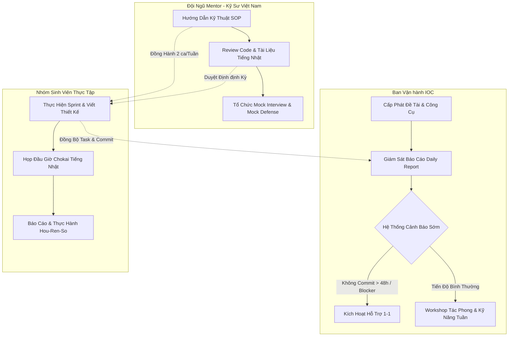

# CHƯƠNG TRÌNH THỰC TẬP FULLSTACK THỰC CHIẾN HƯỚNG NHẬT BẢN - IOC (3 THÁNG OJT)

---

## CHƯƠNG I: TỔNG QUAN & MỤC TIÊU ĐÀO TẠO ĐẦU RA

Chương trình Thực tập Fullstack Hướng Nhật Bản tại IOC được thiết kế đặc biệt dành cho sinh viên IT chuẩn bị sang Nhật làm việc với vai trò Kỹ sư Phần mềm (SE) hoặc Kỹ sư Cầu nối (BrSE). Chương trình không chỉ tập trung vào nâng cao năng lực kỹ thuật mà còn tôi luyện tác phong làm việc chuẩn doanh nghiệp Nhật Bản thông qua dự án nhóm thực chiến.

### 1. Năng lực Chuyên môn Kỹ thuật (Technical Competency)
*   **Kiến trúc & Phát triển Fullstack**: Hoàn thiện dự án End-to-End từ Database, Backend API đến Frontend UI. Sinh viên hiểu rõ bức tranh toàn cảnh của hệ thống và sự tương tác giữa các tầng công nghệ.
*   **Nguyên tắc "No Magic" & Hybrid Control**:
    *   **Frontend**: Được sử dụng các UI Framework hiện đại (React, Vue, Angular) và UI Libraries (Ant Design, MUI, ShadcnUI) để tăng tốc độ phát triển. Tuy nhiên, sinh viên **bắt buộc phải tự viết tay và tùy biến sâu (override) tối thiểu 50% các component cơ sở (base components)** để nắm vững bản chất CSS, DOM, và tối ưu hóa giao diện.
    *   **Backend & Database**: Sử dụng ORM cho các truy vấn đơn giản (CRUD cơ bản). Đối với các luồng nghiệp vụ phức tạp, truy vấn liên bảng lớn hoặc các xử lý yêu cầu hiệu năng cao, sinh viên **bắt buộc sử dụng SQL thuần thông qua Stored Procedures** để rèn luyện tư duy tối ưu hóa CSDL gốc.
*   **Kiểm soát chất lượng mã nguồn**: Sử dụng Git Flow, thực hành viết Clean Code, thực hiện Unit Test và hiểu rõ về bảo mật ứng dụng (các lỗi phổ biến như SQL Injection, XSS, cơ chế mã hóa mật khẩu).

### 2. Kỹ năng Quản trị Dự án & Kỷ luật Agile/Scrum (Project Management)
*   **Kỷ luật Sprint**: Sinh viên đóng vai trò là Product Owner và Developer để tự phân tích bài toán nghiệp vụ, xây dựng Product Backlog, viết User Story với tiêu chí nghiệm thu (Acceptance Criteria - AC) chi tiết.
*   **Vận hành công cụ quản lý**: Sử dụng thành thạo các công cụ quản lý công việc và phát triển phần mềm như Jira, Lark hoặc GitHub Projects. Quản lý tiến độ bằng Issue/Ticket, tuyệt đối không làm việc không có task đi kèm.
*   **Năng lực Giải trình (Engineering Accountability)**: Có khả năng giải thích rõ ràng "Tại sao chọn giải pháp này?" thay vì chỉ "Làm như thế nào?". Mỗi quyết định kỹ thuật phải dựa trên nguyên lý gốc và có sự cân nhắc trade-off.

### 3. Kỹ năng Ứng dụng AI (AI-Assisted Engineering)
*   **Đòn bẩy Hiệu suất**: Học cách sử dụng hiệu quả các AI Code Assistant (Cursor, GitHub Copilot) thông qua kỹ thuật Prompt Engineering để tăng tốc độ viết code, kiểm thử và tìm lỗi.
*   **Ứng dụng AI dịch thuật và nghiệp vụ**: Sử dụng AI để dịch nhanh tài liệu đặc tả (Spec), tạo dữ liệu giả lập (Mock data) cho hệ thống, và viết dự thảo email báo cáo bằng tiếng Nhật.
*   **Kiểm soát chất lượng bằng AI**: Sử dụng AI làm công cụ tự đánh giá code (Self-code review) trước khi gửi PR cho Mentor.

### 4. Tiếng Nhật & Tác phong làm việc kiểu Nhật (Japanese Business Manners)
*   **Vận hành Cuộc họp (朝会 - Chokai & 週次報告 - Shuji Houkoku) linh hoạt**: Thực hành họp hằng ngày (Daily Scrum) bằng tiếng Nhật (khoảng 10-15 phút) **nội bộ giữa các thành viên trong nhóm** để tự rèn luyện phản xạ giao tiếp. Báo cáo tiến độ tuần bằng tiếng Việt (hoặc tiếng Nhật đơn giản) để Mentor người Việt dễ dàng đánh giá kỹ thuật, kết hợp slide báo cáo tiếng Nhật để chuẩn bị cho buổi bảo vệ cuối kỳ.
*   **Tác phong Hou-Ren-So (報連相)**: Rèn luyện kỹ năng **Báo cáo (Houkoku) - Liên lạc (Renraku) - Thảo luận (Soudan)**. Khi gặp blocker kỹ thuật, sinh viên tự nghiên cứu trước, sau đó chủ động liên lạc và thảo luận với đồng đội hoặc Mentor theo đúng quy trình: Nêu vấn đề -> Phương án đã thử -> Đề xuất hỗ trợ. Giao tiếp với Mentor người Việt bằng **tiếng Việt** để giải quyết blocker kỹ thuật nhanh nhất, tránh rào cản ngôn ngữ làm chậm tiến độ dự án.
*   **Tiếng Nhật Chuyên ngành (IT Nihongo) & Giao tiếp**: Viết tài liệu thiết kế hệ thống, comment trong mã nguồn, commit message và mô tả issue bằng tiếng Nhật (có thể sử dụng AI hỗ trợ biên dịch và kiểm tra cấu trúc câu). Sử dụng kính ngữ (Keigo) cơ bản trong các email giả lập gửi khách hàng Nhật.

---

## CHƯƠNG II: MÔ HÌNH VẬN HÀNH CỦA IOC & VAI TRÒ DOANH NGHIỆP

Để đảm bảo sinh viên chuẩn bị sang Nhật đạt chất lượng đầu ra cao nhất, IOC không áp dụng mô hình tự học thả nổi, mà vận hành theo cơ chế đào tạo doanh nghiệp khép kín với các vai trò và hệ thống quản lý rõ ràng.

### Sơ đồ Quy trình Vận hành


### 1. Ban Vận hành IOC (IOC Operations Team)
*   **Cấp phát tài nguyên**: Khởi tạo không gian làm việc (Lark Space/Jira), Git Repository, cấp phát tài liệu đào tạo và phân chia nhóm (3-5 sinh viên/nhóm cân bằng năng lực).
*   **Giám sát tiến độ hằng ngày (Daily Tracking)**:
    *   Hệ thống tự động ghi nhận Daily Report từ sinh viên. Ban vận hành kiểm tra sự khớp nối giữa Daily Report, lịch sử Git Commit và cập nhật trên Kanban Board.
    *   **Hệ thống cảnh báo sớm (Early Warning System)**: Nếu một sinh viên không có commit code hoặc không cập nhật trạng thái công việc trong vòng 48 giờ liên tiếp, hệ thống sẽ gửi cảnh báo đến Ban vận hành và Mentor để tiến hành kiểm tra tình trạng sức khỏe/học tập hoặc gỡ nghẽn khẩn cấp.
*   **Tổ chức Workshop chuyên đề**: Hằng tuần, Ban vận hành phối hợp với các chuyên gia tổ chức các buổi đào tạo bổ trợ về kỹ năng làm việc Nhật Bản (văn hóa cúi chào, cách viết email xin nghỉ phép/báo cáo tiến độ, kỹ năng họp online, cách giao tiếp với khách hàng Nhật).

### 2. Đội ngũ Mentor (Kỹ sư BrSE & Tech Lead)
*   **Tiêu chuẩn tuyển chọn Mentor**: Mentor tại IOC là các Kỹ sư người Việt (Tech Lead hoặc Senior Developer) có tối thiểu 3 năm kinh nghiệm thực chiến, có kinh nghiệm làm việc hoặc hợp tác với các đối tác Nhật Bản, hiểu rõ văn hóa doanh nghiệp Nhật.
*   **Nhịp độ làm việc**: Mentor đồng hành cùng mỗi nhóm **2 buổi/tuần (1.5 giờ/buổi)** theo hình thức review trực tiếp (Offline) hoặc trực tuyến qua Lark/Google Meet.
*   **Cơ chế Ngôn ngữ Linh hoạt của Mentor**:
    *   **Trao đổi Kỹ thuật**: 100% bằng **tiếng Việt** nhằm đảm bảo hiệu quả gỡ blocker tối đa, giúp Mentor truyền đạt rõ ràng các nguyên lý hệ thống, cấu trúc CSDL và kiểm tra tư duy sâu của sinh viên mà không bị giới hạn ngôn ngữ.
    *   **Kiểm soát Đầu ra Tiếng Nhật**: Mentor review chất lượng hiển thị của các sản phẩm đầu ra bằng tiếng Nhật (tài liệu thiết kế, commit message, code comment) bằng cách đối chiếu với spec chuẩn hoặc sử dụng công cụ AI hỗ trợ, đảm bảo sinh viên viết đúng ngữ cảnh kỹ thuật.
*   **Quy trình Hỗ trợ Chuẩn (SOP Mentor)**:
    *   **Không code hộ**: Mentor tuyệt đối không giải quyết bài toán thay sinh viên. Khi sinh viên gặp lỗi (blocker), Mentor dẫn dắt theo cấu trúc: *Phân tích log lỗi -> Giả định nguyên nhân -> Đưa từ khóa/gợi ý -> Sinh viên tự thực hiện kiểm tra và sửa lỗi -> Mentor nghiệm thu*.
    *   **Truy vấn nguồn gốc (The "Why")**: Trong các buổi review, Mentor sẽ chọn ngẫu nhiên các đoạn code phức tạp hoặc thiết kế CSDL để chất vấn sinh viên bằng tiếng Việt: "Tại sao em chọn kiểu dữ liệu này?", "Tại sao đoạn này dùng Stored Procedure mà không dùng ORM?", "Tối ưu hóa ở đây thế nào?".
    *   **Review kép**: Mentor thực hiện song song việc đánh giá chất lượng mã nguồn (Technical Review) và kiểm tra tính hoàn thiện của các tài liệu thiết kế, comment code bằng tiếng Nhật mà sinh viên đã chuẩn bị.

### 3. Quy trình Gating & Mastery Check (Kiểm soát chất lượng nghiêm ngặt)
*   Chương trình được chia làm các mốc đánh giá bắt buộc (Gating Checkpoints).
*   Trước khi chuyển từ Giai đoạn 1 (Nền tảng) sang Giai đoạn 2 (Làm dự án), từng sinh viên phải vượt qua buổi **Mastery Test** về kiến thức nền tảng và cách làm việc.
*   Cuối mỗi Sprint, Mentor tiến hành nghiệm thu theo tiêu chuẩn **DoD (Definition of Done)**: Tính năng chạy đúng Acceptance Criteria + Đạt chuẩn Hybrid (50% Custom FE, SQL cho luồng khó) + Code được viết sạch + Đầy đủ tài liệu spec/thiết kế cập nhật bằng tiếng Nhật.
*   Nếu nhóm không đạt DoD, tính năng đó sẽ bị kéo ngược lại Backlog và nhóm bắt buộc phải cải thiện trong Sprint tiếp theo, không được phép làm tiếp tính năng mới.

---

## CHƯƠNG III: LỘ TRÌNH 12 TUẦN CHI TIẾT (OJT DỰ ÁN NHÓM)

Chương trình kéo dài 12 tuần, chia làm 3 giai đoạn rõ rệt, kết hợp chặt chẽ giữa Kỹ thuật, Agile, AI và Tiếng Nhật/Tác phong.

| Tuần | Trọng tâm Kỹ thuật & AI | Quản trị dự án & Agile | Tiếng Nhật & Tác phong | Vai trò Vận hành / Mentor | Sản phẩm đầu ra |
| :--- | :--- | :--- | :--- | :--- | :--- |
| **Tuần 1** | Cài đặt môi trường phát triển (Docker, Node.js/Java, DB). Làm quen với AI Code Assistant. | Kickoff dự án, chia nhóm. Cài đặt các công cụ quản lý (Jira, Lark, Git). | Học tác phong giao tiếp cơ bản (Chào hỏi, giới thiệu bản thân bằng tiếng Nhật). Quy trình báo cáo công việc. | **Ban vận hành**: Tổ chức kickoff, hướng dẫn sử dụng công cụ, cấp tài nguyên.<br>**Mentor**: Gặp gỡ nhóm, định hướng đề tài. | Môi trường phát triển sẵn sàng. Tài khoản công cụ hoạt động ổn định. |
| **Tuần 2** | Ôn luyện Fullstack nâng cao (thiết kế CSDL chuẩn hóa, viết Stored Procedure cơ bản). Sử dụng AI để sinh Mock data cho DB. | Tìm hiểu nghiệp vụ dự án. Xây dựng sơ đồ thực thể kết hợp (ERD). | Thực hành viết tài liệu Thiết kế cơ bản (Basic Design/Đặc tả yêu cầu) bằng tiếng Việt và chuyển ngữ sang tiếng Nhật. | **Mentor**: Hướng dẫn tư duy thiết kế CSDL thực chiến, review ERD sơ bộ và sửa lỗi tài liệu nghiệp vụ tiếng Nhật. | File ERD chi tiết. Tài liệu thiết kế cơ bản (Basic Design) bằng tiếng Nhật. |
| **Tuần 3** | Setup Boilerplate (Frontend & Backend). Cấu hình Git Flow và quy tắc đặt tên nhánh, commit. | Phân rã tính năng thành Product Backlog. Viết User Story và AC chi tiết cho các Sprint (Sprint 0). | Thống nhất quy tắc viết comment code và commit message bằng tiếng Nhật. Tập viết email báo cáo kickoff dự án. | **Ban vận hành**: Kiểm tra cấu trúc Boilerplate của các nhóm.<br>**Mentor**: Review và phê duyệt Product Backlog, duyệt tài liệu thiết kế kỹ thuật. | Source code Boilerplate đã kết nối DB. Product Backlog trên Jira/Lark. |
| **Tuần 4** | **Sprint 1**: Phát triển tính năng Đăng nhập/Đăng ký, Phân quyền người dùng. Ứng dụng AI viết khung code Auth. | Họp Sprint Planning 1. Phân chia task trên bảng Kanban. Ghi nhận logwork. | Bắt đầu họp đầu giờ (**Chokai**) bằng tiếng Nhật (10 phút hằng ngày). Thực hành báo cáo tiến độ 3 dòng (Đã làm, Sẽ làm, Blocker). | **Ban vận hành**: Giám sát Daily Report và thời gian họp Chokai.<br>**Mentor**: Hướng dẫn về bảo mật cơ bản (JWT, mã hóa mật khẩu), review Sprint 1. | Tính năng Auth hoàn thiện. Bảng Kanban Sprint 1 cập nhật đầy đủ. |
| **Tuần 5** | **Sprint 2**: Phát triển các nghiệp vụ CRUD cơ bản. Bắt buộc tự viết 50% base components cho giao diện (FE). | Họp Sprint Planning 2 và Sprint Review 1. Nghiệm thu tính năng dựa trên AC. | Thực hành tác phong **Hou-Ren-So** linh hoạt (dùng tiếng Nhật trao đổi nội bộ nhóm, tiếng Việt với Mentor) khi gặp blocker về kỹ thuật hoặc giao diện. | **Mentor**: Kiểm tra tỷ lệ tự viết Component (không lạm dụng thư viện UI), review code Backend & DB của Sprint 1. | 50% Base component giao diện được custom. API CRUD cơ bản chạy tốt. |
| **Tuần 6** | **Sprint 3**: Triển khai nghiệp vụ phức tạp. Bắt buộc dùng **Stored Procedure** cho các câu lệnh truy vấn liên bảng lớn. | Họp Sprint Planning 3 và Sprint Review 2. Điều chỉnh Product Backlog (Refinement). | Viết tài liệu Thiết kế chi tiết (Detail Design) bằng tiếng Nhật cho các API nghiệp vụ khó. | **Mentor**: Kiểm tra hiệu năng Stored Procedure, hướng dẫn cách viết thiết kế chi tiết bằng tiếng Nhật chuẩn IT Nhật. | Tài liệu Detail Design tiếng Nhật. Các Stored Procedure nghiệp vụ phức tạp. |
| **Tuần 7** | **Mốc Giữa kỳ (Sprint 4)**: Tích hợp Frontend & Backend cho toàn bộ tính năng cốt lõi. Sử dụng AI hỗ trợ viết Unit Test. | Họp Sprint Planning 4 và Sprint Review 3. Đánh giá tiến độ dự án đạt 60% khối lượng. | **Mock Review Giữa Kỳ**: Nhóm thuyết trình demo sản phẩm bằng tiếng Nhật (10 phút) trước Mentor và đại diện IOC. | **Ban vận hành**: Tổ chức đánh giá giữa kỳ, chấm điểm tác phong nhóm.<br>**Mentor**: Đánh giá năng lực kỹ thuật và giao tiếp tiếng Nhật của từng cá nhân. | Hệ thống chạy thông suốt các luồng chính. Slide và bài thuyết trình giữa kỳ. |
| **Tuần 8** | **Sprint 5**: Phát triển tính năng nâng cao (Thống kê, biểu đồ, xuất nhập file Excel). Dùng AI để refactor code tối ưu hóa. | Họp Sprint Planning 5 và Sprint Review 4. Cập nhật các thay đổi nghiệp vụ phát sinh. | Tiếp tục duy trì Chokai tiếng Nhật. Thực hành viết báo cáo tuần (週次報告) bằng tiếng Nhật gửi Mentor qua email. | **Mentor**: Hướng dẫn giải thuật thống kê, tối ưu hóa câu lệnh SQL liên quan đến báo cáo dữ liệu lớn. | Tính năng báo cáo thống kê hoàn thành. File Excel/PDF xuất ra chuẩn định dạng Nhật. |
| **Tuần 9** | **Sprint 6**: Tối ưu hiệu năng hệ thống (Cấu hình Index DB, Caching). Kiểm tra và vá các lỗ hổng bảo mật. | Họp Sprint Planning 6 và Sprint Review 5. Quản lý chặt chẽ các bug phát sinh trên Jira. | Luyện tập giải trình các quyết định kỹ thuật bằng tiếng Nhật (Ví dụ: Giải thích tại sao cấu hình Index trên cột A thay vì cột B). | **Mentor**: Hướng dẫn Pentest cơ bản hệ thống, kiểm tra chất lượng bảo mật của mã nguồn. | Ứng dụng được tối ưu tốc độ phản hồi API < 200ms. Báo cáo bảo mật cơ bản. |
| **Tuần 10** | **Sprint 7**: Khóa tính năng (Feature Freeze). Tập trung sửa lỗi (Bug fixing) toàn hệ thống. Triển khai ứng dụng (Deployment). | Họp Sprint Planning 7 (chỉ sửa lỗi). Nghiệm thu toàn bộ tính năng theo DoD (Definition of Done). | Viết tài liệu Hướng dẫn sử dụng (User Manual) bằng tiếng Nhật. Viết báo cáo hoàn thành dự án. | **Ban vận hành**: Cấp VPS/Cloud server.<br>**Mentor**: Hướng dẫn quy trình triển khai CI/CD lên server, review tài liệu hướng dẫn sử dụng. | Ứng dụng deploy lên môi trường Production. Tài liệu Hướng dẫn sử dụng bằng tiếng Nhật. |
| **Tuần 11** | **Sprint 8**: Kiểm thử chấp nhận (UAT). Chuẩn bị dữ liệu demo sạch và kịch bản chạy thử (Demo scenario). | Họp Sprint Retrospective tổng kết toàn bộ dự án. Đóng các ticket công việc. | Luyện tập thuyết trình dự án bằng tiếng Nhật. Tập trả lời các câu hỏi Q&A từ khách hàng Nhật. | **Ban vận hành**: Kiểm tra chất lượng triển khai.<br>**Mentor**: Tổ chức **Mock Defense** (Bảo vệ thử) với các nhóm, chỉnh sửa lỗi phát âm, tác phong thuyết trình. | Slide báo cáo hoàn chỉnh. Kịch bản chạy thử demo. Hệ thống UAT ổn định. |
| **Tuần 12** | **Bảo vệ & Đánh giá**: Tổng duyệt hệ thống lần cuối. Đóng băng hoàn toàn mã nguồn và tài liệu. | Kết thúc dự án. Lưu trữ tài nguyên mã nguồn và tài liệu dự án lên kho chung của IOC. | **Buổi Bảo Vệ Dự Án Cuối Kỳ (成果発表会)**: Thuyết trình, chạy demo hệ thống và trả lời câu hỏi phản biện từ Mentor & Khách hàng Nhật. | **Ban vận hành & Mentor**: Đồng hành điều phối buổi bảo vệ. Đánh giá OJT Score đầu ra.<br>**Khách hàng Nhật**: Đánh giá và nhận xét tác phong. | Dự án hoàn thành xuất sắc. Điểm đánh giá OJT Score. Chứng nhận thực tập từ IOC. |

---

## CHƯƠNG IV: QUY TRÌNH KIỂM SOÁT CHẤT LƯỢNG & ĐÁNH GIÁ NĂNG LỰC

Hệ thống đánh giá của IOC được thiết kế đa chiều nhằm phản ánh chính xác năng lực thực tế của sinh viên, đảm bảo khi sang Nhật, sinh viên có thể hòa nhập và làm việc được ngay.

### 1. Cơ cấu Điểm Đánh giá Thực tập (OJT Score)
Điểm số tổng kết của mỗi thực tập sinh được cấu thành từ 4 cột điểm quan trọng sau:

```text
OJT Score (100%) = Kỹ thuật (40%) + Agile & Kỷ luật (20%) + AI & Năng suất (15%) + Tiếng Nhật & Tác phong (25%)
```

#### Cột 1: Năng lực Kỹ thuật & Chất lượng Mã nguồn (Trọng số 40%)
*   **Mức độ hoàn thành tính năng**: Đảm bảo sản phẩm chạy đúng mô tả nghiệp vụ và Acceptance Criteria (AC).
*   **Độ phủ Nguyên lý (Hybrid Control)**: Kiểm tra tỷ lệ tự viết components (đạt tối thiểu 50%) và việc sử dụng Stored Procedures cho các xử lý CSDL phức tạp.
*   **Chất lượng mã nguồn (Clean Code)**: Code có dễ đọc, dễ bảo trì không? Có đúng quy tắc thiết kế hệ thống không?
*   **Minh chứng**: Lịch sử Git Commit, chất lượng Pull Request và kết quả đánh giá DoD cuối mỗi Sprint của Mentor.

#### Cột 2: Kỷ luật Agile/Scrum & Quản trị Dự án (Trọng số 20%)
*   **Kỷ luật Task**: Hoàn thành công việc đúng hạn (Deadline), cập nhật trạng thái task trên Kanban Board thời gian thực.
*   **Logwork & Daily Report**: Ghi nhận thời gian làm việc thực tế và viết báo cáo hằng ngày đầy đủ, chính xác.
*   **Tương tác đồng đội**: Khả năng phối hợp nhóm, phân chia công việc hợp lý trong Sprint.
*   **Minh chứng**: Log lịch sử hoạt động trên Jira/Lark, bảng chấm công của hệ thống.

#### Cột 3: Ứng dụng Công cụ AI & Năng suất (Trọng số 15%)
*   **Tốc độ giải quyết vấn đề**: Đo lường sự gia tăng năng suất khi áp dụng AI Code Assistant.
*   **Kỹ năng viết Prompt**: Khả năng viết các prompt rõ ràng để AI sinh code chính xác, giảm thiểu thời gian chỉnh sửa lại.
*   **Ứng dụng AI dịch thuật và test**: Sử dụng AI dịch đặc tả và sinh testcase hiệu quả.
*   **Minh chứng**: Nhật ký sử dụng AI trong phát triển (thông qua mô tả trong PR hoặc Daily Report).

#### Cột 4: Tiếng Nhật & Tác phong làm việc kiểu Nhật (Trọng số 25%)
*   **Họp Chokai & Thuyết trình**: Tần suất phát biểu, mức độ lưu loát và tự tin khi báo cáo bằng tiếng Nhật trong họp Chokai hằng ngày và họp cuối Sprint.
*   **Tác phong Hou-Ren-So**: Sự chủ động báo cáo tiến độ, liên lạc khi gặp sự cố và thái độ thảo luận tìm giải pháp.
*   **Chất lượng Nhật ngữ trong dự án**: Tính chính xác của tiếng Nhật dùng trong tài liệu thiết kế, comment code và commit message.
*   **Minh chứng**: Video ghi hình các buổi họp Chokai, email báo cáo tuần, các tài liệu thiết kế hệ thống bằng tiếng Nhật.

### 2. Ma trận Năng lực Đầu ra (Competency Matrix)
Dựa trên điểm OJT Score, sinh viên được xếp loại năng lực theo các cấp độ để đánh giá khả năng sẵn sàng làm việc tại Nhật Bản:

| Cấp độ | Khoảng điểm OJT | Đánh giá Khả năng Sẵn sàng (Ready-to-Japan) |
| :---: | :---: | :--- |
| **S (Xuất sắc)** | **90 - 100** | **Vượt trội**: Nắm vững kỹ thuật, tác phong Hou-Ren-So xuất sắc, giao tiếp tiếng Nhật trôi chảy, sử dụng AI thành thạo để tối ưu hiệu suất. Sẵn sàng nhận việc với vai trò Kỹ sư/BrSE ngay khi sang Nhật mà không cần đào tạo lại. |
| **A (Tốt)** | **80 - 89** | **Đạt yêu cầu**: Hoàn thành tốt các yêu cầu kỹ thuật, thực hiện đúng quy trình Agile và Hou-Ren-So. Có khả năng tự lập giải quyết vấn đề dưới sự hướng dẫn tối thiểu. |
| **B (Trung bình)** | **70 - 79** | **Cần giám sát**: Kỹ thuật ở mức cơ bản, tác phong làm việc đôi lúc còn thiếu chủ động, tiếng Nhật cần cải thiện thêm. Cần có sự kèm cặp của Senior khi mới sang Nhật làm việc. |
| **C/F (Yếu/Kém)** | **< 70** | **Chưa sẵn sàng**: Kỹ thuật yếu, vi phạm kỷ luật Agile, không thực hiện Hou-Ren-So tốt hoặc không giao tiếp được bằng tiếng Nhật. Cần phải học lại hoặc kéo dài thời gian thực tập. |

---

## CHƯƠNG V: QUY TRÌNH BẢO VỆ DỰ ÁN CUỐI KỲ TRƯỚC KHÁCH NHẬT (成果発表会)

Buổi bảo vệ dự án cuối kỳ (成果発表会 - Seika Happyoukai) là mốc quan trọng nhất của chương trình, nơi sinh viên chứng minh toàn bộ năng lực đã tích lũy trước khách hàng Nhật Bản. Sự tham gia của khách Nhật đóng vai trò là bên đánh giá độc lập, chấm điểm độ khớp của sinh viên với môi trường làm việc thực tế tại Nhật.

### 1. Kịch bản Vận hành Buổi Bảo vệ (Chi tiết từng phút)
*   **Thời gian**: Khoảng 40 phút cho mỗi nhóm.
*   **Ngôn ngữ**: 100% bằng tiếng Nhật.

| Thời gian | Nội dung chi tiết | Bên thực hiện | Vai trò của Doanh nghiệp (IOC) |
| :--- | :--- | :--- | :--- |
| **00:00 - 00:05** | **Khai mạc & Giới thiệu thành phần tham dự**: Tuyên bố lý do, giới thiệu Ban giám khảo (Mentor, Khách hàng Nhật, Đại diện IOC). | Ban tổ chức IOC | **Ban vận hành**: Chuẩn bị phòng họp trực tuyến/trực tiếp, slide giới thiệu chung và link đánh giá cho khách hàng. |
| **00:05 - 00:10** | **Báo cáo tóm tắt quá trình đào tạo**: Đại diện IOC trình bày ngắn gọn về quá trình 3 tháng rèn luyện của sinh viên, nhấn mạnh các mốc kiểm soát chất lượng (DoD, Gating). | Đại diện IOC | **Đại diện IOC**: Phát biểu để tạo niềm tin với khách Nhật về chất lượng đầu ra của học viên. |
| **00:10 - 00:25** | **Thuyết trình nhóm & Demo Sản phẩm**: Nhóm sinh viên thuyết trình slide báo cáo dự án bằng tiếng Nhật và thực hiện chạy demo trực tiếp hệ thống theo kịch bản chuẩn bị sẵn. | Nhóm sinh viên thực tập | **Mentor**: Đứng sau hỗ trợ kỹ thuật (nếu có sự cố đường truyền), tuyệt đối không nói thay sinh viên. |
| **00:25 - 00:35** | **Phản biện & Q&A**: Khách hàng Nhật và Mentor đặt câu hỏi trực tiếp bằng tiếng Nhật xoáy vào nghiệp vụ, kỹ thuật hệ thống, cách ứng dụng AI và quy trình quản lý dự án. Sinh viên trực tiếp trả lời. | Khách hàng Nhật, Mentor, Nhóm sinh viên | **Mentor**: Ghi nhận các câu hỏi khó của khách Nhật để bổ sung vào ngân hàng câu hỏi phỏng vấn sau này. |
| **00:35 - 00:40** | **Nhận xét tác phong & Tổng kết**: Khách hàng Nhật nhận xét về thái độ thuyết trình, ngôn ngữ giao tiếp, tác phong chuẩn bị và độ hoàn thiện của sản phẩm. | Khách hàng Nhật, Ban giám khảo | **Ban vận hành**: Thu thập phiếu đánh giá từ khách Nhật, chụp ảnh lưu niệm và tiến hành bế mạc. |

### 2. Khung Cấu trúc Slide Báo cáo Chuẩn Nhật (成果発表資料)
Slide báo cáo của nhóm sinh viên phải tuân thủ cấu trúc chuyên nghiệp, trình bày rõ ràng, trực quan (nhiều hình ảnh, biểu đồ, sơ đồ, ít chữ dài dòng):

*   **Slide 1: Trang bìa (表紙)**: Tên dự án, tên nhóm, danh sách thành viên kèm vai trò trong dự án (Project Leader, Backend Dev, Frontend Dev), thời gian thực hiện.
*   **Slide 2: Mục tiêu & Nghiệp vụ Dự án (プロジェクト概要)**: Hệ thống này giải quyết vấn đề gì? Đối tượng người dùng là ai? Tại sao nghiệp vụ này lại cần thiết?
*   **Slide 3: Thiết kế Hệ thống & CSDL (システム構成 & DB設計)**: Sơ đồ kiến trúc (Architecture Diagram), sơ đồ ERD các bảng dữ liệu trọng tâm. Thể hiện các công nghệ sử dụng.
*   **Slide 4: Quy trình Agile/Scrum & Ứng dụng AI (アジャイル開発 & AI活用)**: Tổng số Sprint đã chạy. Cách nhóm sử dụng AI để dịch tài liệu nghiệp vụ, viết testcase và tăng năng suất viết code.
*   **Slide 5: Demo Tính năng cốt lõi (デモンストレーション)**: Video hoặc chạy trực tiếp (Live demo) các luồng tính năng chính của hệ thống.
*   **Slide 6: Điểm tự hào kỹ thuật & Bài học kinh nghiệm (技術的アピール & 振り返り)**: Show trực tiếp source code phần Stored Procedure nghiệp vụ phức tạp hoặc các component custom tự viết. Nêu các khó khăn đã gặp và cách nhóm đã áp dụng Hou-Ren-So để vượt qua.
*   **Slide 7: Lời cảm ơn & Q&A (質疑応答)**: Trân trọng cảm ơn khách hàng và Mentor đã lắng nghe và sẵn sàng nhận câu hỏi.

### 3. Bộ Câu hỏi Q&A Thường gặp từ Khách Nhật & Gợi ý Cách Trả lời
Khách hàng Nhật rất quan tâm đến quá trình làm việc thực chất và khả năng giải quyết vấn đề của từng cá nhân. Dưới đây là các câu hỏi phổ biến và định hướng trả lời thông minh cho sinh viên:

#### Câu hỏi 1: Về Phân chia Công việc và Quản trị
*   *Câu hỏi từ khách Nhật*: "Trong dự án nhóm này, khi có một thành viên bị chậm tiến độ (delay) làm ảnh hưởng đến các task tiếp theo của nhóm, các bạn đã giải quyết như thế nào?"
*   *Định hướng trả lời*: Sinh viên cần nhấn mạnh quy trình quản lý của nhóm. "Chúng tôi họp Chokai hằng ngày để theo dõi bảng Kanban. Khi phát hiện task của bạn A bị nghẽn (Blocker), Leader nhóm đã ngay lập tức thực hiện Hou-Ren-So. Chúng tôi phân tích nguyên nhân: bạn A gặp khó khăn trong việc viết Stored Procedure phức tạp. Cả nhóm đã thống nhất điều chuyển bớt task Frontend đơn giản của bạn B sang cho bạn A, đồng thời bạn B (có kỹ năng DB tốt hơn) đã cùng bạn A thảo luận (Soudan) và hướng dẫn giải quyết lỗi DB. Nhờ vậy, chúng tôi vẫn hoàn thành mục tiêu Sprint đúng hạn."

#### Câu hỏi 2: Về Quyết định Kỹ thuật (Tư duy First Principles)
*   *Câu hỏi từ khách Nhật*: "Tại sao các bạn lại tự viết lại các base component thay vì dùng 100% thư viện UI như MUI hay Ant Design? Như vậy có làm giảm tốc độ phát triển dự án không?"
*   *Định hướng trả lời*: "Mục tiêu của chúng tôi khi tham gia chương trình thực tập tại IOC là hiểu rõ bản chất công nghệ chứ không chỉ lắp ghép thư viện có sẵn (nguyên tắc No Magic). Việc tự viết lại 50% base component giúp chúng tôi làm chủ cấu trúc CSS, tối ưu hóa kích thước ứng dụng và dễ dàng tùy biến giao diện theo đúng đặc tả yêu cầu của khách hàng mà không bị phụ thuộc vào giới hạn của thư viện. Dù thời gian đầu có chậm hơn một chút, nhưng ở các Sprint sau, khi các base component đã ổn định, tốc độ phát triển của nhóm đã tăng lên đáng kể."

#### Câu hỏi 3: Về Ứng dụng AI
*   *Câu hỏi từ khách Nhật*: "Các bạn sử dụng AI rất nhiều trong dự án. Làm sao các bạn đảm bảo được code do AI sinh ra là an toàn, không chứa lỗi logic hoặc rò rỉ dữ liệu?"
*   *Định hướng trả lời*: "Chúng tôi sử dụng AI làm công cụ hỗ trợ tăng năng suất (Code Assistant) chứ không phụ thuộc hoàn toàn. Quy trình của chúng tôi là: AI sinh mã nguồn -> Sinh viên trực tiếp đọc hiểu từng dòng code để kiểm tra logic -> Viết Unit Test để xác minh tính đúng đắn của code -> Thực hiện quy trình Self-code review bằng cách hỏi AI về các nguy cơ bảo mật tiềm ẩn (như SQL Injection hay XSS) -> Gửi Pull Request để Mentor review lần cuối trước khi merge. Chúng tôi chịu trách nhiệm 100% cho dòng code được merge chứ không phải AI."

#### Câu hỏi 4: Về Tác phong và Giao tiếp (Hou-Ren-So)
*   *Câu hỏi từ khách Nhật*: "Khi các bạn không thể hoàn thành task đúng hạn như đã cam kết trong Sprint Planning, các bạn sẽ làm gì?"
*   *Định hướng trả lời*: "Ngay khi ước lượng (estimate) thấy task có nguy cơ không hoàn thành đúng hạn (tối thiểu trước deadline 1 ngày), chúng tôi sẽ thực hiện báo cáo (Houkoku) và liên lạc (Renraku) ngay với Mentor. Chúng tôi sẽ không đợi đến buổi họp Review cuối Sprint mới nói. Báo cáo của chúng tôi sẽ nêu rõ: Tình trạng hiện tại của task (đạt bao nhiêu %), lý do chậm trễ (gặp lỗi kỹ thuật phát sinh ngoài dự kiến), thời gian dự kiến hoàn thành mới, và đề xuất nhờ sự trợ giúp từ đồng đội (Soudan). Điều này giúp Mentor và Ban vận hành luôn nắm bắt được trạng thái thực tế của dự án."
