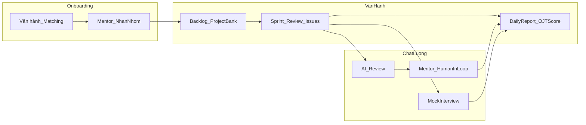

# Quy trình Vận hành Tiêu chuẩn (SOP) — Mentor IOC

| Thuộc tính | Giá trị |
| :--- | :--- |
| **Phiên bản** | 1.0 |
| **Ngày hiệu lực** | 20/03/2026 |
| **Phạm vi** | Mentor trên nền tảng Internship OneConnect |

---

## 1. Mục đích và phạm vi áp dụng

Tài liệu SOP này chuẩn hóa cách Mentor vận hành hỗ trợ sinh viên trong chương trình IOC nhằm đảm bảo:

- **Chất lượng đầu ra**: sinh viên hoàn thành project đạt yêu cầu theo chương trình.
- **Trải nghiệm nhất quán**: cách hỗ trợ, cách chốt “next step”, cách follow-up rõ ràng.
- **Minh bạch đối soát**: giờ làm việc và KPI có bằng chứng để tính thu nhập theo công thức.

### 1.1. Phạm vi

- Áp dụng cho toàn bộ Mentor (CTV) tham gia hướng dẫn sinh viên thuộc các gói dịch vụ của IOC.
- Mentoring diễn ra theo **các ca cố định**, qua **Google/Lark Meet** hoặc **offline trực tiếp** (tùy gói dịch vụ/điều kiện).

### 1.2. Cách sử dụng tài liệu

- Mentor đọc Mục 3 để nắm nguyên tắc sư phạm bắt buộc.
- Mentor vận hành theo checklist ở Mục 5 và quy trình hỗ trợ ở Mục 6.
- Khi có ngoại lệ (đổi lịch, sự cố, vi phạm), xử lý theo eskalation ở Mục 7.4 và quy định vận hành liên quan.

---

## 2. Định nghĩa Mentor

Trong IOC, **Mentor là các Cộng tác viên**, được để hướng dẫn các nhóm thực tập. Mentor chịu trách nhiệm hướng dẫn chuyên môn như review task, điều chỉnh backlog theo năng lực, chấm điểm OJT,... cho đến các công việc như định hướng, động viên, truyền cảm hứng,...

### 2.2. Tiêu chuẩn Mentor

#### 2.2.1. Tiêu chuẩn bắt buộc

- **Chuyên môn**:
  - Có kinh nghiệm thực chiến đúng mảng mentoring (ví dụ Web backend/frontend/fullstack).
  - Nắm chắc kiến thức cơ bản, có khả năng review và hướng dẫn theo “nguyên lý + phương pháp”.
  - Am hiểu quy trình và các mô hình quản lý dự án.
- **Kỹ năng mentoring**:
  - Diễn đạt rõ ràng, có cấu trúc.
  - Khả năng chẩn đoán vấn đề dựa trên ngữ cảnh và đặt câu hỏi đúng.
- **Kỷ luật & trách nhiệm**:
  - Cam kết tham gia ca đúng giờ; không hủy sát giờ.
  - Chấm/nhận xét đúng hạn theo quy định gói dịch vụ/ban điều hành.
- **Bảo mật & đạo đức**:
  - Không chia sẻ dữ liệu/đoạn chat/record ra ngoài.
  - Không “làm hộ” sản phẩm.

#### 2.2.2. Tiêu chuẩn ưu tiên

- Có kinh nghiệm phỏng vấn/đào tạo nội bộ, từng dẫn dắt junior/intern.
- Có khả năng xử lý ca khó (debug phức tạp, thiết kế hệ thống, performance).
- Có portfolio/LinkedIn rõ ràng, uy tín cộng đồng.
- Có khả năng xây dựng thương hiệu cá nhân, hỗ trợ làm truyền thông.

#### 2.2.3. Điều kiện tối thiểu về vận hành

- Thiết bị & đường truyền ổn định (âm thanh rõ, mạng ổn định cho Meet).
- Có khả năng lưu vết: recap sau ca, ghi nhận timesheet và bằng chứng.

### 2.3. Quy trình tuyển chọn Mentor (CTV)

Quy trình khuyến nghị (Operations có thể điều chỉnh theo từng đợt):

1. **Mở nhu cầu**: xác định số lượng Mentor còn thiếu, mảng chuyên môn, số ca/tuần, hình thức (Meet/offline), mức R/K_level dự kiến. Ưu tiên tìm qua nội bộ trước
2. **Nhận hồ sơ**: CV/LinkedIn/portfolio + form thông tin (kỹ năng, thời gian rảnh, địa điểm offline nếu có).
3. **Sàng lọc nhanh (15–20 phút)**:
   - Fit thời gian ca cố định, thái độ, cam kết kỷ luật.
   - Check red flags (không phù hợp đạo đức, hay hủy lịch, thiếu minh bạch).
4. **Đánh giá chuyên môn (60–90 phút)** (chọn 1 hoặc kết hợp):
   - Review 1 đoạn code/sample + hỏi “tại sao” (clean code, design, trade-off).
   - Debug tình huống (log lỗi, bug chặn flow).
   - Thiết kế mini (API + DB + luồng auth cơ bản).
5. **Đánh giá năng lực mentoring (30–45 phút)**:
   - Role-play: ứng viên hướng dẫn “một SV bị blocker” và phải chốt “next step”.
   - Tiêu chí: cấu trúc, ngôn ngữ, không làm hộ, có plan follow-up.
6. **Onboarding & thử ca (Trial)**:
   - Học SOP, quy định bảo mật, cách ghi nhận timesheet/bằng chứng.
   - Chạy 1–2 ca trial có người quan sát (Operations/Senior Mentor) và nhận feedback.
7. **Chốt hợp tác**:
   - Chốt R, K_level, lịch ca, quy định K_perf, phương thức đối soát–thanh toán.
   - Ký thỏa thuận CTV + cam kết bảo mật.

### 2.4. Kênh tuyển dụng Mentor (CTV)

- **Giới thiệu nội bộ (Referral)**: từ network dev/mentor/giảng viên/đối tác doanh nghiệp.
- **Cộng đồng chuyên môn**:
  - Nhóm Facebook/Discord/Zalo về lập trình (backend/frontend/fullstack).
  - Cộng đồng tech địa phương (meetup, coworking).
- **Nền tảng nghề nghiệp**:
  - LinkedIn (post + outreach theo keyword/stack).
  - TopCV/VietnamWorks (nếu cần mở rộng tệp).
- **Hợp tác trường/CLB**:
  - Mời cựu SV giỏi/leader CLB kỹ thuật tham gia mentoring theo ca.
- **Freelance network**:
  - Kênh freelancer/mentor network (ưu tiên người có lịch rảnh cố định và có track record).

### 2.5. Quy trình đào tạo Mentor mới (Onboarding & Enablement)

Mục tiêu của đào tạo Mentor mới là đảm bảo Mentor:
- Hiểu đúng triết lý mentoring của IOC (không làm hộ, ưu tiên “nguyên lý + phương pháp”).
- Vận hành được theo **ca cố định** (Meet/offline), biết chốt “next step” và follow-up.
- Ghi nhận đúng **timesheet + bằng chứng**, và hiểu cơ chế tính thu nhập theo KPI.
- Tuân thủ bảo mật và quy tắc đạo đức nghề nghiệp.

#### 2.5.1. Giai đoạn 0 — Trước khi lên ca (T-3 đến T-1 ngày)

- **Nhận bộ tài liệu bắt buộc**:
  - SOP Mentor (tài liệu này): Mục 1–8.
  - Quy định bảo mật & đạo đức CTV (NDA/thoả thuận hợp tác).
  - Mô tả gói dịch vụ đang tham gia (nội dung dạy, số ca, hình thức Meet/offline, tiêu chí nghiệm thu).
- **Thiết lập công cụ**:
  - Google/Lark Calendar (lịch ca), Google/Lark Meet, kênh chat nhóm.
  - Mẫu recap sau ca và mẫu timesheet (theo chuẩn IOC).

#### 2.5.2. Giai đoạn 1 — Đào tạo chuẩn vận hành (0.5 ngày)

- **Module A — Quy trình hỗ trợ theo ca** (Mục 6):
  - Cách gom câu hỏi trước ca, ưu tiên blocker, cách điều phối trong ca.
  - Format chốt “next step” sau ca (ngắn, rõ, có tiêu chí Done).
- **Module B — Chấm điểm/KPI/thu nhập** (Mục 2.1):
  - Cách tính `Total = (H * R * K_level) * K_perf`.
  - 3 tiêu chí KPI (đầu ra project, đánh giá SV, kỷ luật) và cách thu thập bằng chứng.
- **Module C — Bảo mật & đạo đức**:
  - Không chia sẻ thông tin nội bộ, không nhận tiền riêng, không làm hộ bài.
  - Không record/lan truyền nội dung Meet/offline nếu không được phép.

#### 2.5.3. Giai đoạn 2 — Tham gia học hỏi (1–2 ca)

- Mentor mới **dự thính** ca của Mentor giàu kinh nghiệm (Senior/đầu mối vận hành).
- Nhiệm vụ: ghi chú cách đặt câu hỏi, cách debug, cách chốt “next step”, cách xử lý tình huống khó.
- Sau ca: viết recap thử (bản nháp) và nhận feedback.

#### 2.5.4. Giai đoạn 3 — Co-mentor (1–2 ca)

- Mentor mới **đứng hỗ trợ một phần** (ví dụ 20–30% case) dưới giám sát.
- Tiêu chí đạt:
  - Chốt “next step” rõ ràng cho case phụ trách.
  - Không làm hộ; hướng dẫn đúng phương pháp.
  - Recap + timesheet đầy đủ bằng chứng.

#### 2.5.5. Giai đoạn 4 — Trial độc lập có giám sát (2–4 ca)

- Mentor mới chạy ca độc lập; Operations/Senior Mentor audit ngẫu nhiên qua recap/bằng chứng.
- Checklist đánh giá trial:
  - **Đầu ra ca**: recap rõ, có kế hoạch follow-up.
  - **Kỷ luật**: đúng giờ, không hủy sát giờ.
  - **Phản hồi SV**: khảo sát nhanh sau ca (nếu áp dụng).
  - **Ghi nhận**: timesheet hợp lệ, bằng chứng đủ.

#### 2.5.6. Chốt chuẩn & xếp level

- Sau trial, ban điều hành/Operations chốt:
  - **K_level** khởi điểm (Mentor Chính thức/Senior).
  - Lịch ca cố định theo tuần.
  - Các yêu cầu đặc thù của gói dịch vụ (offline/Meet, số ca, tiêu chí nghiệm thu).
- Nếu chưa đạt: kéo dài co-mentor/trial thêm 1–2 ca hoặc dừng hợp tác.

### 2.6. Cơ chế trần tải Mentor (mức giờ tối đa/tuần)

Mục tiêu là đảm bảo Mentor có đủ “băng thông” để hướng dẫn chất lượng, tránh quá tải dẫn đến giảm chất lượng đầu ra và trải nghiệm sinh viên.

#### 2.6.1. Mức trần khuyến nghị

- **Mentor Chính thức (K_level = 1.0)**:
  - **Soft-cap**: 8 giờ/tuần
  - **Hard-cap**: 12 giờ/tuần
- **Senior Mentor (K_level = 1.2+)**:
  - **Soft-cap**: 10 giờ/tuần
  - **Hard-cap**: 15 giờ/tuần

Định nghĩa:
- **Soft-cap**: ngưỡng khuyến nghị. Vượt soft-cap yêu cầu Operations xem xét (độ khó nhóm, tỷ lệ pass, điểm đánh giá SV).
- **Hard-cap**: ngưỡng tối đa. Không phân bổ thêm ca/sinh viên trừ khi có quyết định của ban điều hành IOC (và phải có cơ chế bù tải).

#### 2.6.3. Quy tắc xử lý khi vượt trần

- **Ưu tiên 1**: tách nhóm/giảm số sinh viên trên mỗi ca hoặc tăng số ca nhưng **chia cho 2 mentor** (co-mentor).
- **Ưu tiên 2**: chuyển một phần sinh viên/nhóm sang mentor khác có lịch ca phù hợp.
- **Ưu tiên 3**: nếu bắt buộc giữ mentor (case đặc thù), Operations phải:
  - Chốt thời hạn vượt trần (ví dụ 1–2 tuần)
  - Tăng lực hỗ trợ (Senior hỗ trợ ca khó) hoặc giảm scope kỳ vọng theo gói dịch vụ
  - Theo dõi sát 3 tiêu chí KPI (pass dự án, đánh giá SV, kỷ luật)

### 2.7. Nguyên tắc phân bổ sinh viên cho Mentor (theo trường hoặc cá nhân)

Phân bổ phải đảm bảo **fit chuyên môn – fit lịch ca – công bằng tải – chất lượng đầu ra**.

#### 2.7.1. Nguyên tắc chung (áp dụng mọi trường hợp)

- **Fit lịch ca (bắt buộc)**: sinh viên chỉ được phân bổ vào mentor có ca phù hợp với lịch học/làm của sinh viên.
- **Fit chuyên môn (bắt buộc)**: mentor phải đúng stack/mảng chính của chương trình (FE/BE/Fullstack).
- **Không vượt hard-cap**.
- **Ổn định mentor**: hạn chế đổi mentor giữa kỳ; chỉ đổi khi có lý do vận hành rõ ràng (xung đột, vi phạm, quá tải, không phù hợp).

#### 2.7.2. Phân bổ theo trường

Áp dụng khi có danh sách sinh viên theo trường/khoa (B2B hoặc cohort B2C):

- **Ưu tiên theo cụm**: gom sinh viên cùng trường vào cùng một “cụm ca” để dễ vận hành.
- **Cân tải theo tỷ lệ**: phân theo số SV active và độ khó (nếu có baseline đầu vào).
- **Cơ chế dự phòng**: mỗi cohort nên có ít nhất 1 mentor dự phòng để thay ca khi mentor chính bận/ốm.

#### 2.7.3. Phân bổ theo cá nhân (B2C tự do)

Áp dụng khi sinh viên đăng ký lẻ:

- **Matching theo mục tiêu + lịch**: lịch ca là điều kiện tiên quyết, sau đó mới match theo stack.
- **Ưu tiên mentor có KPI tốt** (điểm pass dự án + điểm đánh giá SV) cho các case khó/high-risk.
- **Fairness**: tránh dồn case khó liên tục cho 1 mentor; luân phiên phân bổ theo tuần.

#### 2.7.4. Quy tắc đổi mentor (re-assignment)

Chỉ đổi mentor khi:
- Mentor vượt hard-cap kéo dài hoặc vắng ca nhiều lần
- Xung đột/vi phạm quy tắc (bảo mật, đạo đức, nhận tiền riêng, làm hộ)
- Không phù hợp chuyên môn (stack mismatch) làm ảnh hưởng tiến độ

Khi đổi mentor:
- Operations lập biên bản lý do + thời điểm hiệu lực
- Mentor bàn giao “tình trạng SV” (điểm đang nghẽn, next step) và lịch ca tiếp theo

---

## 3. Chuẩn sư phạm

1. **Không dạy lại lý thuyết cơ bản trong giờ mentor–nhóm.** Hướng sinh viên sang LMS/tài liệu; thời gian chung dùng cho thực chiến, gỡ lỗi logic, kiến trúc, mindset kỹ sư.

2. **Giảm passive dependency:** Yêu cầu sinh viên mô tả đã thử gì, đã đọc gì trước khi trả lời; can thiệp sâu khi có **block kỹ năng kéo dài** hoặc cảnh báo Mastery từ hệ thống.

3. **Đánh giá dựa trên bằng chứng:** Daily Report, lịch sử Issue, kết quả test/quiz, mã nguồn, mock interview — không chấm “cảm tính” không có log.

4. **Tôn trọng Competency-Based Training:** Đầu ra theo **mức thành thạo**, không theo số giờ ngồi học; Mentor điều chỉnh lộ trình cho phù hợp.

---

## 4. Quy trình theo vòng đời nhóm thực tập

Mentor vận hành nhóm chủ yếu qua 3 kênh: **tin nhắn**, **Google/Lark Meet**, và **offline trực tiếp** (nếu gói dịch vụ/điều kiện cho phép). Các giai đoạn dưới đây được map sang hành động cụ thể của Mentor.

| Giai đoạn | Hành động SOP Mentor | Output / Ghi nhận |
| :--- | :--- | :--- |
| **Nhận sinh viên** | Đọc hồ sơ, baseline test đầu vào (nếu có); họp kickoff ngắn: mục tiêu kỳ, kênh chat, quy trình làm việc. | Biên bản kickoff (tin nhắn/ghi chú group) |
| **Chờ sinh viên / chờ dự án** | Xác nhận đủ thành viên; chọn **Space Template** (Scrum/Kanban/Waterfall/Custom); chọn hoặc clone dự án từ **Project Bank** hoặc dự án **Blank** để sinh viên tự tạo ra dự án của riêng mình; tinh chỉnh backlog (có thể dùng gợi ý AI). | Board khởi tạo, backlog sprint 1 (hoặc phase 1) |
| **Sprint / phase vận hành** | Cung cấp kiến thức, tài liệu e-learning để hỗ trợ sinh viên. Tiếp nhận câu hỏi trước ca (qua tin nhắn) và **xử lý trong ca cố định** bằng Google/Lark Meet hoặc offline; khi cần có thể follow-up ngoài ca theo điều phối; giao việc theo **Adaptive OJT**; review theo bằng chứng. Giải thích mọi thứ theo nguyên lý. | Tóm tắt “next step” sau ca + link Meet/biên bản offline |
| **Mastery / Gating** | Không “mở khóa” task nâng cao nếu chưa đạt ngưỡng (test/mock); khi SV nghẽn — tổ chức 1:1 qua Meet hoặc offline (có kế hoạch). | Notes/biên bản + tiêu chí đạt/không đạt |
| **Đóng kỳ** | Hoàn tất **OJT Score** theo **Score Template**; nhận xét tổng kết có minh chứng (link issue, PR, báo cáo); góp ý portfolio/CV trong phạm vi chương trình. | Bảng điểm OJT, báo cáo cuối kỳ cho B2B nếu yêu cầu |

---

### 5. Cơ chế thu nhập và chi trả cho Mentor (CTV)

IOC áp dụng cơ chế **Thu nhập theo Giờ & Hiệu suất (Hourly + KPI)**. Cách tính này minh bạch, dễ đối soát và tạo động lực để Mentor/CTV vận hành hiệu quả, thực chất.

#### 5.1. Công thức tính tổng thu nhập (tháng)

Tổng thu nhập tháng được tính theo:

```text
Total = (H * R * K_level) * K_perf
```

Trong đó:

- **H (Hours)**: Tổng số giờ làm việc thực tế trong tháng (được ghi nhận qua timesheet + log hệ thống).
- **R (Rate)**: Đơn giá giờ cơ bản. **Hiện tại: 80.000đ/giờ**.
- **K_level**: Hệ số năng lực theo cấp độ Mentor (mentor càng kinh nghiệm hệ số càng cao).
- **K_perf**: Hệ số hoàn thành công việc theo KPI (từ 0 đến 1.2 tùy kết quả đánh giá) và được dùng để nhân vào toàn bộ thu nhập theo giờ trong tháng.

#### 5.2. Đơn vị tính, đơn giá giờ và nguyên tắc áp dụng

- **Đơn vị tính duy nhất:** **Giờ (hour)**. Tất cả hoạt động Mentor đều quy đổi và đối soát theo giờ.
- **Đơn giá giờ cơ bản (R)**: là mức sàn áp dụng cho CTV mới/tập sự và là “mỏ neo” để tính chi trả theo năng lực. **Hiện tại: 80.000đ/giờ**.  
  - **Đơn giá giờ thực nhận** được xác định theo `R * K_level` (chưa bao gồm thưởng KPI).

**Lưu ý quan trọng:** chi tiết về **nội dung giảng dạy**, **bố trí thời gian**, **giảng dạy thế nào** (có/không có mock interview, số buổi, tần suất, phạm vi kèm, v.v.) là do **từng gói dịch vụ** quy định.

#### 5.3. Bảng phân cấp Mentor và hệ số năng lực (K_level) (tham khảo)

IOC phân cấp để tạo lộ trình thăng tiến và phản ánh năng lực. Bảng dưới là tham khảo để quy đổi hệ số:

| Cấp bậc | K_level | Đặc điểm vai trò |
| :--- | :---: | :--- |
| **Mentor Chính thức** | 1.0 | Nắm vững quy trình và mentor được cho sinh viên ở mức tiêu chuẩn |
| **Senior Mentor** | 1.2+ | Được sự đánh giá cao sinh viên, có nhiều kết quả tốt trong công việc training |


#### 5.4. Cách tính hệ số hoàn thành (K_perf) theo KPI

KPI dùng để “uốn nắn” hành vi Mentor theo mục tiêu vận hành. **Không sử dụng chỉ số phản hồi**. IOC chấm điểm theo **3 tiêu chí** (tổng 100 điểm):

- **Tiêu chí 1 — Kết quả đầu ra dự án đạt yêu cầu theo chương trình** (tối đa 40 điểm): tính trung bình điểm số về việc đáp ứng chuẩn cấu trúc mã nguồn theo chương trình của sinh viên phụ trách ở kỳ đánh giá.
  - ≥ 90%: 40 điểm
  - 80–89%: 30 điểm
  - 70–79%: 20 điểm
  - 60–69%: 10 điểm
  - < 60%: 0 điểm

- **Tiêu chí 2 — Điểm đánh giá Mentor từ sinh viên** (tối đa 20 điểm): dùng điểm khảo sát theo thang điểm của IOC.
  - Điểm trung bình ≥ 4.7/5: 20 điểm
  - 4.3–4.69/5: 15 điểm
  - 4.0–4.29/5: 10 điểm
  - 3.7–3.99/5: 5 điểm
  - < 3.7/5: 0 điểm

- **Tiêu chí 3 — Kỷ luật** (tối đa 40 điểm):
  - **Đúng lịch Meet/Offline**: tỷ lệ tham gia đúng giờ/không hủy sát giờ:  
    - ≥ 95%: 15 điểm; 90–94%: 10 điểm; 80–89%: 5 điểm; < 80%: 0 điểm.
  - **Đúng hạn chấm/nhận xét**:  
    - ≥ 95% đúng hạn: 15 điểm; 90–94%: 10 điểm; 80–89%: 5 điểm; < 80%: 0 điểm.
  - **Tuân thủ bảo mật & báo cáo**:  
    - 10 điểm nếu **0 vi phạm**; có 1 vi phạm nhẹ: 5 điểm; vi phạm nghiêm trọng: 0 điểm (và xử lý theo quy định).

- **Bằng chứng ghi nhận (điều kiện để được tính KPI & timesheet)**:
  - **Google/Lark Meet**: link lịch (Calendar) + thời lượng + recap/tóm tắt sau buổi (gửi lại nhóm chat).
  - **Offline**: có xác nhận đầu mối/vận hành.

Ví dụ quy đổi K_perf (ban điều hành IOC có quyền chốt):

| Mức | Điểm KPI | K_perf | Ý nghĩa |
| :--- | :---: | :---: | :--- |
| **Xuất sắc** | 90-100 | 1.2 | **Chỉ áp dụng khi có thành tích đặc biệt và được ban điều hành IOC khen thưởng/chốt trong tháng**; khi áp dụng sẽ tăng 20% trên tổng thu nhập theo giờ trong tháng |
| **Tốt** | 85–100 | 1.0 | Giữ nguyên tổng thu nhập theo giờ trong tháng |
| **Trung bình** | 70–85 | 0.8 | Giảm 20% thu nhập theo giờ trong tháng |
| **Cần cố gắng** | < 70 | 0.5 | Giảm 50% trên tổng thu nhập theo giờ trong tháng |

#### 5.5. Quy tắc ghi nhận thời gian (timesheet rules)

- **Timesheet là bắt buộc**: mọi công việc tính công phải có **dòng timesheet** tương ứng.
- **Các công việc phát sinh**: cần gửi lại bằng chứng và là hoạt động chính đáng
- **Không tính công** cho các hoạt động không có bằng chứng hoặc không gắn group/issue cụ thể.

#### 5.6. Đối soát, phê duyệt và kỳ thanh toán

- **Kỳ thanh toán và đối soát:** theo tháng.
- **Người phê duyệt:** ban điều hành dự án xác nhận **timesheet + bằng chứng**; bộ phận tài chính thực hiện chi trả.
- **Hồ sơ chi trả:** thông tin CTV, phương thức thanh toán, chứng từ theo quy định (nếu cần).

#### 5.7. Quy tắc điều chỉnh công (khấu trừ/không duyệt/dừng) (nếu phát sinh)

Đội ngũ vận hành có thể không duyệt hoặc điều chỉnh timesheet trong các trường hợp:

- **Timesheet thiếu link bằng chứng** hoặc bằng chứng không khớp group/ngày/loại hoạt động.
- **Không đáp ứng quy định tối thiểu** (ví dụ vắng ca hỗ trợ, không chấm điểm đúng hạn) và đã được nhắc.
- **Vi phạm quy tắc đạo đức / bảo mật / xung đột lợi ích** theo quy định chung.
- **Nhóm bị dừng/chuyển Mentor** theo quyết định vận hành (chốt công đến thời điểm bàn giao được xác nhận).

Lưu ý: mọi điều chỉnh phải dựa trên **quy định vận hành từng chương trình** hoặc **phụ lục hợp đồng CTV**, tránh xử lý tùy tiện theo cảm tính.

---

## 6. Quy trình hỗ trợ Mentor (Tin nhắn / Google/Lark Meet / Offline)

1. Trước ca: Đặt lịch (Calendar) và gửi link cho đúng người/đúng nhóm.
2. Trong ca: xử lý theo thứ tự ưu tiên (blocker trước), hướng dẫn theo cấu trúc: **nguyên nhân giả định → bước kiểm tra → bước xử lý → tiêu chí Done**.  
3. Sau ca: gửi **tóm tắt + next step** vào nhóm chat và cập nhật timesheet.  
4. Nếu cần chuyên sâu: chốt lịch 1:1 Meet/offline theo điều phối.

---

## 7. Giao tiếp và kỷ luật chuyên nghiệp

### 7.1. Kênh

- **Tin nhắn**: kênh chính để nhận yêu cầu và phản hồi hằng ngày (nhóm/1:1).  
- **Google/Lark Meet**: dùng khi cần trao đổi sâu, debug, hoặc review kiến trúc.  
- **Offline trực tiếp**: chỉ áp dụng khi gói dịch vụ/điều kiện cho phép, có đầu mối điều phối.

### 7.2. Ứng xử

- Ngôn ngữ tôn trọng, tập trung hành vi và sản phẩm, không cá nhân hóa.  
- Thời gian phản hồi thống nhất trong nhóm (nêu rõ giờ “offline” nếu cần).

### 7.3. Vi phạm / trung thực

- Nghi ngờ báo cáo ảo, copy, gian lận: **không kết luận một mình** — thu thập log (issue, commit, daily); báo **Vận hành** để quy trình đối soát.

### 7.4. Giải quyết xung đột

| Tình huống | Hành động |
| :--- | :--- |
| Xung đột nhóm không giải quyết được sau 1–2 vòng hòa giải | Vận hành |
| Vi phạm quy chế, gian lận nghiêm trọng | Vận hành → Master |
| Yêu cầu thay đổi hợp đồng B2B / phạm vi dự án | Vận hành + phòng phụ trách hợp đồng |

---

## 8. Phụ lục

### 8.1. Sơ đồ luồng tổng quan



### 8.2. Ma trận RACI (rút gọn)

| Hoạt động | Sinh viên | Mentor | Vận hành | Nhà trường B2B |
| :--- | :---: | :---: | :---: | :---: |
| Nộp Daily Report | R | A | I | I |
| Học E-learning / LMS | R | I | C | I |
| Chạy sprint / issue | R | A | I | I |
| Review code & task | I | A | I | I |
| Chấm OJT / Score Template | I | A | C | I |
| Mock Interview | R | A | I | I |
| Cảnh báo drop-off hệ thống | I | C | A | I |
| Báo cáo tổng hợp kỳ cho trường | I | C | A | A |

**Chú thích:** R = Thực hiện, A = Chịu trách nhiệm chính, C = Tư vấn, I = Được thông tin.